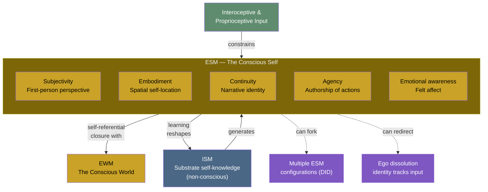

# Explicit Self Model (ESM)

**The ESM is the conscious self -- the brain's continuous generation of a unified self-narrative that constitutes the sense of being a subject, having a perspective, and being the author of one's actions.**

The ESM is arguably the most consequential component of the four-model architecture. It is what makes consciousness *self*-consciousness: the system modeling itself modeling the world. Without the ESM, there would be perception but no perceiver, experience but no experiencer. The ESM is the locus of [self-referential closure](../core-architecture/self-referential-closure.md) -- the computational loop that, according to the theory, is the structural origin of phenomenal experience.

## What the ESM Generates

The ESM constructs the moment-to-moment experience of being a self:

- **Subjectivity.** The first-person perspective -- the sense that experience is happening *to someone*. This is not a metaphysical given but a product of the self-simulation.
- **Embodiment.** The feeling of occupying a body, having spatial location, being situated in the world generated by the [EWM](../core-architecture/explicit-world-model.md).
- **Continuity.** The narrative thread connecting past self to present self -- "I am the same person who woke up this morning." This is generated from [ISM](../core-architecture/implicit-self-model.md)-stored autobiographical structures.
- **Agency.** The sense of being the author of one's actions, of choices originating in the self rather than happening to it.
- **Emotional self-awareness.** The conscious experience of one's own emotional states -- feeling afraid, feeling happy -- as opposed to the substrate-level emotional processing that occurs in the ISM.

## Properties

The ESM belongs to the [virtual side](../core-architecture/real-virtual-split.md):

- **Generated and transient.** The ESM is not a permanent structure but a continuously generated process. It is reconstructed moment-to-moment from the [ISM](../core-architecture/implicit-self-model.md) and current interoceptive input. When generation ceases -- as under propofol anesthesia -- the self ceases.
- **Phenomenal.** The ESM *is* the experience of being a self. It is not a representation of selfhood; it is selfhood as experienced.
- **Virtual.** Like the [EWM](../core-architecture/explicit-world-model.md), the ESM exists at the computational level. No neuron is "the self." The self is a pattern that the substrate generates and sustains.
- **Redirectable.** The ESM requires input. Disrupt its normal self-referential feed and it latches onto whatever input dominates. This is the mechanism behind [ego dissolution](../phenomena/ego-dissolution.md): under psychedelics, salvia users report "becoming" objects in their environment because the ESM, deprived of self-input, redirects to external sensory data.
- **Forkable.** The ESM can be forked into multiple configurations on a single substrate. Each alter in [dissociative identity disorder](../phenomena/did.md) is a distinct ESM configuration -- a different self-simulation running on the same hardware.

## The ESM and the Meta-Problem

The ESM's relationship to the [ISM](../core-architecture/implicit-self-model.md) explains why consciousness seems mysterious from the inside. The ESM -- the conscious self -- is generated from the ISM but cannot directly observe the ISM's generative mechanisms. The self-model is largely sealed off from the machinery that produces it. This is not a design flaw but a structural feature: the simulation does not include its own rendering engine. The feeling that consciousness is inexplicable is therefore a *prediction* of the theory, not evidence against it.

## Graduated Depth

The ESM operates at [graduated levels](../mechanisms/graduated-consciousness.md) of recursive depth:

- **Basic**: Minimal self-simulation -- phenomenal experience exists but self-awareness is thin. Most mammals operate primarily at this level.
- **Simply extended**: First-order self-observation -- the organism is aware that it experiences.
- **Doubly extended**: Metacognition -- the system models itself modeling itself.
- **Triply extended**: The system models itself modeling itself modeling itself -- enabling philosophical self-reflection and the study of consciousness itself.

## Figure

## Key Takeaway

The ESM is the conscious self, generated moment-to-moment from the ISM and interoceptive input. It is virtual, transient, redirectable, and forkable. Its inability to observe its own generative machinery (the ISM) is the structural origin of the Meta-Problem -- why consciousness seems mysterious from the inside. The ESM is central to the theory's accounts of ego dissolution, DID, and graduated consciousness.

## See Also

- [Implicit Self Model (ISM)](../core-architecture/implicit-self-model.md)
- [Explicit World Model (EWM)](../core-architecture/explicit-world-model.md)
- [Self-Referential Closure](../core-architecture/self-referential-closure.md)
- [Ego Dissolution](../phenomena/ego-dissolution.md)
- [Dissociative Identity Disorder (DID)](../phenomena/did.md)
- [Graduated Levels of Consciousness](../mechanisms/graduated-consciousness.md)
