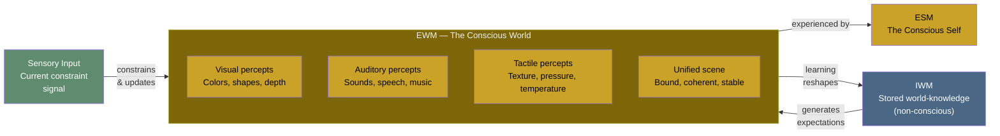

# Explicit World Model (EWM)

**The EWM is the conscious world -- the brain's dynamic construction of a unified scene from sensory data and stored knowledge that constitutes perceptual experience.**

When a person sees a room, hears a voice, feels the texture of a surface, they are experiencing the EWM. It is not a recording of reality but a real-time simulation: a virtual construct generated from the [IWM](../core-architecture/implicit-world-model.md)'s stored world-knowledge and constrained by current sensory input. The EWM is transient, dynamic, and constitutive of what philosophers call phenomenal consciousness of the external world.

## Construction Process

The EWM is generated, not received. Sensory input does not flow into consciousness like water into a bowl -- it constrains and updates a running simulation that the substrate is continuously generating from its stored knowledge.

This is why perception is so robust despite impoverished input. The visual system receives a noisy, incomplete, upside-down, chromatic-aberration-riddled signal from the retinae, yet the EWM presents a stable, detailed, three-dimensional world. The gap is filled by the [IWM](../core-architecture/implicit-world-model.md): the substrate's accumulated knowledge about how the world works generates expectations that fill in what the senses omit. This is not a defect but the core function -- the EWM is a *best-guess simulation*, not a passive mirror.

Current sensory input serves as a constraint signal, anchoring the simulation to external reality. When this constraint is removed -- as in dreaming or sensory deprivation -- the EWM continues to generate a world, drawing entirely on IWM-stored knowledge. This produces the characteristic features of dreams: familiar places, impossible physics, narrative incoherence. The simulation engine keeps running; only the constraint signal changes.

## Properties

The EWM belongs to the [virtual side](../core-architecture/real-virtual-split.md) of the architecture:

- **Generated and transient.** The EWM is a pattern of electrochemical activity, constructed moment-to-moment. It has no persistent existence -- it is a process, not a structure.
- **Phenomenal.** The EWM *is* perceptual experience. The seen color, the heard sound, the felt texture are EWM content. This is not a representation *of* experience; it is experience itself.
- **Virtual.** The EWM exists at the computational level but is incoherent at the substrate level, the way a rendered video game world exists in the running program but is nowhere in the transistors. The "redness" of a red apple in the EWM is a computational-level property -- no neuron is red.
- **Unified.** Despite being generated from multiple sensory modalities and IWM domains, the EWM presents a single, coherent scene. This unity is a product of the binding achieved by the [criticality](../physical-foundations/criticality.md)-regime dynamics of the substrate.

## What the EWM Is Not

The EWM is not a faithful copy of reality. Optical illusions, change blindness, inattentional blindness, and the blind spot demonstrate that the EWM routinely diverges from external reality. It is not *wrong* -- it is a simulation optimized for behavioral relevance, not for accuracy. The theory does not claim the brain *should* accurately represent reality; it claims the brain generates a simulation useful for the organism's survival.

The EWM is also not the same as "sensory processing." Processing occurs in the [IWM](../core-architecture/implicit-world-model.md) -- at the substrate level, outside of consciousness. The EWM is the *output* of that processing: the unified scene that results from the substrate's computational work. Intermediate processing stages are normally implicit, visible only during states of increased [permeability](../mechanisms/variable-permeability.md) (psychedelics, pre-sleep).

## Interaction with the ESM

The EWM generates the world; the [ESM](../core-architecture/explicit-self-model.md) generates the subject experiencing it. Together, they constitute conscious experience: a self in a world. Without the EWM, the ESM would be a subject with nothing to experience. Without the ESM, the EWM would be a world with no one to experience it. The theory holds that both are necessary for consciousness as humans know it, though [graduated levels](../mechanisms/graduated-consciousness.md) of each are possible.

## Figure

## Key Takeaway

The EWM is a real-time simulation of the external world, generated from stored knowledge (IWM) and constrained by current sensory input. It is not a passive mirror of reality but an active construction -- virtual, transient, and phenomenal. The EWM *is* perceptual experience, existing at the computational level while being incoherent at the substrate level.

## See Also

- [Implicit World Model (IWM)](../core-architecture/implicit-world-model.md)
- [Explicit Self Model (ESM)](../core-architecture/explicit-self-model.md)
- [The Real/Virtual Split](../core-architecture/real-virtual-split.md)
- [Virtual Qualia](../hard-problem/virtual-qualia.md)
- [Variable Permeability](../mechanisms/variable-permeability.md)
