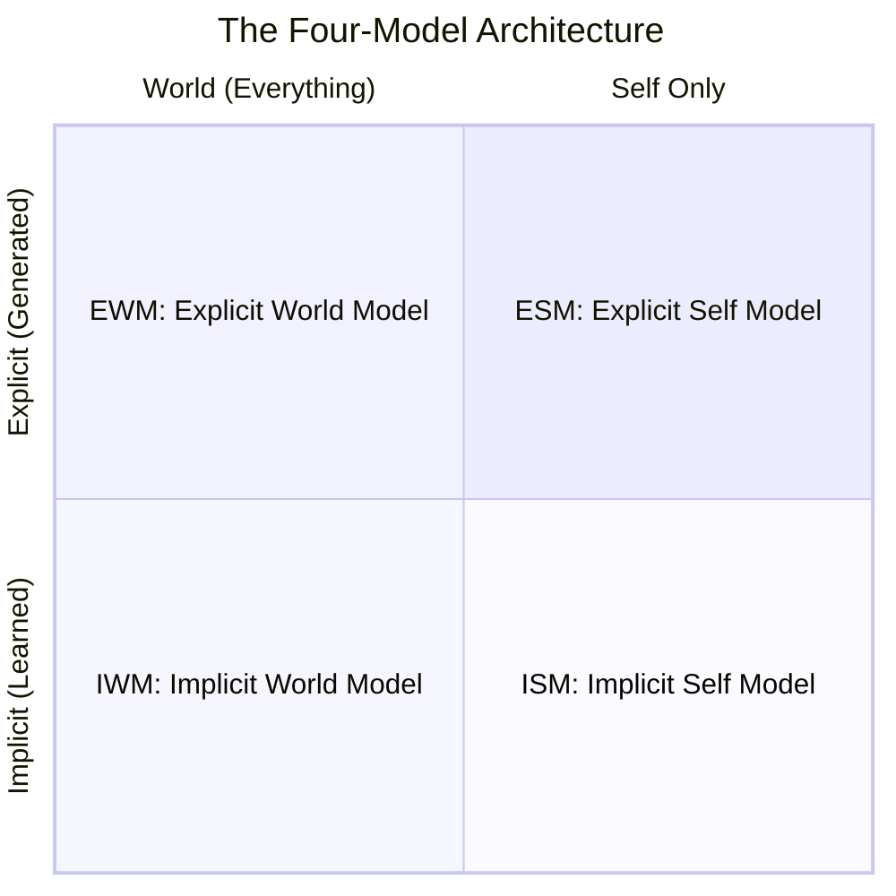
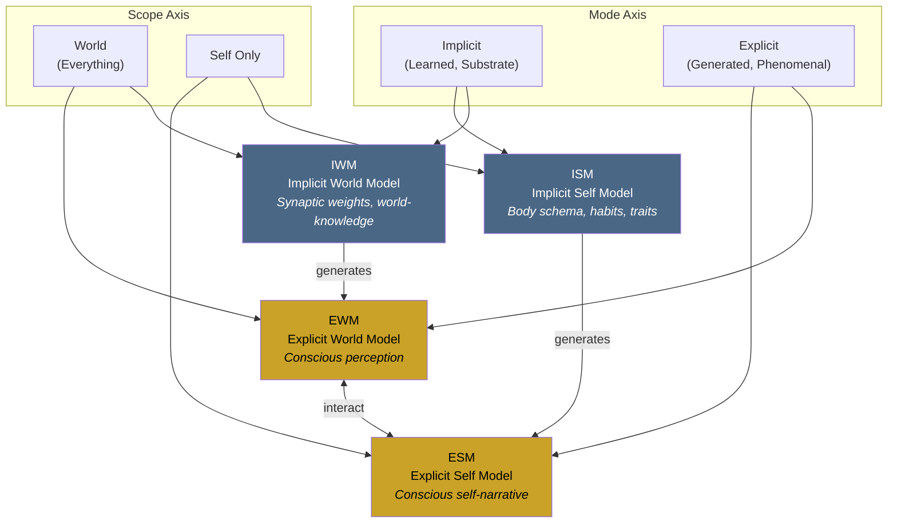

# The Four-Model Theory

**Consciousness is constituted by ongoing self-simulation across four nested models arranged along two axes — scope and mode — with four being the principled minimum, not a claim about the brain's actual model count.**

The Four-Model Theory (FMT) proposes that consciousness is not a property a brain possesses but a process it performs: the continuous generation of a self-referential simulation. The theory specifies the minimal architecture required for this process — four model kinds distinguished by two orthogonal dimensions — and combines it with a physical prerequisite (the substrate must operate at the edge of chaos) to produce a framework that addresses all eight core requirements for a theory of consciousness.

## Self-Simulation as Mechanism

The theory centers on mechanism rather than output, for the same reason molecular biology defines life through metabolism and replication rather than "the feeling of being alive." Consciousness, on this account, is what ongoing self-simulation produces when the substrate operates at criticality. The term "self-simulation" is pedagogical shorthand — the brain does not run a deterministic digital twin of reality. What it generates is closer to a unified narrative: a more or less linear, relatively contradiction-free story of the organism's current situation, assembled from fragmentary substrate-level knowledge and current sensory input, revised where it fails, and filled with interpolations, simplifications, and outright confabulations.

The critical architectural feature is that the explicit models are *generated processes* running on a structural substrate, distinct from that substrate in the way any computation is distinct from the hardware executing it. What makes consciousness unique is not this substrate-computation distinction (which holds for every computing system) but what happens at the computational level: **self-referential closure**, the fact that the system's model includes a model of itself generating the model.

## The 2x2 Architecture

The theory identifies four model kinds along two orthogonal dimensions:

- **Scope**: world (everything) versus self only
- **Mode**: implicit (learned, substrate-level) versus explicit (generated, phenomenal)

This yields four canonical models: the **Implicit World Model** (IWM), the **Implicit Self Model** (ISM), the **Explicit World Model** (EWM), and the **Explicit Self Model** (ESM). The implicit models store accumulated knowledge in the substrate's architecture. The explicit models are the running simulation — transient, virtual, and phenomenal.

## The Principled Minimum

The 2x2 taxonomy identifies the *minimum sufficient set* of models for consciousness, not the actual number the brain maintains. The biological brain implements an effectively uncountable number of overlapping models on both sides of the implicit/explicit divide. A motor model for reaching simultaneously encodes world-geometry and self-kinematics; an emotional model of a social interaction simultaneously encodes other-knowledge and self-assessment. Real neural models do not respect the world/self boundary.

The four canonical models are best understood as extremal points in a continuous modeling space. The principled claim is: "Any system capable of consciousness must model both world and self, at both the structural and the simulation level — four is the floor, not the ceiling."

## Figure

## Key Takeaway

Consciousness requires a system that models both world and self at both the substrate level (implicit, learned) and the simulation level (explicit, generated). Four model kinds — defined by scope and mode — constitute the minimum architecture; the brain's actual modeling ecology is vastly richer, but no conscious system can have fewer than these four.

## See Also

- [Core Definition of Consciousness](../core-architecture/core-definition.md)
- [The Two Axes: Scope and Mode](../core-architecture/two-axes.md)
- [The Real/Virtual Split](../core-architecture/real-virtual-split.md)
- [Self-Referential Closure](../core-architecture/self-referential-closure.md)
- [The Four Models](../core-architecture/four-models.md)
- [Two Thresholds for Consciousness](../physical-foundations/two-thresholds.md)
