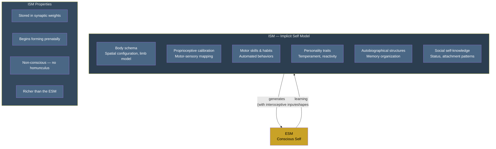

# Implicit Self Model (ISM)

**The ISM is the substrate's accumulated self-knowledge -- body schema, motor skills, personality traits, autobiographical memory structures -- stored in the substrate and never directly conscious.**

The ISM is everything the brain knows about its own organism, encoded not as retrievable self-descriptions but as structural features of the substrate that shape how the body is controlled, how emotions are processed, and how the [conscious self](../core-architecture/explicit-self-model.md) is generated. There is no inner homunculus reading the ISM. It is a configuration of the hardware, not an experience.

## Contents and Scope

The ISM encompasses the system's total self-knowledge at the substrate level:

- **Body schema.** The brain's model of the body's spatial configuration -- limb lengths, joint ranges, postural geometry. Updated continuously through proprioceptive input but stored as a persistent structural model. Phantom limbs demonstrate what happens when the ISM retains a body part the substrate has lost.
- **Proprioceptive calibration.** The mapping between motor commands and expected sensory consequences. Why reaching for a cup succeeds without conscious calculation -- the ISM has calibrated the mapping through years of experience.
- **Motor skills and habits.** Riding a bicycle, touch-typing, tying shoelaces. Once learned, these operate from the ISM without requiring conscious attention. They become substrate-level automatisms.
- **Personality traits.** Temperamental dispositions, emotional reactivity patterns, social interaction defaults. These are not conscious self-descriptions ("I am an introvert") but substrate-level configurations that bias behavior and shape the [ESM](../core-architecture/explicit-self-model.md)'s self-narrative.
- **Autobiographical memory structures.** The organizational scaffolding of personal history -- not the memories themselves as consciously experienced, but the substrate-level indices and associations that determine which memories are accessible and how they relate to each other.
- **Social self-knowledge.** Implicit models of how one is perceived by others, status hierarchies, attachment patterns. Operating below conscious awareness, shaping social behavior without deliberation.

## Properties

Like the [IWM](../core-architecture/implicit-world-model.md), the ISM belongs to the [real side](../core-architecture/real-virtual-split.md):

- **Physical and structural.** Stored in synaptic weights and connectivity patterns, not in phenomenal experience.
- **Accumulated through development and experience.** The ISM begins forming prenatally (body schema calibration) and continues throughout life.
- **Never directly conscious.** The ISM operates below the threshold of awareness. Conscious self-knowledge -- "I know I am anxious" -- is a product of the [ESM](../core-architecture/explicit-self-model.md), not the ISM. The ISM is the source material, not the experience.
- **Informationally richer than the ESM.** The ISM contains vastly more self-knowledge than the ESM can represent at any moment. The conscious self is a thin, selective rendering of the substrate's full self-model.

## The ISM-ESM Relationship

The ISM feeds the [ESM](../core-architecture/explicit-self-model.md) the way the [IWM](../core-architecture/implicit-world-model.md) feeds the [EWM](../core-architecture/explicit-world-model.md): the substrate-level model provides the raw material from which the conscious model is generated. The ESM is a selective, simplified, narrative-structured rendering of the ISM's contents, constrained by current interoceptive and proprioceptive input.

This relationship is the foundation of the theory's account of the [Meta-Problem](../hard-problem/meta-problem.md): the ESM cannot directly observe the ISM's mechanisms. The conscious self-model is mostly sealed off from its own generative machinery -- which is precisely why consciousness *seems* mysterious from the inside. The mystery is a structural feature of the architecture, not evidence of something non-physical.

## Clinical Significance

The ISM's role becomes visible through its pathology:

- **[Anosognosia](../phenomena/anosognosia.md)**: The ISM registers a deficit (paralysis, blindness), but the transfer to the ESM is locally blocked. The ISM knows; the ESM does not. The patient's conscious self-model lacks the information that the substrate possesses.
- **Phantom limbs**: The ISM retains a body schema that includes the amputated limb. The ESM generates a self-model from this outdated ISM data, producing the experience of a limb that no longer exists.
- **Blindsight**: The ISM continues processing visual information via subcortical pathways, guiding motor behavior, while the damaged cortical pathways fail to relay this information to the ESM. Substrate-level self-knowledge without conscious self-experience.

## Figure

## Key Takeaway

The ISM is the substrate's total self-knowledge -- body schema, motor skills, personality, autobiographical scaffolding -- stored structurally and never directly conscious. It is informationally richer than the conscious self (ESM) it generates, and the ESM's inability to observe the ISM's mechanisms is the structural origin of the Meta-Problem of consciousness.

## See Also

- [Implicit World Model (IWM)](../core-architecture/implicit-world-model.md)
- [Explicit Self Model (ESM)](../core-architecture/explicit-self-model.md)
- [The Real/Virtual Split](../core-architecture/real-virtual-split.md)
- [The Meta-Problem Dissolved](../hard-problem/meta-problem.md)
- [Anosognosia](../phenomena/anosognosia.md)
