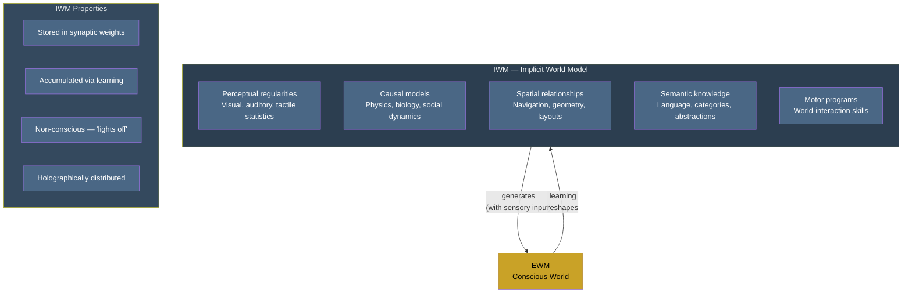

# Implicit World Model (IWM)

**The IWM is the substrate's total accumulated knowledge about the world, stored in synaptic weights -- never directly conscious, never appearing in experience, but providing the entire knowledge base from which the conscious simulation is generated.**

Every causal relationship a brain has ever learned, every spatial regularity it has internalized, every perceptual pattern it has extracted from decades of sensory exposure -- all of this resides in the IWM. It is the largest of the four models by information content, and the one most invisible to introspection. The IWM operates "in the dark," shaping every moment of conscious experience without itself being experienced.

## Contents and Scope

The IWM encompasses everything the system has learned about the external world:

- **Perceptual regularities.** The statistical structure of visual scenes, the spectral properties of natural sounds, the texture-weight correlations of materials. A lifetime of sensory exposure distilled into implicit expectations.
- **Causal models.** Objects fall when dropped. Fire burns. Clouds precede rain. These are not conscious beliefs retrieved from storage -- they are structural features of the substrate that constrain how the [EWM](../core-architecture/explicit-world-model.md) generates its conscious scene.
- **Spatial relationships.** The geometry of familiar environments, the relative locations of objects, navigational knowledge. Encoded not as maps to be read but as synaptic configurations that shape behavior.
- **Semantic knowledge.** Language, categories, abstract relationships, cultural knowledge -- everything from "dogs have four legs" to "inflation reduces purchasing power."
- **Motor programs for world interaction.** How to reach for a cup, how to drive a car, how to type on a keyboard. These straddle the boundary with the [ISM](../core-architecture/implicit-self-model.md), encoding both world-geometry and body-kinematics simultaneously.

This list is illustrative, not exhaustive. The IWM is not a filing cabinet of discrete facts -- it is a high-dimensional configuration of the substrate's connectivity that encodes the system's entire model of how the world works.

## Properties

The IWM sits on the [real side](../core-architecture/real-virtual-split.md) of the architecture. Its defining properties:

- **Physical and structural.** In biological brains, the IWM is stored in synaptic weights, dendritic morphology, and connectivity patterns. It is the substrate's learned configuration.
- **Accumulated through experience.** The IWM grows throughout the organism's lifetime. Every experience that reshapes synaptic connections modifies the IWM.
- **Never directly conscious.** There is nothing it is like to be a synaptic weight. The IWM provides raw material for the [EWM](../core-architecture/explicit-world-model.md) but never enters experience directly -- except during states of increased [permeability](../mechanisms/variable-permeability.md), when intermediate processing stages leak through.
- **Holographically distributed.** Information in the IWM is stored in a distributed manner across the substrate. Damage degrades the IWM but does not destroy discrete chunks of it. This [holographic storage](../mechanisms/holographic-storage.md) pattern explains why brain damage produces graded deficits rather than categorical knowledge loss.

## Relationship to the EWM

The IWM is the knowledge base; the [EWM](../core-architecture/explicit-world-model.md) is the simulation drawn from it. When visual cortex constructs a conscious percept of a coffee cup on a desk, the IWM provides the perceptual templates (what cups look like, what desks are, how shadows fall on cylindrical objects), while current sensory input provides the specific constraints (this cup, this desk, this lighting). The EWM synthesizes both into a unified conscious scene.

This relationship is one-directional in terms of generation (IWM feeds EWM) but bidirectional in terms of learning: what happens in the EWM -- conscious experience, decisions, errors -- feeds back to reshape the IWM through synaptic plasticity. The conscious simulation is the mechanism by which the substrate evaluates outcomes and updates its world model.

## Figure

*A complete neuron with dendrites, axon, myelin sheath, and three synapse types (axosomatic, axodendritic, axoaxonic). The IWM is stored in the strengths of these synaptic connections — not in any individual neuron, but in the pattern of connectivity across billions of them. Each synapse's transmission efficiency, shaped by a lifetime of experience, encodes a fragment of the substrate's total world-knowledge.*

## Key Takeaway

The IWM is the substrate's total world-knowledge -- vast, structural, and completely non-conscious. It never appears in experience directly but provides the entire foundation from which the conscious world (EWM) is generated. The IWM is the "dark side" of cognition: invisible, indispensable, and far larger than the thin slice of it that reaches awareness at any moment.

## See Also

- [Implicit Self Model (ISM)](../core-architecture/implicit-self-model.md)
- [Explicit World Model (EWM)](../core-architecture/explicit-world-model.md)
- [The Real/Virtual Split](../core-architecture/real-virtual-split.md)
- [The Implicit-Explicit Boundary](../mechanisms/implicit-explicit-boundary.md)
- [Holographic Storage](../mechanisms/holographic-storage.md)
