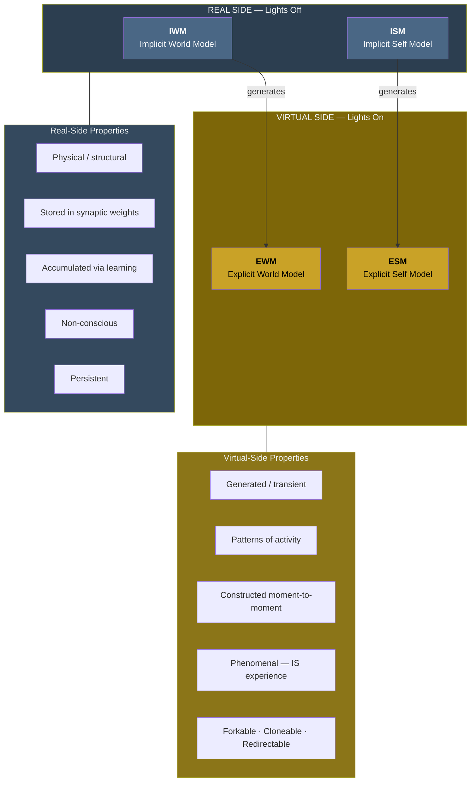

# The Real/Virtual Split

**The four models divide into two fundamental categories: the real side (IWM + ISM), which is physical, structural, and non-conscious, and the virtual side (EWM + ESM), which is generated, transient, and phenomenal.**

This division is not a metaphor. It is the foundational ontological distinction of the Four-Model Theory — the structural feature from which the dissolution of the Hard Problem, the account of altered states, and the engineering specification for artificial consciousness all follow.

## The Real Side: Lights Off

The **real side** comprises the Implicit World Model (IWM) and the Implicit Self Model (ISM). These models are:

- **Physical and structural.** In biological brains, they are stored in synaptic weights, dendritic morphology, and connectivity patterns. They are the hardware's learned configuration.
- **Accumulated through learning.** They grow over the organism's lifetime as experience reshapes the substrate. The IWM encodes everything the system has learned about the world; the ISM encodes everything it has learned about itself.
- **Non-conscious.** There is nothing it is like to be a synaptic weight. The implicit models operate "in the dark" — they provide the knowledge base from which conscious experience is generated, but they never appear in experience directly. "Lights off."

The real side is analogous to data stored on a hard drive: persistent, structural, and inert until activated. The implicit models do not experience anything, produce any phenomenal character, or contribute to consciousness except as the source material from which the virtual side is constructed.

## The Virtual Side: Lights On

The **virtual side** comprises the Explicit World Model (EWM) and the Explicit Self Model (ESM). These models are:

- **Generated and transient.** In biological brains, they are patterns of electrochemical activity — dynamic processes, not permanent structures. They are constructed moment-to-moment from the implicit models and current sensory input.
- **Phenomenal.** The explicit models *are* experience. The EWM is conscious perception — the seen room, the heard voice, the felt texture. The ESM is the conscious self — the sense of being a subject, having a history, occupying a body. "Lights on."
- **Virtual in a precise technical sense.** They exist at the computational level but are incoherent at the substrate level, the way a spreadsheet cell's value exists in the running program but is nowhere in the transistors.

The virtual side is analogous to a running program: dynamic, transient, and constituted by the process of execution rather than by the hardware executing it.

## Software-Like Properties

Because the virtual models are generated processes rather than stored structures, they possess properties characteristic of software:

- **Forkable.** A single substrate can run multiple configurations of the ESM simultaneously. This is the mechanism behind dissociative identity disorder (DID): each alter is a distinct ESM configuration operating on the same neural substrate.
- **Cloneable.** Physical separation of the substrate produces degraded but complete copies of the virtual models. Split-brain patients (after callosotomy) show bilateral degradation rather than clean hemispheric specialization — each hemisphere retains a degraded but functional copy of the whole simulation.
- **Redirectable.** The ESM requires input; disrupt normal self-referential input and it latches onto whatever input dominates. During ego dissolution on psychedelics, subjects report "becoming" objects in their environment — the ESM, deprived of its usual self-referential feed, redirects to external sensory input.
- **Reconfigurable.** Therapeutic interventions (CBT, exposure therapy, psychedelic-assisted therapy) work by modifying the virtual models through substrate-level rewiring. The virtual side is plastic precisely because it is generated anew from the substrate at each moment.

These properties are not speculative — they are observed in clinical and experimental settings. The theory accounts for them as natural consequences of the real/virtual architecture.

## Not Dualism

The real/virtual split is a *level* distinction, not a *substance* distinction. Both sides are fully physical. The virtual models are physical processes — patterns of electrochemical activity — as physical as the synaptic weights that store the implicit models. The distinction is between two levels of description within a single physical system, not between physical and non-physical substances. This is **process physicalism**: consciousness is constituted by a physical process (self-simulation), not by a non-physical substance.

The analogy to software and hardware is exact in this respect: software is not made of a different substance than hardware. It is a different level of description of what the hardware is doing. The real/virtual split in the brain works the same way.

## Figure

## Key Takeaway

The real/virtual split is the theory's foundational ontological division. The real side (implicit models) stores knowledge in the substrate without any phenomenal character. The virtual side (explicit models) generates conscious experience as a transient computational process. Both are physical; the distinction is one of level, not substance. The virtual side's software-like properties — forkable, cloneable, redirectable, reconfigurable — are directly observable in clinical phenomena and follow naturally from the architecture.

## See Also

- [The Four-Model Theory](../core-architecture/four-model-theory.md)
- [Virtual Qualia](../hard-problem/virtual-qualia.md)
- [Hard Problem Dissolution](../hard-problem/hard-problem-dissolution.md)
- [Two-Level Ontology](../hard-problem/two-level-ontology.md)
- [Process Physicalism](../philosophical/process-physicalism.md)
- [Virtual Model Forking](../mechanisms/virtual-model-forking.md)
