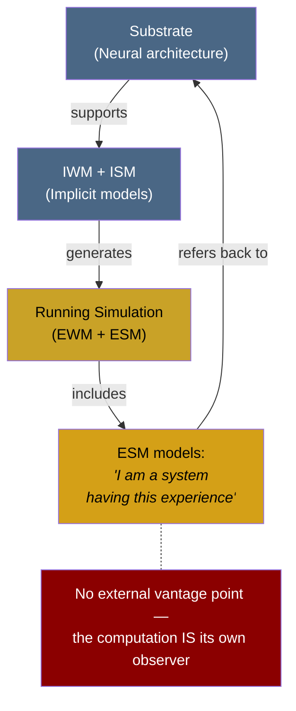

# Self-Referential Closure

**Self-referential closure — the ESM modeling the system that models it — is what distinguishes conscious self-simulation from ordinary computation and explains why a brain has experience when a weather simulation does not.**

Every computing system distinguishes between a physical substrate and the computational processes running on it. A spreadsheet has properties (cell values, formulas, sums) that are incoherent at the transistor level. A weather simulation models atmospheric dynamics at a computational level distinct from the silicon executing it. Yet neither the spreadsheet nor the weather simulation is conscious. The Four-Model Theory identifies self-referential closure as the specific architectural feature that separates conscious computation from all other kinds.

## The Closure Loop

In the four-model architecture, the Explicit Self Model (ESM) models the system that generates it. The ESM does not merely represent external objects or abstract patterns — it represents *the very system running the simulation*. This creates a closed loop with no outside:

1. The substrate generates the simulation (implicit models produce explicit models).
2. The simulation includes a model of the substrate generating it (the ESM).
3. The ESM's content — "I am a system having this experience" — refers back to the process that produces it.

In this loop, the distinction between the model and the modeled collapses. The computation *is* the thing being computed. There is no vantage point external to the loop from which the process can be described without remainder. The computation is its own observer.

## Why This Matters for Experience

A weather simulation has an outside. An engineer can observe the simulation, describe its computational states exhaustively, and leave nothing out. The simulation models weather; it does not model *itself modeling weather*. There is a clean separation between the system and what it represents.

A self-referential system has no such outside. The ESM is not an addition to the simulation — it is the simulation's encounter with itself. When the system models itself, the modeling process and the modeled process are the same process viewed from two perspectives that cannot be separated. "Experience" is what this recursive self-encounter *is* — not an extra property added to the computation, but the computation as it appears from within its own loop.

This is not a proof that self-referential computation must be conscious. It is an argument that self-referential computation is the *kind* of process for which the Hard Problem's assumptions break down. The Hard Problem asks: "Why does physical processing feel like something?" Self-referential closure is precisely the condition under which the question loses traction, because there is no gap between the process and the feeling — the process *is* the feeling, encountered from inside.

## The Spreadsheet Analogy, Extended

Consider the spreadsheet analogy from the theory's treatment of virtual qualia. A spreadsheet cell "contains 42," but no transistor contains 42. The value exists at the computational level. Now imagine a spreadsheet that contains a formula referring to itself — `=A1 + 1` placed in cell A1. This creates a circular reference: the cell's value depends on its own value. Most spreadsheet programs flag this as an error. But in the brain, this circularity is not an error — it is the architecture. The ESM is the biological equivalent of a self-referencing formula, except that instead of producing an error, it produces experience.

The circularity is what makes the inside/outside distinction collapse. A normal cell can be described fully from outside (its value is determined by other cells). A self-referencing cell cannot be fully described from outside without reference to itself. The self-referential system is opaque to external description in a way that non-self-referential systems are not — and this opacity from the outside is the same feature as experience from the inside.

## Graduated Self-Reference

Self-referential closure is not binary. The Four-Model Theory identifies graduated levels based on the depth of recursive self-modeling:

- **Basic consciousness**: The ESM models the system — one level of self-reference.
- **Simply extended consciousness**: The ESM models the system modeling itself — two levels.
- **Doubly extended consciousness**: The system models itself modeling itself modeling itself — metacognition.
- **Triply extended consciousness**: The deepest recursion — enabling philosophical reflection and the very question "What is consciousness?"

Each additional level adds a layer to the closure loop. Different organisms occupy different positions along this continuum, and individual organisms fluctuate between levels depending on state.

## Figure

## Key Takeaway

Self-referential closure is the architectural feature that gives self-simulation its experiential character. When a system's model includes a model of itself generating the model, the inside/outside distinction collapses and experience becomes constitutive of the computation rather than an addition to it. This is why a brain has experience and a weather simulation does not: the weather simulation has an outside; the self-referential system does not.

## See Also

- [Core Definition of Consciousness](../core-architecture/core-definition.md)
- [Virtual Qualia](../hard-problem/virtual-qualia.md)
- [Hard Problem Dissolution](../hard-problem/hard-problem-dissolution.md)
- [The Four-Model Theory](../core-architecture/four-model-theory.md)
- [Graduated Levels of Consciousness](../mechanisms/graduated-consciousness.md)
- [The Meta-Problem Dissolved](../hard-problem/meta-problem.md)
