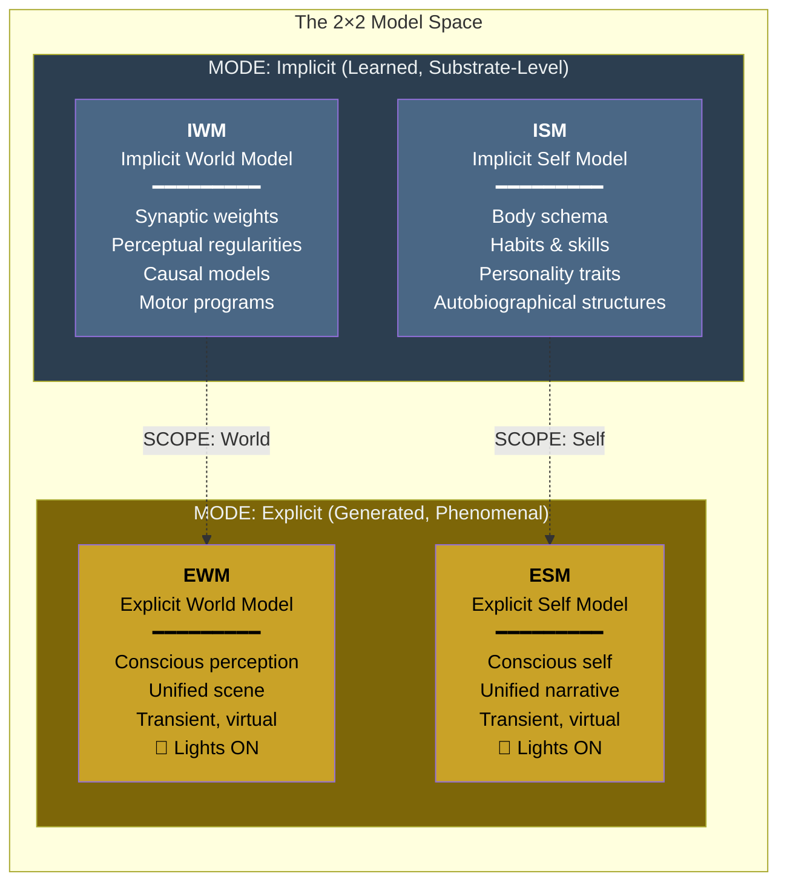

# The Two Axes: Scope and Mode

**The four models arise from two orthogonal dimensions — scope (world vs. self) and mode (implicit vs. explicit) — and this 2x2 structure identifies the minimum number of model kinds any conscious system must maintain.**

The Four-Model Theory does not posit four models as an empirical discovery about the brain's internal organization. Instead, it derives four model *kinds* from two independent dimensions that any self-simulating system must distinguish. The resulting 2x2 matrix is a principled minimum — a constraint that follows from the logic of self-simulation itself.

## The Scope Axis: World vs. Self

The first dimension separates what the system models about its environment from what it models about itself. This distinction is not optional. A system that models only the world has no self-awareness; a system that models only itself has no perception. Consciousness as the theory defines it — ongoing self-simulation embedded in a world — requires both.

- **World scope** covers everything external to the system: objects, other agents, spatial layout, causal regularities, physical laws as learned through experience. In the brain, world-scope modeling spans perception, semantic memory, spatial navigation, and causal reasoning.
- **Self scope** covers the system itself: its body, its states, its history, its capabilities, its social identity. In the brain, self-scope modeling spans proprioception, interoception, autobiographical memory, personality, and the sense of agency.

The scope axis is a continuum, not a binary switch. Many real neural models blend world and self (a social interaction model encodes both other-knowledge and self-assessment), but the endpoints — pure world-knowledge and pure self-knowledge — define the axis.

## The Mode Axis: Implicit vs. Explicit

The second dimension separates how the models exist in the system:

- **Implicit mode** (learned, substrate-level): Information stored in the system's architecture — in the brain, synaptic weights, connectivity patterns, dendritic morphology. Implicit models are the accumulated product of lifetime learning. They are structural, persistent, and non-conscious. They operate "in the dark."
- **Explicit mode** (generated, phenomenal): Information actively constructed as a running simulation — in the brain, transient patterns of electrochemical activity. Explicit models are generated dynamically from the implicit models and current sensory input. They *are* experience. "Lights on."

The mode axis captures a distinction familiar from computer science: the difference between data stored on disk (implicit) and data currently loaded into RAM and being processed (explicit). The analogy is imperfect — the brain is not a von Neumann architecture — but the structural principle holds: there is a categorical difference between information that exists as structure and information that exists as process.

## Why These Two Axes?

The scope and mode axes are not arbitrary. They follow from the definition of consciousness as self-simulation:

1. **Self-simulation requires a self-model.** That model must be distinguished from the world-model it is embedded in. This forces the scope axis.
2. **A simulation must be generated from something.** The running process (explicit) must draw on stored knowledge (implicit). This forces the mode axis.
3. **The two axes are orthogonal.** Scope (what is modeled) is independent of mode (how it exists in the system). World-knowledge can be either implicit or explicit; self-knowledge can be either implicit or explicit.

Any system that collapses either axis — a system with no implicit/explicit distinction, or a system with no world/self distinction — lacks the architecture for consciousness as the theory defines it.

## Why the 2x2 Is the Minimum

Two axes with two values each yield four quadrants. The claim is not that four is the *right* number of models but that it is the *smallest* number that satisfies the architectural requirements for self-simulation. A system with fewer than four model kinds is missing something essential:

- Without an IWM: no accumulated world-knowledge to generate perception from.
- Without an ISM: no accumulated self-knowledge to generate a self from.
- Without an EWM: no conscious perception — the "lights" stay off for the world.
- Without an ESM: no conscious self — experience with no subject.

The brain's actual modeling ecology is vastly richer — an effectively uncountable number of overlapping models that blend across both axes. The four canonical models are extremal points in a continuous space, not discrete boxes in the brain.

## Figure

## Key Takeaway

The two axes — scope and mode — are not arbitrary classification dimensions but necessary consequences of what self-simulation requires. Any conscious system must distinguish world from self (scope) and stored knowledge from running simulation (mode). The resulting 2x2 structure defines the minimum architecture; real brains implement far more models, but no conscious system can have fewer than these four kinds.

## See Also

- [The Four-Model Theory](../core-architecture/four-model-theory.md)
- [The Four Models](../core-architecture/four-models.md)
- [The Real/Virtual Split](../core-architecture/real-virtual-split.md)
- [Implicit World Model](../core-architecture/implicit-world-model.md)
- [Explicit Self Model](../core-architecture/explicit-self-model.md)
