# Compounding Effects: A Structural Prediction

**The recursive intelligence model predicts that both motivation-destroying and motivation-enhancing interventions produce effects that compound over time — accelerating divergence, not static differences.**

This is not a vague claim about "long-term consequences." It is a mathematical property of a recursive system: any change to a component within a positive feedback loop propagates through subsequent iterations, producing effects that grow with each cycle. The Recursive Intelligence Model makes this dynamic explicit and testable.

## The Structural Argument

The **recursive loop** links Knowledge, Performance, and Motivation in a closed amplification cycle (see [The Recursive Loop](../intelligence/recursive-loop.md)). Each component enhances the others: knowledge improves performance, performance generates success, success fuels motivation, motivation drives further knowledge acquisition. The cycle iterates continuously across the lifespan.

In any such system, perturbations do not produce one-time effects — they alter the *rate* at which the loop iterates. A single bad grade in first grade does not merely reduce motivation in first grade. It slightly reduces the rate at which the loop iterates, which produces a slightly smaller knowledge base by second grade, which produces slightly worse performance in second grade, which produces another discouraging signal. The recursive structure predicts that early motivational damage should be visible as an **accelerating divergence** from peers — a fanning out of trajectories that grows wider with each passing year.

The same logic applies in reverse. A motivation-enhancing intervention — an environment that supports autonomy, competence, and relatedness ([Deci & Ryan, 2000](https://doi.org/10.1037/0003-066X.55.1.68)); feedback that emphasizes growth over fixed ability ([Dweck, 2006](https://doi.org/10.1037/0003-066X.61.6.622)); explicit teaching of operational knowledge ([Dignath & Buttner, 2008](https://doi.org/10.1007/s10648-008-9085-3)) — should produce benefits that compound over time. An intervention that boosts Motivation in first grade should show *larger* effects at five-year follow-up than at one-year follow-up, because the additional loop iterations accumulate.

## The Heckman Evidence

[James Heckman's (2006)](https://doi.org/10.1126/science.1128898) analysis of early childhood interventions provides striking support for the compounding prediction. His examination of the Perry Preschool Project revealed returns that *grow* over time — larger effects at age 27 than at age 7.

The critical detail: the initial cognitive gains (IQ increases) often *faded* within a few years. What persisted and compounded were motivational and self-regulatory gains — exactly the components the recursive model identifies as the drivers of the loop. The children did not remain smarter in the psychometric sense; they remained more motivated, more self-regulated, more engaged with learning. And these motivational gains, iterating through the recursive loop, produced compounding benefits in educational attainment, employment, and life outcomes.

This pattern is precisely what the recursive model predicts and precisely what a static-trait model does not. A static-trait model predicts that early interventions either produce permanent gains (which should be visible at every follow-up point equally) or temporary gains (which should fade). The recursive model predicts a third pattern: *initial gains in one component fade while downstream effects in the system compound* — apparent short-term failure masking long-term success.

## Distinguishing Compounding from Persistence

The compounding prediction is empirically distinguishable from simpler alternatives:

| Model | Prediction at 1-year | Prediction at 5-year | Pattern |
|---|---|---|---|
| **Static effect** | Gain = X | Gain = X | Flat |
| **Fading effect** | Gain = X | Gain < X | Declining |
| **Recursive compounding** | Gain = X | Gain > X | Accelerating |

The recursive model predicts the third pattern for motivation-targeting interventions. Crucially, it predicts the *inverse* third pattern (accelerating decline) for motivation-destroying practices like punitive grading, ability tracking, and fixed-ability labeling (see [The School Grade Disaster](school-grade-disaster.md)).

## Figure

```mermaid
graph LR
    subgraph "Year 1"
        M1["Motivation<br/>boost"] --> K1["Slightly more<br/>knowledge"]
        K1 --> P1["Slightly better<br/>performance"]
        P1 --> M1b["Motivation<br/>reinforced"]
    end

    subgraph "Year 3"
        M3["Motivation<br/>sustained"] --> K3["Notably more<br/>knowledge"]
        K3 --> P3["Notably better<br/>performance"]
        P3 --> M3b["Motivation<br/>further reinforced"]
    end

    subgraph "Year 7"
        M7["Motivation<br/>entrenched"] --> K7["Substantially more<br/>knowledge"]
        K7 --> P7["Substantially better<br/>performance"]
        P7 --> M7b["Motivation<br/>self-sustaining"]
    end

    M1b --> M3
    M3b --> M7

    style M1 fill:#2ecc71,stroke:#333
    style M3 fill:#27ae60,stroke:#333,color:#fff
    style M7 fill:#1e8449,stroke:#333,color:#fff
```

*The compounding dynamic: a motivation-enhancing intervention in Year 1 produces modest initial gains. Through recursive loop iteration, these gains compound — by Year 7 the effect is substantially larger than the initial intervention, because each year's gains become the input for the next year's iteration. This is the pattern Heckman observed in the Perry Preschool data.*

## Key Takeaway

The recursive intelligence model transforms "interventions have long-term effects" from a vague platitude into a precise, testable prediction: motivation-targeting interventions produce *accelerating* effects over time, distinguishable from both static and fading effects by their growth pattern at successive follow-up points.

## See Also

- [The Recursive Loop](../intelligence/recursive-loop.md)
- [The School Grade Disaster](school-grade-disaster.md)
- [Educational Implications](educational-implications.md)
- [Intelligence Is Learnable](intelligence-learnable.md)
- [The Matthew Effect](../intelligence/matthew-effect.md)

---

Based on: Gruber, M. (2026). Why Intelligence Models Must Include Motivation: A Recursive Framework. PsyArXiv. https://osf.io/preprints/osf/kctvg
