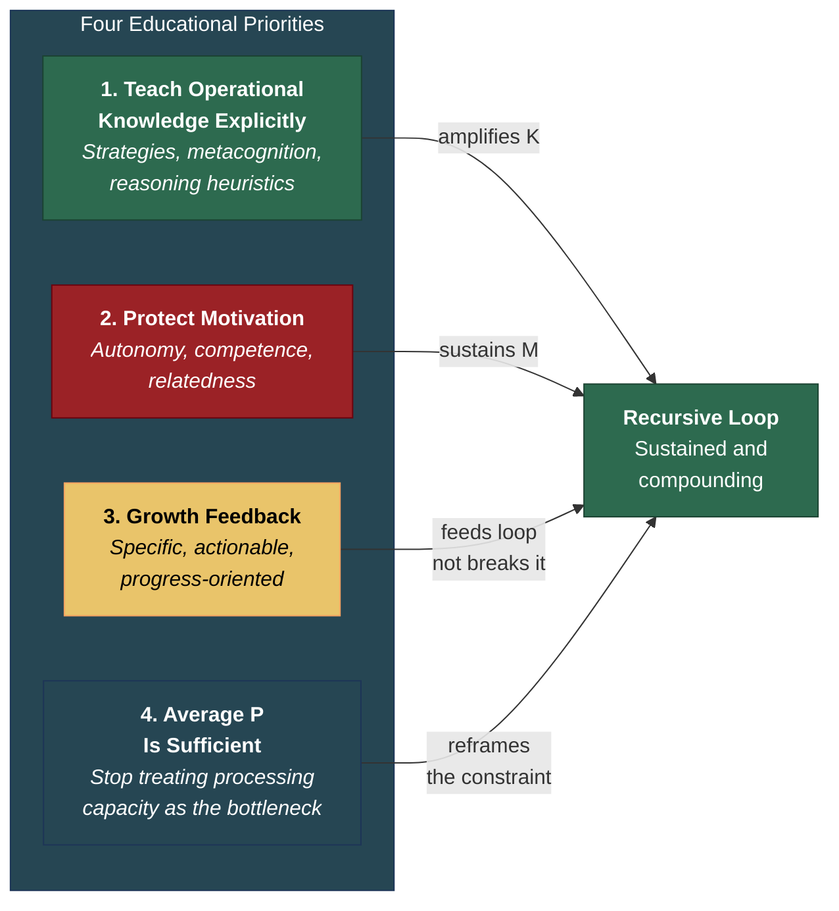

# Educational Implications

**The Recursive Intelligence Model implies four specific educational priorities: teach operational knowledge explicitly, protect motivation above all, replace grades with growth feedback, and recognize that average cognitive processing capacity is sufficient for most learners.**

If intelligence is a [recursive system](../intelligence/recursive-loop.md) driven by Knowledge, Performance, and Motivation, then the most effective educational interventions are not those that maximize factual knowledge transmission (the current default), nor those that attempt to boost raw processing capacity (which has limited malleability). The most effective interventions are those that target the two [learnable components](../education/intelligence-learnable.md) — Knowledge (especially operational knowledge) and Motivation — in ways designed to initiate and sustain the recursive loop.

## The Four Priorities

### 1. Teach Operational Knowledge Explicitly

[Operational knowledge](../intelligence/operational-knowledge.md) — learning strategies, metacognitive skills, reasoning heuristics — functions as the multiplier within the recursive loop. It amplifies the *rate* of all subsequent learning, not merely the *amount*. Yet educational systems treat these skills as incidental byproducts of content instruction rather than as a primary focus.

The recursive model predicts that teaching operational knowledge explicitly should produce [compounding effects](../education/compounding-effects.md): because operational knowledge improves the efficiency of all subsequent learning, its benefits grow with each loop iteration. A student taught spaced repetition in third grade does not merely retain more facts in third grade — the retention advantage accelerates through every subsequent year of learning. Evidence supports this: [Dignath and Buttner (2008)](https://doi.org/10.1007/s10648-008-9085-3) found that metacognitive strategy instruction produced durable effects on academic performance, and the recursive model explains why — the intervention targets the loop's multiplier.

### 2. Protect Motivation Above All

Any educational practice that systematically reduces intrinsic motivation is, from the recursive model's perspective, directly suppressing intelligence development. The [school grade disaster](../education/school-grade-disaster.md) is the most prominent example, but the principle extends to ability tracking, competitive ranking, fixed-ability labeling, and any system that communicates to children that their intellectual capacity is predetermined.

Self-Determination Theory ([Deci & Ryan, 2000](https://doi.org/10.1037/0003-066X.55.1.68)) identifies three conditions that sustain intrinsic motivation: autonomy (the sense of choice and volition), competence (the experience of mastery), and relatedness (connection to others). Educational environments that support these conditions cultivate the Motivation component; environments that thwart them extinguish it. The recursive model explains why motivational damage is so destructive: it does not merely reduce present engagement — it reduces the loop's iteration rate, which compounds over time.

### 3. Replace Grades with Growth Feedback

If assessment is necessary — and it may be, for diagnostic purposes — it should take a form that feeds the recursive loop rather than [breaking it](../education/school-grade-disaster.md). This means feedback that is:

- **Specific**: identifying what has been mastered and what remains
- **Actionable**: providing clear next steps
- **Growth-oriented**: communicating "here is where you are and where to go next" rather than "here is your rank"

The shift from summative ranking ("you scored 60%") to formative growth feedback ("you have mastered X, work on Y next, here is how") preserves the diagnostic function of assessment while protecting Motivation. The recursive model predicts that this shift should produce measurably better long-term outcomes — not because the feedback is "nicer" but because it sustains the loop's iteration rate.

### 4. Recognize That Average Performance Is Sufficient

Educational systems implicitly treat cognitive processing capacity as the primary constraint on intellectual development. The recursive model argues that [Performance is not the bottleneck](../intelligence/three-components.md) for the vast majority of students. The difference between the 25th and 75th percentile in working memory capacity is real but modest — roughly one additional chunk. For most intellectual pursuits, average Performance is more than sufficient.

This does not mean that cognitive differences are unreal. It means that the recursive loop amplifies Knowledge and Motivation differences far more than Performance differences across a lifespan. For the broad middle of the cognitive distribution, trajectory is determined by what students know about how to learn and whether they want to keep learning — not by how many items they can hold in working memory.

## Alignment with Existing Practices

Several established educational approaches already align with the recursive model's predictions:

- **Montessori education** prioritizes autonomy and intrinsic motivation — directly supporting the M component.
- **Mastery learning** (Bloom, 1968) replaces competitive grading with criterion-referenced progression, protecting self-efficacy.
- **Portfolio assessment** shifts focus from summative ranking to growth documentation, feeding the loop rather than breaking it.

The recursive model transforms these approaches from soft pedagogical preferences into hard predictions about the dynamics of a formal system. They work because they target the right components.

## Figure

## Key Takeaway

The recursive model does not merely suggest that education should be "better" — it specifies which interventions will compound over time (operational knowledge, motivational protection) and which interventions are structurally destructive (grades, ability tracking, fixed-ability framing). The priorities are not soft preferences — they are predictions about the dynamics of a recursive system.

## See Also

- [Intelligence Is Learnable](../education/intelligence-learnable.md)
- [The School Grade Disaster](../education/school-grade-disaster.md)
- [Operational Knowledge: The Hidden Multiplier](../intelligence/operational-knowledge.md)
- [Compounding Effects: A Structural Prediction](../education/compounding-effects.md)
- [The Recursive Loop](../intelligence/recursive-loop.md)
