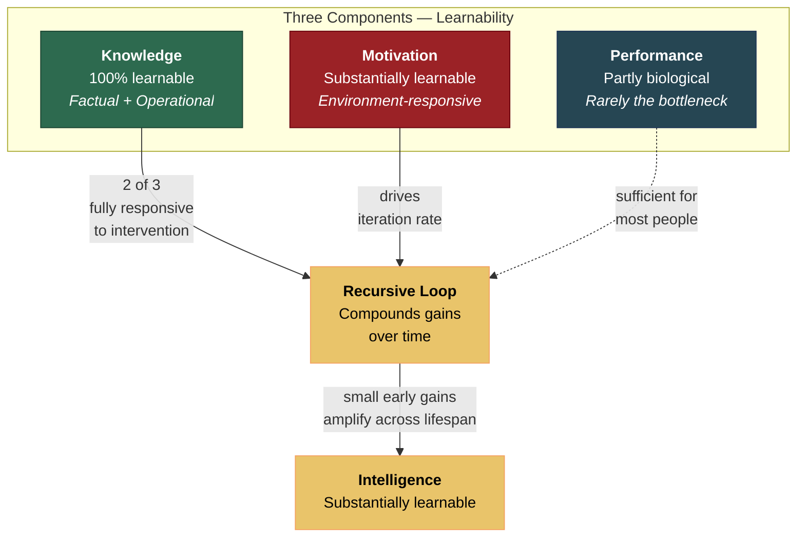

# Intelligence Is Learnable

**Two of intelligence's three components — Knowledge and Motivation — are highly responsive to intervention. The third — Performance — has a biological ceiling but is rarely the binding constraint. The recursive structure amplifies gains over time, making intelligence substantially learnable. This is a structural prediction, not a platitude.**

The claim that intelligence is learnable sounds like motivational poster material. It is not. It is a formal consequence of the [Recursive Intelligence Model](../intelligence/overview.md)'s composition: when a system's behavior is determined by three interacting components, and two of those components are environmentally responsive, the system as a whole is substantially malleable. Add the recursive loop's compounding dynamics, and small early interventions produce large long-term effects.

## Component-by-Component Analysis

**Knowledge is entirely learnable.** This is true by definition. Both factual knowledge and [operational knowledge](../intelligence/operational-knowledge.md) (learning strategies, metacognitive skills, reasoning heuristics) are acquired through experience, instruction, and practice. No one is born knowing calculus or knowing how to use spaced repetition. The entire Knowledge component — including the operational knowledge that functions as the recursive loop's multiplier — is a product of learning.

**Motivation is substantially learnable.** Self-Determination Theory ([Deci & Ryan, 2000](https://doi.org/10.1037/0003-066X.55.1.68)) demonstrates that intrinsic motivation is not a fixed trait but a response to environmental conditions — specifically, the satisfaction of autonomy, competence, and relatedness needs. Environments that support these needs cultivate intrinsic motivation; environments that thwart them extinguish it. Growth mindset research (Dweck, 2006) shows that beliefs about the malleability of intelligence — themselves a form of knowledge — directly affect motivational persistence. These beliefs are teachable.

A caveat: mindset interventions alone produce negligible effects on achievement (Macnamara & Burgoyne, 2023, *d* = 0.05 after correction). The recursive model explains why: changing one belief within one component cannot restart the full loop. Motivation is learnable, but effective intervention must engage Knowledge and operational Knowledge simultaneously — the loop, not a single cog.

**Performance has a biological ceiling — but it is rarely the bottleneck.** Working memory capacity, processing speed, and the raw computational power of the neural substrate are partly heritable and not infinitely malleable. There is a real ceiling, and it would be dishonest to deny it. However, the difference between the 25th and 75th percentile in working memory capacity amounts to roughly one additional chunk held in mind — a difference that matters at extremes (theoretical physics, grandmaster chess) but is largely irrelevant for most intellectual pursuits. For the broad middle of the cognitive distribution, average Performance is more than sufficient. The binding constraints are Knowledge and Motivation.

## The Compounding Argument

The learnability claim becomes powerful when combined with the [recursive loop](../intelligence/recursive-loop.md)'s compounding dynamics. Intelligence is not merely learnable — it is learnable in a way that *accelerates*. An intervention that boosts Knowledge or Motivation does not produce a one-time gain. It increases the loop's iteration rate, which produces more Knowledge, which improves Performance on subsequent tasks, which generates success that strengthens Motivation, which increases the iteration rate further. Gains compound like interest.

[Heckman's (2006)](https://doi.org/10.1126/science.1128898) analysis of early childhood interventions confirms this pattern: the Perry Preschool Project showed returns that *grew* over time — larger effects at age 27 than at age 7. The initial cognitive gains faded, but the motivational and self-regulatory gains compounded through subsequent learning. This is exactly what the recursive model predicts and exactly what static-trait models cannot explain.

## Figure

## Key Takeaway

Intelligence is learnable not because "anyone can be a genius" but because the recursive loop is a compound interest machine, and two of its three inputs are fully responsive to environmental influence. The biological component (Performance) sets a ceiling that most people never approach. For the vast majority, trajectory is determined by Knowledge and Motivation — both of which can be taught, cultivated, and protected.

## See Also

- [The Three Components: Knowledge, Performance, Motivation](../intelligence/three-components.md)
- [Operational Knowledge: The Hidden Multiplier](../intelligence/operational-knowledge.md)
- [The School Grade Disaster](../education/school-grade-disaster.md)
- [Educational Implications](../education/educational-implications.md)
- [Compounding Effects: A Structural Prediction](../education/compounding-effects.md)
