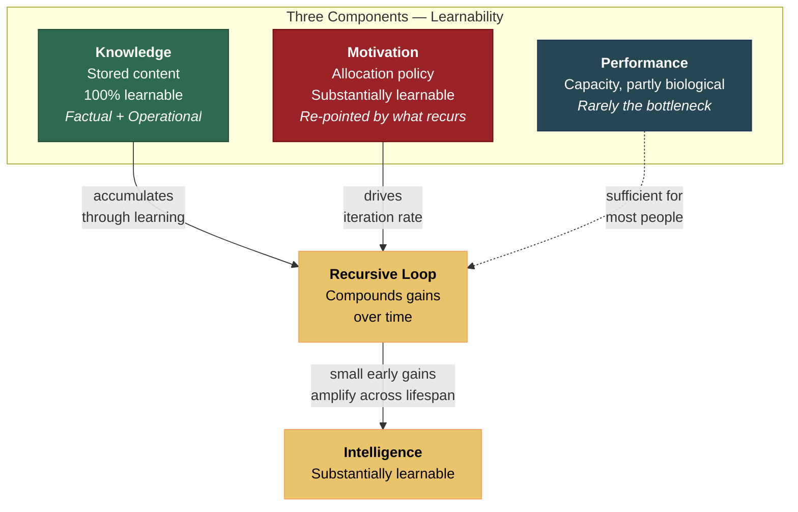

# Intelligence Is Learnable

**Two of intelligence's three constituents — Knowledge and Motivation — are highly responsive to intervention. The third — Performance, the only capacity among them — has a biological ceiling but is rarely the binding constraint. The recursive structure amplifies gains over time, making intelligence substantially learnable.**

The learnability of intelligence is a structural consequence of the [Recursive Intelligence Model](../intelligence/overview.md)'s composition: when a system's behavior is determined by three interacting constituents, and two of them are environmentally responsive, the system as a whole is substantially malleable. Add the recursive loop's compounding dynamics, and small early interventions produce large long-term effects.

The three constituents are different kinds of thing. Performance is a capacity, the only one of the three in the psychometric sense. Knowledge is stored content. Motivation is the policy that allocates the loop's time — how much of the loop runs, on what, and for how long. What each kind of learning changes follows from that typing.

## Component-by-Component Analysis

**Knowledge is entirely learnable.** This is true by definition. Both factual knowledge and [operational knowledge](../intelligence/operational-knowledge.md) (learning strategies, metacognitive skills, reasoning heuristics) are acquired through experience, instruction, and practice. No one is born knowing calculus or knowing how to use spaced repetition. The entire Knowledge component — including the operational knowledge that functions as the recursive loop's multiplier — is a product of learning.

**Motivation is substantially learnable.** Self-Determination Theory ([Deci & Ryan, 2000](https://doi.org/10.1037/0003-066X.55.1.68)) demonstrates that intrinsic motivation is not a fixed trait but a response to environmental conditions — specifically, the satisfaction of autonomy, competence, and relatedness needs. Environments that support these needs cultivate intrinsic motivation; environments that thwart them extinguish it. Growth mindset research (Dweck, 2006) shows that beliefs about the malleability of intelligence — themselves a form of knowledge — directly affect motivational persistence. These beliefs are teachable. On the policy reading, learning here means the schedule is re-pointed or kept more reliably; "more motivation" is shorthand for that change, never for a larger amount of a hidden quantity.

A caveat: mindset interventions alone produce negligible effects on achievement (Macnamara & Burgoyne, 2023, *d* = 0.05, non-significant once publication bias is accounted for). The recursive model prices this near zero. A single message moves a momentary willingness, and a schedule that any single message could re-set would not be a schedule; what changes a policy is what recurs. An intervention that changes what a learner is willing to attempt, without the operational knowledge that makes the attempt pay, buys little.

**Performance has a biological ceiling — but it is rarely the bottleneck.** Working memory capacity, processing speed, and the raw computational power of the neural substrate are partly heritable and not infinitely malleable. There is a real ceiling. However, the difference between the 25th and 75th percentile in working memory capacity amounts to roughly one additional chunk held in mind — a difference that matters at extremes (theoretical physics, certain classes of mathematical proof) but is largely irrelevant for most intellectual pursuits. Expert chess is not such an extreme: grandmasters work around the working-memory limit with a store of recognizable positions, which is a difference in Knowledge ([Chase & Simon, 1973](https://doi.org/10.1016/0010-0285(73)90004-2)). For the broad middle of the cognitive distribution, average Performance is more than sufficient. The binding constraints are Knowledge and Motivation.

The intervention record fits this typing. Schooling raises measured intelligence by roughly one point per year of education in the design that controls prior intelligence ([Ritchie & Tucker-Drob, 2018](https://doi.org/10.1177/0956797618774253)). Working-memory training, the intervention that targets Performance directly, produces no far transfer to nonverbal ability against controls matched for engagement, and the estimate at delayed follow-up is negative (Melby-Lervåg et al., 2016). Schooling adds content, teaches operational knowledge and points the allocation policy at material for years on an external schedule; drilling the capacity measure touches none of these. The learnable part of intelligence is the loop.

## The Compounding Argument

The learnability claim becomes powerful when combined with the [recursive loop](../intelligence/recursive-loop.md)'s compounding dynamics. Intelligence is learnable in a way that *accelerates*. An intervention that boosts Knowledge or Motivation does not produce a one-time gain. It increases the loop's iteration rate, which produces more Knowledge, which improves Performance on subsequent tasks, which generates success that strengthens Motivation, which increases the iteration rate further. Gains compound like interest.

[Heckman's (2006)](https://doi.org/10.1126/science.1128898) analysis of early childhood interventions supports this pattern: in the Perry Preschool Project, the treatment group's IQ was no higher than the control group's by age 10, yet follow-ups to age 40 showed higher graduation rates, higher salaries and fewer arrests. Heckman attributes the divergence to the treated children being "more motivated to learn", a gain that compounds through subsequent learning, which a recursive model predicts and a static-trait model does not.

## Figure

```mermaid
graph TD
    subgraph Components["Three Components — Learnability"]
        K["<b>Knowledge</b><br/>Stored content<br/>100% learnable<br/><i>Factual + Operational</i>"]
        M["<b>Motivation</b><br/>Allocation policy<br/>Substantially learnable<br/><i>Re-pointed by what recurs</i>"]
        P["<b>Performance</b><br/>Capacity, partly biological<br/><i>Rarely the bottleneck</i>"]
    end

    K -->|"accumulates<br/>through learning"| LOOP["<b>Recursive Loop</b><br/>Compounds gains<br/>over time"]
    M -->|"drives<br/>iteration rate"| LOOP
    P -.->|"sufficient for<br/>most people"| LOOP

    LOOP -->|"small early gains<br/>amplify across lifespan"| OUT["<b>Intelligence</b><br/>Substantially learnable"]

    style K fill:#2d6a4f,color:#fff,stroke:#1b4332
    style M fill:#9b2226,color:#fff,stroke:#6a040f
    style P fill:#264653,color:#fff,stroke:#1d3557
    style LOOP fill:#e9c46a,color:#000,stroke:#f4a261
    style OUT fill:#e9c46a,color:#000,stroke:#f4a261
```

## Key Takeaway

Intelligence is learnable not because "anyone can be a genius" but because the recursive loop is a compound interest machine, and two of its three constituents respond to environmental influence: the stored content, and the policy that decides where the loop's time goes. The capacity (Performance) sets a ceiling that most people never approach. For the vast majority, trajectory is determined by Knowledge and Motivation — both of which can be taught, cultivated, and protected.

## See Also

- [Three Components, Three Kinds: Knowledge, Performance, Motivation](../intelligence/three-components.md)
- [Operational Knowledge: The Hidden Multiplier](../intelligence/operational-knowledge.md)
- [The School Grade Disaster](../education/school-grade-disaster.md)
- [Educational Implications](../education/educational-implications.md)
- [Compounding Effects: A Structural Prediction](../education/compounding-effects.md)

---

Based on: Gruber, M. (2026). A Schedule, Not a Substance: Motivation as Allocation Policy and the Mis-Typed Components of Intelligence. Zenodo. https://doi.org/10.5281/zenodo.20125095
