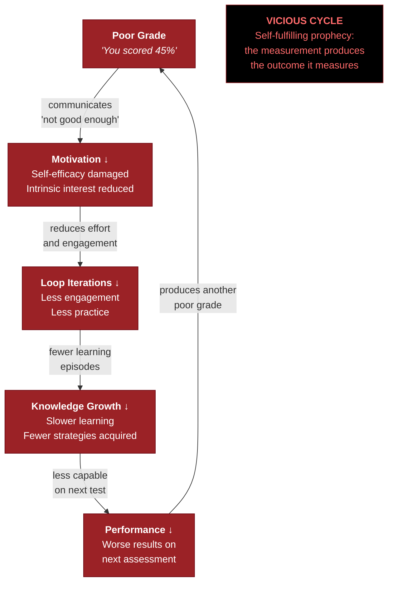

# The School Grade Disaster

**Conventional grading systems function as motivation-destroying interventions that reverse the recursive intelligence loop — producing a self-fulfilling prophecy in the precise technical sense (Merton, 1948) where the measurement system creates the outcome it claims to measure.**

If intelligence is a [recursive system](../intelligence/recursive-loop.md) driven primarily by [Motivation](../intelligence/three-components.md) and [Knowledge](../intelligence/operational-knowledge.md), then any system that systematically destroys motivation in learners is not merely failing to develop intelligence — it is actively suppressing it. The Recursive Intelligence Model argues that conventional grading does exactly this.

## The Mechanism

Consider what happens when a child receives a poor grade. The grade is presented as a measurement — an objective assessment of the child's ability or performance. Through the lens of the recursive model, the grade functions as an **intervention on the Motivation component**.

A poor grade communicates: *you are not good enough at this.* For a child who has not yet developed a robust growth mindset — which is most children — this translates directly into: *you are not intelligent enough.* The child's self-efficacy is damaged. Intrinsic motivation to engage with the subject diminishes. Willingness to invest effort — the fuel of the recursive loop — is reduced.

This is not speculation. The broader Pygmalion findings — that teacher expectations influence student performance (Rosenthal, 2002; Jussim & Harber, 2005) — document the mechanism from the positive direction. The stereotype threat literature ([Steele & Aronson, 1995](https://doi.org/10.1037/0022-3514.69.5.797)) documents it from the negative direction: when individuals are made aware of negative intellectual stereotypes about their group, their cognitive performance measurably declines — not from any change in ability but from motivational disruption.

## The Vicious Cycle

The recursive model makes the dynamic structurally precise:

1. A poor grade attacks **Motivation** (M).
2. Reduced M means fewer iterations of the recursive loop.
3. Fewer iterations mean slower growth in **Knowledge** (K).
4. Slower K growth means worse performance on subsequent assessments.
5. Worse performance produces more poor grades.
6. More poor grades further damage M.

The loop has reversed. Instead of a virtuous cycle of compounding growth, the child is trapped in a vicious cycle of compounding stagnation. The grading system is not merely measuring an outcome — it is producing the outcome it claims to measure.

This is a self-fulfilling prophecy in Merton's (1948) precise technical sense. And the recursive model explains *why* it is self-fulfilling: because intelligence is a recursive system, any intervention that suppresses one component has [compounding effects](../education/compounding-effects.md) on all components over time.

## Why "Fair Grading" Does Not Fix It

The problem is not that grades are sometimes unfair or inaccurate. The problem is structural. Even a perfectly calibrated grade — one that accurately reflects current performance — damages Motivation in students who score below the reference group. The information "you are currently below average" is motivationally toxic regardless of its accuracy, because the recursive model's dynamics make it self-reinforcing.

Grading systems that rank students against each other are particularly destructive: by definition, half the class must be "below average," ensuring that the recursive loop is reversed for a large proportion of students regardless of their absolute capability.

## The Cost

The cost is measured in children who stop trying. In potential unrealized. In minds told they are not enough, who internalize that assessment, and whose recursive loops stall at an age when compounding gains would have been largest. The recursive model predicts that the damage from early motivational destruction accelerates over time — diverging trajectories that fan out with each passing year. Early childhood is precisely when the loop's compounding dynamics are most powerful, which means early motivational damage is maximally destructive.

## Figure

## Key Takeaway

Conventional grading is not a neutral measurement instrument. Through the lens of the recursive intelligence model, it is a systematic intervention on the Motivation component that reverses the recursive loop for a significant proportion of students — producing the very intellectual stagnation it then documents as "low ability." The measurement system creates its own evidence.

## See Also

- [The Recursive Loop](../intelligence/recursive-loop.md)
- [Intelligence Is Learnable](../education/intelligence-learnable.md)
- [Compounding Effects: A Structural Prediction](../education/compounding-effects.md)
- [Educational Implications](../education/educational-implications.md)
- [The Matthew Effect and Compounding](../intelligence/matthew-effect.md)
