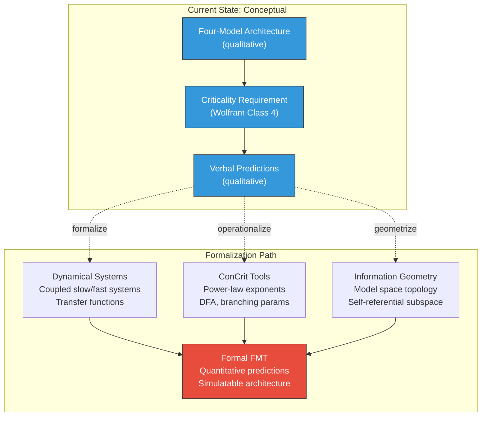

# Toward Mathematical Formalization

**The Four-Model Theory is specified at a level of precision that makes mathematical formalization tractable — and the ConCrit framework, dynamical systems theory, and information geometry provide the starting points.**

The theory's criticality requirement is currently specified qualitatively: the substrate must operate at Wolfram's Class 4 regime. Its predictions are stated in qualitative terms: "criticality increases," "permeability changes," "the ESM redirects." A full mathematical treatment — defining the four models formally, specifying the criticality threshold in measurable quantities, deriving predictions as formal consequences — is the natural next step after the conceptual architecture has been evaluated through peer review.

## Why Formalization Matters

Mathematical formalization transforms three categories of theoretical content:

**Qualitative claims become quantitative predictions.** "The substrate must operate at criticality" becomes a specification in terms of branching parameters, power-law exponents, or Lempel-Ziv complexity values. "Variable permeability" becomes a transfer function with measurable parameters. "The ESM redirects" becomes a dynamical systems attractor shift with calculable basin properties.

**Derived phenomena become formal consequences.** The theory's explanatory range — from psychedelic phenomenology to split-brain phenomena to sleep states — currently relies on verbal reasoning. Formalization would allow these phenomena to be *derived* from the axioms, making the theory's internal consistency checkable and its predictions more precise.

**The architecture becomes simulatable.** A formal specification of the four models, their interactions, and the criticality requirement would enable computational simulation — a direct path toward the engineering specification for artificial consciousness.

## Starting Points

Three established mathematical frameworks offer natural entry points:

### The ConCrit Framework

The Consciousness and Criticality (ConCrit) framework ([Algom & Shriki, 2026](https://doi.org/10.1016/j.neubiorev.2026.105614)) provides mathematical tools developed specifically for the criticality-consciousness relationship: **power-law exponents** for neuronal avalanche distributions, **detrended fluctuation analysis** (DFA) for long-range temporal correlations, **branching parameters** for propagation dynamics, and **Lempel-Ziv complexity** for information content (see [Information-Theoretic Measures](information-theoretic.md)). These tools can operationalize the criticality threshold — specifying the exact parameter ranges that distinguish Class 4 from adjacent classes.

### Dynamical Systems Theory

The four models can be formalized as coupled dynamical systems. The **implicit models** (IWM, ISM) are slow-timescale systems (changing over days to years through learning), while the **explicit models** (EWM, ESM) are fast-timescale systems (changing at ~20 Hz). The implicit-explicit boundary becomes a transfer function. Variable permeability becomes a parameter controlling information flow between slow and fast systems. The self-referential closure of the ESM becomes a fixed-point property of the coupled system.

### Information Geometry

The four models can be represented as points or distributions in an information-geometric space. The **real/virtual split** maps to a distinction between structural parameters (which define the manifold) and dynamic trajectories (which move along it). The **graduated levels of consciousness** map to the dimensionality of the self-referential subspace. This approach connects naturally to IIT's mathematical framework while avoiding its panpsychist commitments.

## The Sequencing Argument

The theory is presented at the conceptual level first, with formalization deferred, for a deliberate reason. To expect both the theoretical model and its full mathematical apparatus from a single author — prior to any peer evaluation of the model's conceptual soundness — inverts the usual scientific workflow. Conceptual frameworks are typically formalized *after*, not before, they are evaluated for theoretical merit. Quantum mechanics was proposed qualitatively (Bohr, Heisenberg) before being formalized (Dirac, von Neumann). The theory of evolution was conceptual (Darwin) before being mathematized (Fisher, Wright, Haldane).

The Four-Model Theory is specified precisely enough that formalization is tractable. The four models are defined by two binary axes (scope and mode). The criticality requirement invokes a well-characterized mathematical regime. The predictions specify measurable quantities. What remains is the mathematical work itself.

## Figure

*The path from conceptual to formal theory. Three mathematical frameworks provide complementary entry points: dynamical systems (for the four-model interactions), ConCrit tools (for operationalizing criticality), and information geometry (for the topology of model space). The target is a unified formal treatment that generates quantitative, simulatable predictions.*

## Key Takeaway

Mathematical formalization of the Four-Model Theory is tractable and overdue. The ConCrit framework, dynamical systems theory, and information geometry provide the tools. The conceptual architecture is precise enough to formalize; what remains is the mathematical work itself.

## See Also

- [Information-Theoretic Measures](information-theoretic.md)
- [The Holography-Criticality Nexus](holography-criticality.md)
- [RIM Formalization](rim-formalization.md)
- [The Criticality Requirement](../physical-foundations/criticality.md)
- [Wolfram's Four Classes](../physical-foundations/wolfram-classes.md)

---

Based on: Gruber, M. (2026). The Four-Model Theory of Consciousness. Zenodo. https://doi.org/10.5281/zenodo.18669891
