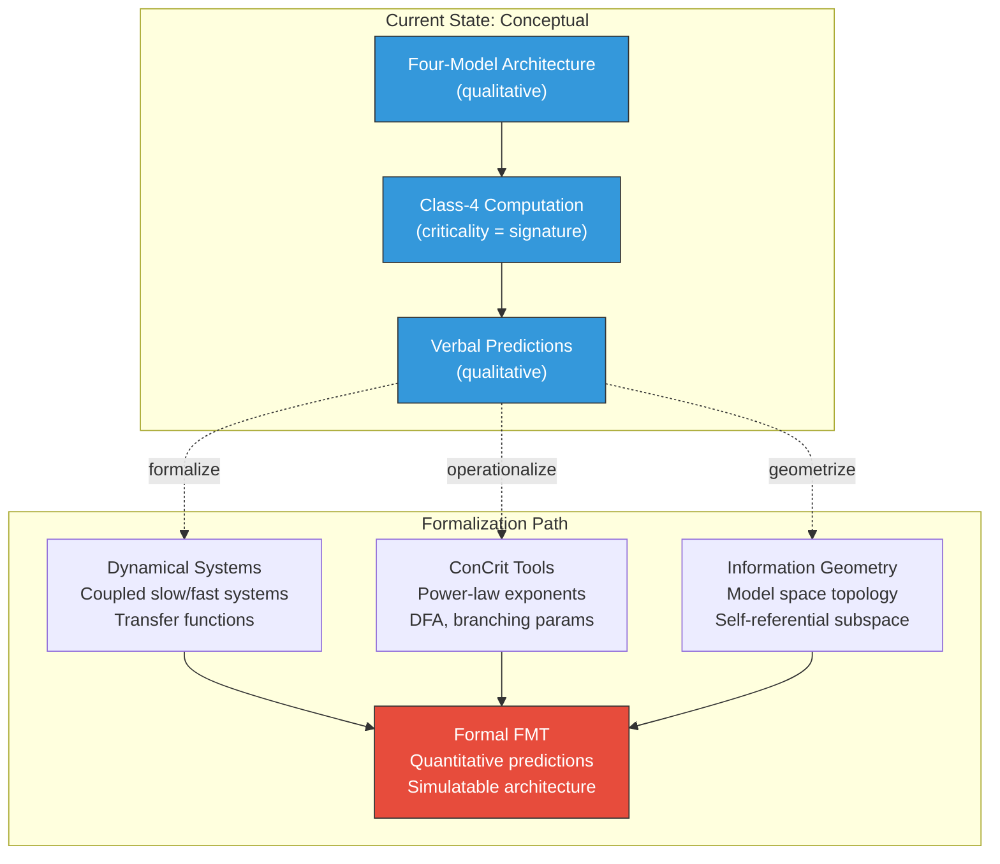

# Toward Mathematical Formalization

**The Four-Model Theory is specified at a level of precision that makes mathematical formalization tractable — and the ConCrit framework, dynamical systems theory, and information geometry provide the starting points.**

The theory's free-compute requirement is currently specified qualitatively: the substrate must have Wolfram Class-4 (universal-computation) capability and actually deploy it on open-ended self-modeling, with criticality as the dynamical signature this leaves. Its predictions are stated in qualitative terms: "criticality increases," "permeability changes," "the ESM redirects." A full mathematical treatment — defining the four models formally, specifying the criticality signature in measurable quantities, deriving predictions as formal consequences — remains to be developed; a formalization roadmap sets out the recommended approach ([Gruber, 2026b](https://doi.org/10.5281/zenodo.21843693)).

## Why Formalization Matters

Mathematical formalization transforms three categories of theoretical content:

**Qualitative claims become quantitative predictions.** "The substrate is in the Class 4 regime" becomes a specification in terms of branching parameters, DFA exponents, and avalanche power-law exponents. "Variable permeability" becomes a transfer function with measurable parameters. "The ESM redirects" becomes a dynamical systems attractor shift with calculable basin properties.

**Derived phenomena become formal consequences.** The theory's explanatory range — from psychedelic phenomenology to split-brain phenomena to sleep states — currently relies on verbal reasoning. Formalization would allow these phenomena to be *derived* from the axioms, making the theory's internal consistency checkable and its predictions more precise.

**The architecture becomes simulatable.** A formal specification of the four models, their interactions, and the free-compute requirement enables computational simulation of the architecture's component mechanisms. An in-silico research program has begun this in model systems ([Gruber, 2026d](https://doi.org/10.5281/zenodo.21610993)); it tests mechanisms and does not attempt to build consciousness.

## Starting Points

Three established mathematical frameworks offer natural entry points:

### The ConCrit Framework

The Consciousness and Criticality (ConCrit) framework (Algom & Shriki, 2026, *Neuroscience & Biobehavioral Reviews*) provides mathematical tools developed specifically for the criticality-consciousness relationship: **power-law exponents** for neuronal avalanche distributions, **detrended fluctuation analysis** (DFA) for long-range temporal correlations, and **branching parameters** for propagation dynamics; **Lempel-Ziv complexity** adds a measure of the richness of the dynamics (see [Information-Theoretic Measures](information-theoretic.md)). These tools can quantify the criticality signature — specifying the parameter ranges of the regime's measurable signatures. Which class a given automaton belongs to is formally undecidable, so the commitment is to those signatures rather than to a proof of class membership.

### Dynamical Systems Theory

The four models can be formalized as coupled dynamical systems. The **implicit models** (IWM, ISM) are slow-timescale systems (changing over days to years through learning), while the **explicit models** (EWM, ESM) are fast-timescale systems (updating at perceptual frame rates, typically 7–13 Hz and up to about 20 Hz). The implicit-explicit boundary becomes a transfer function. Variable permeability becomes a parameter controlling information flow between slow and fast systems. The self-referential closure of the ESM becomes a fixed-point property of the coupled system.

### Information Geometry

The four models can be represented as points or distributions in an information-geometric space. The **real/virtual split** maps to a distinction between structural parameters (which define the manifold) and dynamic trajectories (which move along it). The **graduated levels of consciousness** map to the dimensionality of the self-referential subspace. This approach connects naturally to IIT's mathematical framework while avoiding its panpsychist commitments.

## Current Status

A formalization roadmap translating the theory's structural commitments into mathematical notation exists ([Gruber, 2026b](https://doi.org/10.5281/zenodo.21843693)). Quantitative operationalization — effect sizes, measurement protocols, falsification thresholds — requires collaboration with empirical laboratories, and the model systems of the in-silico program supply a concrete setting in which the formal quantities can be operationalized.

The Four-Model Theory is specified precisely enough that formalization is tractable. The four models are defined by two axes (scope and mode). The free-compute requirement invokes a well-characterized dynamical regime. The predictions specify measurable quantities.

## Figure

```mermaid
graph TD
    subgraph "Current State: Conceptual"
        A["Four-Model Architecture<br/>(qualitative)"] --> B["Class-4 Computation<br/>(criticality = signature)"]
        B --> C["Verbal Predictions<br/>(qualitative)"]
    end

    subgraph "Formalization Path"
        D["Dynamical Systems<br/>Coupled slow/fast systems<br/>Transfer functions"] --> G["Formal FMT<br/>Quantitative predictions<br/>Simulatable architecture"]
        E["ConCrit Tools<br/>Power-law exponents<br/>DFA, branching params"] --> G
        F["Information Geometry<br/>Model space topology<br/>Self-referential subspace"] --> G
    end

    C -.->|"formalize"| D
    C -.->|"operationalize"| E
    C -.->|"geometrize"| F

    style G fill:#e74c3c,stroke:#333,color:#fff
    style A fill:#3498db,stroke:#333,color:#fff
    style B fill:#3498db,stroke:#333,color:#fff
    style C fill:#3498db,stroke:#333,color:#fff
```

*The path from conceptual to formal theory. Three mathematical frameworks provide complementary entry points: dynamical systems (for the four-model interactions), ConCrit tools (for operationalizing criticality), and information geometry (for the topology of model space). The target is a unified formal treatment that generates quantitative, simulatable predictions.*

## Key Takeaway

Mathematical formalization of the Four-Model Theory is tractable, and a roadmap exists. The ConCrit framework, dynamical systems theory, and information geometry provide the tools; quantitative operationalization is the work that remains.

## See Also

- [Information-Theoretic Measures](information-theoretic.md)
- [The Holography-Criticality Nexus](holography-criticality.md)
- [RIM Formalization](rim-formalization.md)
- [Criticality: Signature, Not Requirement](../physical-foundations/criticality.md)
- [Wolfram's Four Classes](../physical-foundations/wolfram-classes.md)

---

Based on: Gruber, M. (2026). The Four-Model Theory of Consciousness. Zenodo. https://doi.org/10.5281/zenodo.18669891
