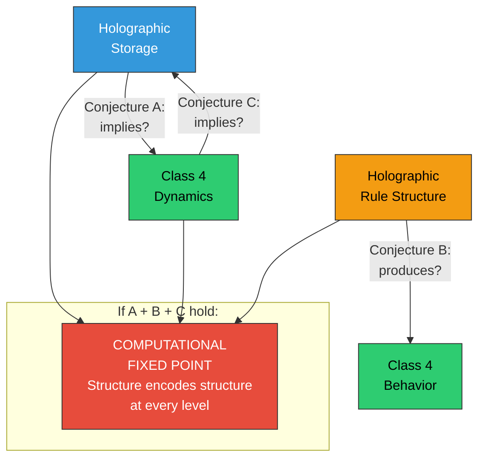

# The Holography-Criticality Nexus

**The formal relationship between holographic information storage and Class 4 criticality remains unexplored — three distinct conjectures frame the question, and their intersection suggests a computational fixed point.**

The Four-Model Theory invokes both **holographic storage** (the implicit models store information in a distributed manner where each part contains a degraded version of the whole) and **Class 4 criticality** (the substrate must operate at the edge of chaos). Both are essential features. But are they independent requirements, or are they formally linked? This question lies at the intersection of cellular automata theory, information theory, and distributed computation.

## Three Conjectures

### Conjecture A: Holographic Substrate Implies Class 4 Dynamics

Does a neural substrate that stores information holographically — in the patchwork sense where damage degrades but does not destroy stored representations — *necessarily* exhibit Class 4 dynamics under appropriate driving conditions?

If yes, **criticality would be a consequence of the storage architecture** rather than an independent requirement. The theory's axioms would simplify: specify holographic storage, and criticality follows as a derived property. This would explain why the biological brain exhibits both features — not because evolution separately optimized for each, but because one entails the other.

The plausibility rests on the connection between distributed storage and long-range correlations. Holographic encoding requires that information about the whole is present in each part, which implies non-local correlations across the substrate — precisely the hallmark of critical dynamics.

### Conjecture B: Class 4 Automaton with Holographic Rule Structure

Can a cellular automaton be constructed whose *transition rules themselves* are defined holographically — where each cell's update rule is a distributed function of the global rule set, degrading gracefully under partial rule deletion?

Such a system would unify holographic and criticality principles at the level of the automaton's *definition* rather than its behavior. The rules would be as distributed as the information they process. Partial damage to the rule set would degrade functionality gradually rather than producing catastrophic failure — a property observed in biological brains (graceful degradation under cortical lesions) but not in most computational architectures.

Constructing and characterizing such a system would constitute progress toward mathematical formalization of the entire theory.

### Conjecture C: Class 4 Dynamics Implies Holographic Emergent Behavior

Does a Class 4 automaton, regardless of its rule structure, *necessarily* produce holographic-like properties in its emergent patterns — distributed information, graceful degradation, part-contains-whole structure?

If demonstrable, the holographic character of neural information storage would be *derivable from the criticality requirement alone*. The theory would need only one physical prerequisite (criticality), with holographic storage emerging as a consequence.

## The Computational Fixed Point

The most intriguing possibility is that *multiple conjectures hold simultaneously*. A system satisfying both (A) and (B) — holographic rules generating holographic output through Class 4 dynamics — would constitute a **computational fixed point**: a process that encodes its own structure at every level.

The concept is recursive in the deepest sense: the system's rules are distributed like its information, its dynamics produce the same distributional character they operate on, and the whole is reflected in each part at every level of description. If such a system exists, it would suggest a deep connection between critical computation, holographic encoding, and self-referential structure — potentially relevant to questions about the computational nature of physical law that extend well beyond consciousness science.

This fixed-point concept resonates with the theory's treatment of consciousness as self-referential closure: a system that models itself modeling itself. A computational fixed point where structure encodes structure at every level is the mathematical analogue of a cognitive system whose self-model includes the fact that it self-models.

## Figure

*Three conjectures about the holography-criticality relationship. Conjecture A: holographic storage implies critical dynamics. Conjecture B: holographic rules produce Class 4 behavior. Conjecture C: Class 4 dynamics produce holographic emergent properties. If multiple conjectures hold, the system is a computational fixed point — encoding its own structure at every level.*

## Status and Invitation

These conjectures are well-defined mathematical problems. They are speculative and lie at the boundary of the theory's current scope, but they are tractable for researchers in cellular automata theory, distributed computation, and information theory. Resolving which relationships hold (and whether multiple hold simultaneously) may bear on questions in computational complexity well beyond consciousness science.

## Key Takeaway

The relationship between holographic storage and Class 4 criticality — both essential to the Four-Model Theory — may not be coincidental. Three formal conjectures frame the possible relationships, and their intersection points toward a computational fixed point that would fundamentally unify the theory's physical foundations.

## See Also

- [Holographic Storage](../mechanisms/holographic-storage.md)
- [The Criticality Requirement](../physical-foundations/criticality.md)
- [Toward Mathematical Formalization](formalization.md)
- [The Cortical Automaton](../physical-foundations/cortical-automaton.md)

---

Based on: Gruber, M. (2026). The Four-Model Theory of Consciousness. Zenodo. https://doi.org/10.5281/zenodo.18669891
