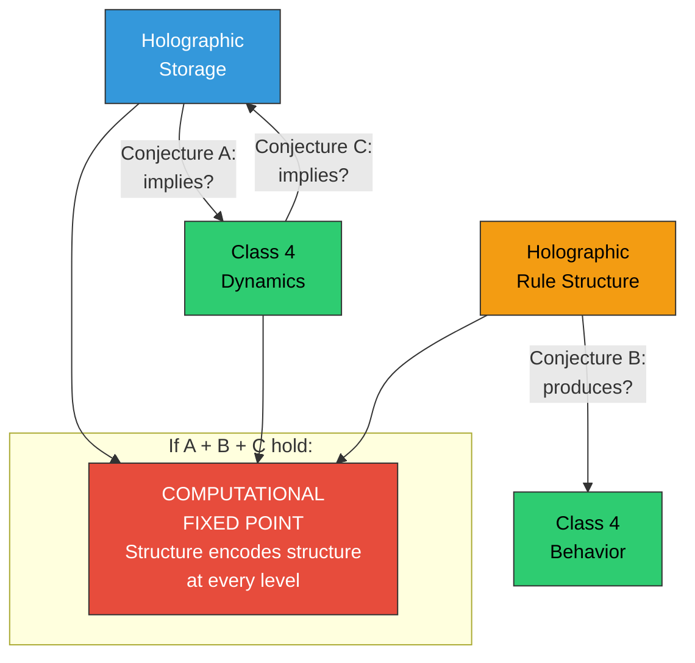

# The Holography-Criticality Nexus

**Whether holographic information storage and the Class 4 regime are formally linked is an open question. Three conjectures frame it; if all three held in one system, that system would be a computational fixed point.**

The three conjectures and the fixed-point proposal come from Gruber (2015) and are restated in the cosmology paper ([Gruber, 2026, §6.1](https://doi.org/10.5281/zenodo.18698605)), which develops the fixed point as a model of cosmological structure. The Four-Model Theory paper does not state them. All three are open.

The Four-Model Theory uses both **holographic storage** (the implicit models store information in a distributed manner where each part contains a degraded version of the whole; the explicit models are processes, not stored structures, and are not holographic) and the **Class 4 regime** (the open-ended computational regime a substrate occupies when it spends free compute on self-simulation, whose signature in neural tissue is near-criticality). Whether the two are independent or formally linked is not settled.

## Three Conjectures

### Conjecture A: Holographic Substrate Implies Class 4 Dynamics

Does a neural substrate that stores information holographically — in the patchwork sense where damage degrades but does not destroy stored representations — *necessarily* exhibit Class 4 dynamics under appropriate driving conditions?

If yes, **criticality would be a consequence of the storage architecture** rather than an independently specified feature. The theory's axioms would simplify: specify holographic storage, and criticality follows as a derived property. It would also mean the biological brain shows both features because one entails the other, with no separate selection for each.

### Conjecture B: Class 4 Automaton with Holographic Rule Structure

Can a cellular automaton be constructed whose *transition rules themselves* are defined holographically — where each cell's update rule is a distributed function of the global rule set, degrading gracefully under partial rule deletion?

Such a system would unify holographic storage and critical dynamics at the level of the automaton's *definition* rather than its behavior. The rules would be as distributed as the information they process. Partial damage to the rule set would degrade functionality gradually rather than producing catastrophic failure.

### Conjecture C: Class 4 Dynamics Implies Holographic Emergent Behavior

Does a Class 4 automaton, regardless of its rule structure, *necessarily* produce holographic-like properties in its emergent patterns — distributed information, graceful degradation, part-contains-whole structure?

If demonstrable, the holographic character of neural information storage would be *derivable from Class 4 dynamics alone*. The theory would need only one physical requirement — free compute, whose dynamical signature is criticality — with holographic storage emerging as a consequence.

## The Computational Fixed Point

Gruber (2015) proposed that if all three relationships held in a single system — holographic rules, Class 4 dynamics, holographic output — the result would be a **computational fixed point**: a system that encodes itself. Its rules would be distributed like its information, and its dynamics would produce the same distributional character they operate on. Whether such a system exists is open. The cosmology paper develops the idea as a model of physical structure ([Gruber, 2026](https://doi.org/10.5281/zenodo.18698605)); it draws a structural correspondence with the self-referential closure of a self-model and states that the shared notation is not an identity of operators.

## Figure

```mermaid
graph TD
    H["Holographic<br/>Storage"] -->|"Conjecture A:<br/>implies?"| C4["Class 4<br/>Dynamics"]
    C4 -->|"Conjecture C:<br/>implies?"| H

    HR["Holographic<br/>Rule Structure"] -->|"Conjecture B:<br/>produces?"| C4B["Class 4<br/>Behavior"]

    subgraph "If A + B + C hold:"
        FP["COMPUTATIONAL<br/>FIXED POINT<br/>Structure encodes structure<br/>at every level"]
    end

    H --> FP
    C4 --> FP
    HR --> FP

    style FP fill:#e74c3c,stroke:#333,color:#fff
    style H fill:#3498db,stroke:#333,color:#fff
    style C4 fill:#2ecc71,stroke:#333,color:#000
    style HR fill:#f39c12,stroke:#333,color:#000
    style C4B fill:#2ecc71,stroke:#333,color:#000
```

*Three conjectures about the holography-criticality relationship. Conjecture A: holographic storage implies critical dynamics. Conjecture B: holographic rules produce Class 4 behavior. Conjecture C: Class 4 dynamics produce holographic emergent properties. If all three hold in one system, it is a computational fixed point: a system that encodes itself.*

## Status

The conjectures are stated verbally, and none has been proved or refuted.

## Key Takeaway

Holographic storage of the implicit models and the Class 4 regime both appear in the Four-Model Theory; whether they are formally linked is open. Three conjectures from Gruber (2015) frame the possible links, and a system satisfying all three would be a computational fixed point.

## See Also

- [Holographic Storage](../mechanisms/holographic-storage.md)
- [Criticality: Signature, Not Requirement](../physical-foundations/criticality.md)
- [Toward Mathematical Formalization](formalization.md)
- [The Cortical Automaton](../physical-foundations/cortical-automaton.md)

---

Based on: Gruber, M. (2026). The Four-Model Theory of Consciousness. Zenodo. https://doi.org/10.5281/zenodo.18669891; Gruber, M. (2026). The Singularity-Bounded Holographic Class 4 Automaton. Zenodo. https://doi.org/10.5281/zenodo.18698605
