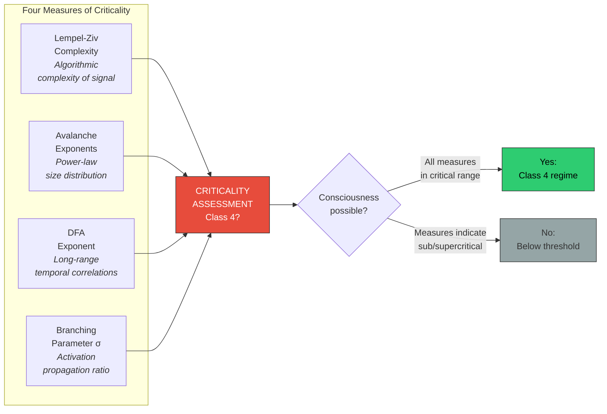

# Information-Theoretic Measures

**Four families of measurable quantities operationalize the Four-Model Theory's criticality requirement: Lempel-Ziv complexity, neuronal avalanche exponents, detrended fluctuation analysis, and branching parameters.**

The theory's criticality requirement — that the substrate must operate at Wolfram's Class 4 regime — is a qualitative specification. To test it empirically, it must be translated into measurable quantities. The neuroscience of criticality has developed precisely these tools, consolidated in the ConCrit framework ([Algom & Shriki, 2026](https://doi.org/10.1016/j.neubiorev.2026.105614)) and the meta-analysis of [Hengen & Shew (2025)](https://doi.org/10.1016/j.tins.2024.11.007).

## Lempel-Ziv Complexity (LZc)

**Lempel-Ziv complexity** measures the algorithmic complexity of a signal — roughly, how many distinct patterns it contains. Applied to neural signals (EEG, MEG), LZc quantifies the informational richness of brain dynamics.

At criticality, LZc is **submaximal but high**: more complex than periodic (Class 2) signals, less complex than random (Class 3) signals. This intermediate complexity is the signature of Class 4 dynamics — structured enough to carry information, variable enough to process it.

Empirical findings consistently show that LZc tracks consciousness level:
- **High LZc**: Normal waking, psychedelic states (at or past criticality)
- **Intermediate LZc**: REM sleep (near criticality)
- **Low LZc**: Deep NREM, propofol anesthesia (subcritical)
- **Maximal LZc**: Seizure onset (approaching Class 3 chaos)

[Schartner et al. (2017)](https://doi.org/10.1038/s41598-017-16924-0) demonstrated that LZc distinguishes between anesthetic agents that produce unconsciousness (propofol: low LZc) and those that produce altered consciousness (ketamine: high LZc) — precisely the distinction the Four-Model Theory predicts based on whether the agent pushes the substrate subcritical or merely disrupts its inputs.

## Neuronal Avalanche Exponents

A **neuronal avalanche** is a cascade of neural activity triggered by a single event and propagating through the network. At criticality, the distribution of avalanche sizes follows a **power law**: many small avalanches, fewer medium ones, very few large ones, with no characteristic scale.

The critical exponent (typically near -3/2 for size distribution and -2 for duration distribution) is the signature of self-organized criticality ([Beggs & Plenz, 2003](https://doi.org/10.1523/JNEUROSCI.23-35-11167.2003)). Deviations from these exponents indicate departure from criticality:
- **Steeper exponents** (subcritical): Activity dies out too quickly — avalanches are too small
- **Shallower exponents** (supercritical): Activity propagates too freely — avalanches grow uncontrollably
- **Power-law with critical exponents**: The system is at the edge — information propagates across the network without either dying out or exploding

This provides a direct, quantitative test of whether a system operates at the criticality threshold the theory requires.

## Detrended Fluctuation Analysis (DFA)

**DFA** measures long-range temporal correlations in a signal. At criticality, neural dynamics exhibit temporal correlations that extend across multiple timescales — a single perturbation influences dynamics seconds to minutes later, producing a **DFA exponent** near 0.75 (between uncorrelated random noise at 0.5 and deterministic structure at 1.0).

This measure captures a crucial aspect of Class 4 dynamics: temporal depth. A system at criticality does not simply respond to the current input — it integrates information across time, maintaining a "memory" of past states that influences future dynamics. This temporal integration is precisely what the theory requires for sustained self-simulation: the explicit models must maintain coherent content across time, not merely react to moment-by-moment input.

## Branching Parameter (sigma)

The **branching parameter** measures the average number of descendant activations triggered by a single neural activation. At criticality, sigma = 1: each activation triggers, on average, exactly one subsequent activation. Activity neither dies out (sigma < 1, subcritical) nor explodes (sigma > 1, supercritical).

[Priesemann et al. (2013, 2014)](https://doi.org/10.3389/fnsys.2014.00108) found that the waking brain operates slightly *below* criticality (sigma ≈ 0.98) — a small safety margin that prevents seizure-like runaway activation while maintaining near-maximal computational capacity. This "slightly subcritical" finding is consistent with the theory: the brain operates *near* the edge of chaos, not necessarily *at* it, balancing computational power against stability.

## Figure

*Four complementary measures converge on a single question: is the system operating at criticality? Lempel-Ziv complexity captures informational richness, avalanche exponents capture spatial propagation, DFA captures temporal depth, and the branching parameter captures activation dynamics. Together, they provide a quantitative operationalization of the theory's qualitative criticality requirement.*

## Key Takeaway

The criticality requirement is not merely philosophical — it is measurable. Four established information-theoretic measures (LZc, avalanche exponents, DFA, branching parameter) operationalize the Class 4 regime, enabling direct empirical testing of the theory's physical foundation.

## See Also

- [The Criticality Requirement](../physical-foundations/criticality.md)
- [Wolfram's Four Classes](../physical-foundations/wolfram-classes.md)
- [Criticality Evidence](../predictions/criticality-evidence.md)
- [Toward Mathematical Formalization](formalization.md)

---

Based on: Gruber, M. (2026). The Four-Model Theory of Consciousness. Zenodo. https://doi.org/10.5281/zenodo.19064950
