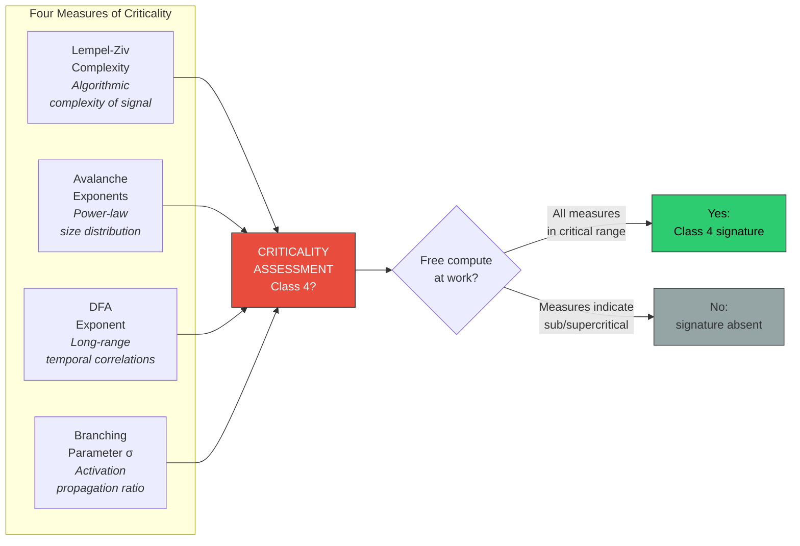

# Information-Theoretic Measures

**Four families of measurable quantities bear on the signature the Four-Model Theory predicts: neuronal avalanche exponents, detrended fluctuation analysis, and branching parameters as convergent criticality signatures, and Lempel-Ziv complexity as a measure of how rich the dynamics are.**

The theory's requirement is free compute — Wolfram Class-4 (universal-computation) capability actually deployed for open-ended self-modeling — and criticality is the dynamical signature this leaves in the substrate. That signature is stated qualitatively; to test it empirically, it must be translated into measurable quantities. The neuroscience of criticality has developed precisely these tools, consolidated in the ConCrit framework (Algom & Shriki, 2026) and the ~140-dataset meta-analysis of Hengen and Shew (2025). In the biological case the theory commits to the *convergence* of three signatures -- branching ratio, DFA exponent, and avalanche statistics -- with the DFA exponent as its primary operational measure. Lempel-Ziv complexity is a fourth, related family: it indexes the complexity (differentiation) of the dynamics rather than criticality itself.

## Lempel-Ziv Complexity (LZc)

**Lempel-Ziv complexity** measures the algorithmic complexity of a signal — roughly, how many distinct patterns it contains. Applied to neural signals (EEG, MEG), LZc quantifies the informational richness of brain dynamics.

LZc is not itself a criticality measure. It measures the *complexity* dimension of the dynamics -- how rich the computation is -- which the theory separates from *extent*, how much of the substrate is recruited into the critical process. It is useful as a complexity proxy that co-varies with criticality across states, not as a test of criticality.

Empirical findings consistently show that LZc tracks consciousness level:
- **High LZc**: Normal waking, psychedelic states (at or slightly past criticality, short of runaway)
- **Intermediate LZc**: REM sleep (near criticality)
- **Low LZc**: Deep NREM, propofol at surgical depth (subcritical)
- **Low LZc despite high co-activation**: Generalized seizure -- hypersynchronous, low-differentiation activity that has left Class 4 even though most of cortex is active

[Schartner et al. (2017)](https://doi.org/10.1038/srep46421) found increased spontaneous MEG signal diversity under psychoactive doses of ketamine, LSD, and psilocybin. Ketamine's rising entropy fits the distinction the Four-Model Theory draws: propofol pushes the substrate subcritical, and at surgical depth reportable experience is absent, while ketamine does not push it subcritical but disrupts its inputs, leaving consciousness present but disconnected.

## Neuronal Avalanche Exponents

A **neuronal avalanche** is a cascade of neural activity triggered by a single event and propagating through the network. At criticality, the distribution of avalanche sizes follows a **power law**: many small avalanches, fewer medium ones, very few large ones, with no characteristic scale.

The critical exponent (typically near -3/2 for size distribution and -2 for duration distribution) is the signature of self-organized criticality ([Beggs & Plenz, 2003](https://doi.org/10.1523/JNEUROSCI.23-35-11167.2003)). Deviations from these exponents indicate departure from criticality:
- **Steeper exponents** (subcritical): Activity dies out too quickly — avalanches are too small
- **Shallower exponents** (supercritical): Activity propagates too freely — avalanches grow uncontrollably
- **Power-law with critical exponents**: The system is at the edge — information propagates across the network without either dying out or exploding

This provides a quantitative test of whether a system shows the criticality signature the theory predicts, with two caveats. Non-critical processes can also produce apparent power laws ([Touboul & Destexhe, 2017](https://doi.org/10.1103/PhysRevE.95.012413)), which is why the theory commits to the convergence of several signatures rather than any one. And the markers need not come from a critical point at all: an extended phase of long-range order produces avalanche power laws and long-range correlations with no critical point, and such a phase still counts as a Class 4 regime ([Sipling, Zhang & Di Ventra, 2026](https://doi.org/10.1016/j.treopn.2026.06.001)).

## Detrended Fluctuation Analysis (DFA)

**DFA** measures long-range temporal correlations in a signal. At criticality, neural dynamics exhibit temporal correlations that extend across multiple timescales — a single perturbation influences dynamics seconds to minutes later, producing a **DFA exponent** α in the range 0.6–0.9 (between uncorrelated noise at 0.5 and non-stationary drift above 1.0). The theory designates α as its primary operational measure: it is computable from standard EEG/MEG without spike-level resolution and avoids the distributional ambiguities of power-law fitting in finite data.

This measure captures one aspect of Class 4 dynamics: temporal depth. A system at criticality does not simply respond to the current input — it integrates information across time, maintaining a "memory" of past states that influences future dynamics. This temporal integration is precisely what the theory requires for sustained self-simulation: the explicit models must maintain coherent content across time, not merely react to moment-by-moment input.

## Branching Parameter (sigma)

The **branching parameter** measures the average number of descendant activations triggered by a single neural activation. At criticality, sigma = 1: each activation triggers, on average, exactly one subsequent activation. Activity neither dies out (sigma < 1, subcritical) nor explodes (sigma > 1, supercritical).

[Priesemann et al. (2013, 2014)](https://doi.org/10.3389/fnsys.2014.00108) found that the waking brain operates slightly *below* criticality (sigma ≈ 0.98) — a small safety margin that prevents seizure-like runaway activation while retaining enough dynamic range and long-range correlation for coherent self-simulation. This "slightly subcritical" finding is consistent with the theory: the brain operates *near* the edge of chaos, not necessarily *at* it, balancing computational power against stability.

## Figure

```mermaid
graph LR
    subgraph "Four Measures of Criticality"
        LZ["Lempel-Ziv<br/>Complexity<br/><em>Algorithmic<br/>complexity of signal</em>"]
        AV["Avalanche<br/>Exponents<br/><em>Power-law<br/>size distribution</em>"]
        DFA["DFA<br/>Exponent<br/><em>Long-range<br/>temporal correlations</em>"]
        BR["Branching<br/>Parameter σ<br/><em>Activation<br/>propagation ratio</em>"]
    end

    LZ --> CRIT["CRITICALITY<br/>ASSESSMENT<br/>Class 4?"]
    AV --> CRIT
    DFA --> CRIT
    BR --> CRIT

    CRIT --> CON{"Free compute<br/>at work?"}
    CON -->|"All measures<br/>in critical range"| YES["Yes:<br/>Class 4 signature"]
    CON -->|"Measures indicate<br/>sub/supercritical"| NO["No:<br/>signature absent"]

    style CRIT fill:#e74c3c,stroke:#333,color:#fff
    style YES fill:#2ecc71,stroke:#333,color:#000
    style NO fill:#95a5a6,stroke:#333
```

*Four complementary measures bear on a single question: is the system operating in the Class 4 regime? Avalanche exponents capture spatial propagation, DFA captures temporal depth, and the branching parameter captures activation dynamics -- the three criticality signatures whose convergence the theory commits to. Lempel-Ziv complexity adds the richness of the dynamics as a complexity proxy. Together, they provide a quantitative operationalization of the signature the theory predicts — the fingerprint of free compute spent on self-modeling.*

## Key Takeaway

The criticality signature is measurable. Three convergent signatures (avalanche exponents, DFA, branching parameter), with Lempel-Ziv complexity as a complexity proxy, quantify the Class 4 regime in neural tissue, enabling empirical testing of the theory's physical foundation: free compute at work.

## See Also

- [Criticality: Signature, Not Requirement](../physical-foundations/criticality.md)
- [Wolfram's Four Classes](../physical-foundations/wolfram-classes.md)
- [Criticality Evidence](../predictions/confirmed.md)
- [Toward Mathematical Formalization](formalization.md)

---

Based on: Gruber, M. (2026). The Four-Model Theory of Consciousness. Zenodo. https://doi.org/10.5281/zenodo.18669891
