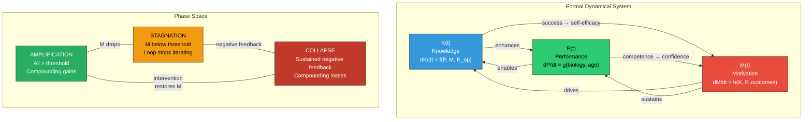

# RIM Formalization

**The Recursive Intelligence Model's K-P-M loop can be formalized as a coupled dynamical system with specifiable functional forms, developmental time dependence, and identifiable phase transitions between amplification, stagnation, and collapse.**

The Recursive Intelligence Model (RIM) proposes that intelligence is a recursive system of three interacting components — Knowledge (K), Performance (P), and Motivation (M). This architecture is currently described verbally. Formalizing it as a dynamical system is the next step, transforming verbal predictions into quantitative ones and enabling simulation, parameter estimation, and precise empirical testing.

## The System Specification

The recursive loop can be expressed as a system of coupled differential (or difference) equations describing how each component changes over time:

**Knowledge** grows through the interaction of performance capacity and motivational drive, modulated by the quality of available information:

> dK/dt = f(P, M, K_op, environment)

where K_op represents **operational knowledge** — the multiplicative component that accelerates the rate of all subsequent learning (see [Operational Knowledge](../intelligence/operational-knowledge.md)).

**Performance** has a biological baseline that changes with maturation and aging, modified by training effects:

> dP/dt = g(biology, training, age)

**Motivation** is driven by success/failure feedback and intrinsic disposition:

> dM/dt = h(K, P, outcomes, M_intrinsic)

The critical theoretical claim is that these equations are *coupled*: each variable appears in the others' update rules. This coupling is what produces recursive amplification — and what distinguishes the model from additive frameworks where K, P, and M contribute independently.

## Key Formal Properties

### The Multiplicative Role of Operational Knowledge

Operational knowledge (K_op) does not add to K linearly — it multiplies the *rate* of knowledge acquisition. Formally, K_op appears as a coefficient on the learning rate, not as an additive term. This means that a small increase in K_op has disproportionate long-term effects: it accelerates every subsequent iteration of the loop.

### Time Dependence and Developmental Stage

The system is not time-invariant. Performance (P) follows a biological trajectory: rising through childhood and adolescence, peaking in early adulthood, declining thereafter. The formal model must capture how the loop adapts to this changing substrate — explaining why crystallized intelligence (Gc, roughly corresponding to K) continues to grow even as fluid intelligence (Gf, roughly corresponding to P) declines (see [Gf-Gc Divergence](../intelligence/gf-gc-divergence.md)).

### Boundary Conditions and Phase Transitions

The loop exhibits three qualitative regimes:

**Amplification**: When all three components are above threshold, the loop iterates positively — each cycle produces gains that feed the next. Small initial advantages compound (the Matthew effect).

**Stagnation**: When Motivation drops below a critical threshold, the loop ceases to iterate despite adequate K and P. The individual has the capacity and knowledge to learn but lacks the drive. This explains the empirically observed phenomenon of "gifted underachievers."

**Collapse**: When sustained negative feedback (punitive grading, ability tracking, repeated failure) drives Motivation below recovery threshold, the loop reverses — each cycle produces losses that feed further decline. This is the compounding damage documented in the school grade analysis (see [Compounding Effects](../education/compounding-effects.md)).

The transitions between these regimes have the character of **bifurcations** in dynamical systems theory — qualitative changes in system behavior at critical parameter values.

## Figure

*Top: The K-P-M system as coupled differential equations with bidirectional interactions. Bottom: The three qualitative regimes (amplification, stagnation, collapse) and the bifurcation transitions between them. Motivation is the critical parameter — its value determines which regime the system occupies.*

## What Formalization Would Enable

Specifying functional forms for f, g, and h would allow:

1. **Parameter estimation** from longitudinal educational data (tracking K, P, and M indicators across years)
2. **Simulation** of intervention effects (what happens when you boost K_op vs. M vs. P?)
3. **Quantitative predictions** about compounding timescales (how many years until a motivation intervention shows larger-than-initial effects?)
4. **Individual trajectory modeling** (fitting the system to individual developmental data)
5. **Policy simulation** (modeling population-level effects of educational system changes)

## Key Takeaway

The K-P-M recursive loop is not merely a verbal model — it has the structure of a coupled dynamical system with well-defined components, interactions, and phase transitions. Formalizing it mathematically would transform qualitative insights into quantitative predictions and enable direct empirical testing through longitudinal data.

## See Also

- [The Recursive Loop](../intelligence/recursive-loop.md)
- [Toward Mathematical Formalization](formalization.md)
- [Compounding Effects](../education/compounding-effects.md)
- [Operational Knowledge](../intelligence/operational-knowledge.md)
- [The Three Components](../intelligence/three-components.md)

---

Based on: Gruber, M. (2026). Why Intelligence Models Must Include Motivation: A Recursive Framework. PsyArXiv. https://osf.io/preprints/osf/kctvg
