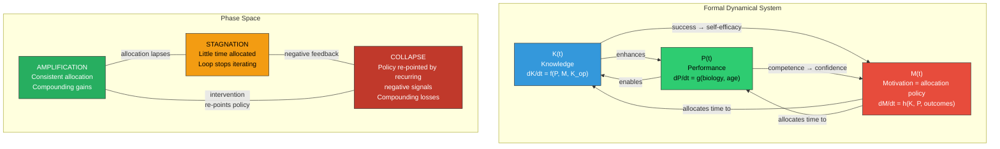

# RIM Formalization

**The Recursive Intelligence Model's K-P-M loop can be formalized as a coupled dynamical system with specifiable functional forms, developmental time dependence, and identifiable phase transitions between amplification, stagnation, and collapse.**

The Recursive Intelligence Model (RIM) proposes that intelligence is a recursive system of three interacting constituents — Knowledge (K), Performance (P), and Motivation (M) — that are not the same kind of thing. Performance is a capacity. Knowledge is stored content, divided into factual and operational knowledge. Motivation is the **allocation policy** over the loop: it decides how much of the loop runs, on what, and for how long. This architecture is currently described verbally. Formalizing it as a dynamical system is the next step, transforming verbal predictions into quantitative ones and enabling simulation, parameter estimation, and precise empirical testing. The RIM paper names the concrete starting point: add M as a node to a mutualism network (van der Maas et al., 2006) and ask whether the model's empirical signatures follow.

## The System Specification

The recursive loop can be expressed as a system of coupled differential (or difference) equations describing how each component changes over time:

**Knowledge** grows through performance capacity applied where the allocation policy points it, modulated by the quality of available information:

> dK/dt = f(P, M, K_op, environment)

where K_op represents **operational knowledge** — the multiplicative component that accelerates the rate of all subsequent learning (see [Operational Knowledge](../intelligence/operational-knowledge.md)).

**Performance** has a biological baseline that changes with maturation and aging, modified by training effects:

> dP/dt = g(biology, training, age)

**Motivation** is revised by the outcomes of the loop — success and failure in learning:

> dM/dt = h(K, P, outcomes, M_intrinsic)

Here M does not stand for a level of drive. It stands for a policy — how many iterations of the loop run, what they are pointed at, and how consistently — so its update rule changes where and how regularly time is allocated, not how much of a hidden quantity a person has. Motivation contributes no quantity to be summed with K and P; it is still a node of the loop and not an external input, because K and P have edges into it (the Matthew effect requires that success revise the schedule).

The critical theoretical claim is that these equations are *coupled*: each variable appears in the others' update rules. This coupling is what produces recursive amplification — and what distinguishes the model from additive frameworks where K, P, and M contribute independently.

## Key Formal Properties

### The Multiplicative Role of Operational Knowledge

Operational knowledge (K_op) does not add to K linearly — it multiplies the *rate* of knowledge acquisition. Formally, K_op appears as a coefficient on the learning rate, not as an additive term. This means that a small increase in K_op has disproportionate long-term effects: it accelerates every subsequent iteration of the loop.

### Time Dependence and Developmental Stage

The system is not time-invariant. Performance (P) follows a biological trajectory: rising through childhood and adolescence, peaking in early adulthood, declining thereafter. The formal model must capture how the loop adapts to this changing substrate — explaining why crystallized intelligence (Gc, roughly corresponding to K) continues to grow even as fluid intelligence (Gf, roughly corresponding to P) declines (see [Gf-Gc Divergence](../intelligence/gf-gc-divergence.md)).

### Boundary Conditions and Phase Transitions

The RIM paper leaves to a subsequent formal treatment the boundary conditions under which the loop amplifies, stagnates, or collapses. In outline, the three regimes are:

**Amplification**: When the allocation policy keeps the loop iterating consistently, each cycle produces gains that feed the next. Small initial advantages compound (the Matthew effect). Because the loop compounds through iteration count rather than iteration intensity, the model predicts that consistency of engagement, not its peak, carries long-term development.

**Stagnation**: When the policy allocates little of the loop's time to learning, the loop stops iterating despite adequate K and P. A child with high initial cognitive ability but poor allocation or poor learning strategies may stagnate.

**Collapse**: When a recurring signal (punitive grading, ability tracking, repeated failure) re-points the policy — away from the material and onto the evaluation, or away from the subject altogether — the loop runs in reverse: fewer iterations mean slower growth in K, worse performance on later assessments, and further discouraging signals. The model predicts this damage compounds (see [Compounding Effects](../education/compounding-effects.md)). What changes a policy is what recurs, which is why an institutional schedule of grades can do what a single motivational message cannot.

The transitions between these regimes would have the character of **bifurcations** in dynamical systems theory — qualitative changes in system behavior at critical parameter values.

## Figure

```mermaid
graph TD
    subgraph "Formal Dynamical System"
        K["K(t)<br/>Knowledge<br/>dK/dt = f(P, M, K_op)"]
        P["P(t)<br/>Performance<br/>dP/dt = g(biology, age)"]
        M["M(t)<br/>Motivation = allocation policy<br/>dM/dt = h(K, P, outcomes)"]

        K -->|"enhances"| P
        P -->|"enables"| K
        M -->|"allocates time to"| K
        M -->|"allocates time to"| P
        K -->|"success → self-efficacy"| M
        P -->|"competence → confidence"| M
    end

    subgraph "Phase Space"
        AMP["AMPLIFICATION<br/>Consistent allocation<br/>Compounding gains"]
        STAG["STAGNATION<br/>Little time allocated<br/>Loop stops iterating"]
        COL["COLLAPSE<br/>Policy re-pointed by recurring<br/>negative signals<br/>Compounding losses"]

        AMP ---|"allocation lapses"| STAG
        STAG ---|"negative feedback"| COL
        COL ---|"intervention<br/>re-points policy"| AMP
    end

    style K fill:#3498db,stroke:#333,color:#fff
    style P fill:#2ecc71,stroke:#333,color:#000
    style M fill:#e74c3c,stroke:#333,color:#fff
    style AMP fill:#27ae60,stroke:#333,color:#fff
    style STAG fill:#f39c12,stroke:#333,color:#000
    style COL fill:#c0392b,stroke:#333,color:#fff
```

*Top: The K-P-M system as coupled differential equations with bidirectional interactions. Bottom: The three qualitative regimes (amplification, stagnation, collapse) and the bifurcation transitions between them. Which regime the system occupies depends on where and how consistently the allocation policy points the loop, and on the operational knowledge that makes each iteration pay.*

## What Formalization Would Enable

Specifying functional forms for f, g, and h would allow:

1. **Parameter estimation** from longitudinal educational data (tracking K, P, and M indicators across years)
2. **Simulation** of intervention effects (what happens when you boost K_op vs. M vs. P?)
3. **Quantitative predictions** about compounding timescales (how many years until an intervention that re-points the allocation policy shows larger-than-initial effects?)
4. **Individual trajectory modeling** (fitting the system to individual developmental data)
5. **Policy simulation** (modeling population-level effects of educational system changes)

## Key Takeaway

The K-P-M recursive loop has the structure of a coupled dynamical system — one capacity, two knowledge stores, and one allocation policy, with defined interactions and three qualitative regimes whose boundaries remain to be derived. Formalizing it mathematically would transform qualitative insights into quantitative predictions and enable direct empirical testing through longitudinal data.

## See Also

- [The Recursive Loop](../intelligence/recursive-loop.md)
- [Toward Mathematical Formalization](formalization.md)
- [Compounding Effects](../education/compounding-effects.md)
- [Operational Knowledge](../intelligence/operational-knowledge.md)
- [Three Components, Three Kinds: Knowledge, Performance, Motivation](../intelligence/three-components.md)

---

Based on: Gruber, M. (2026). Motivation as Allocation Policy and the Mis-Typed Components of Intelligence. Zenodo. https://doi.org/10.5281/zenodo.20125095
