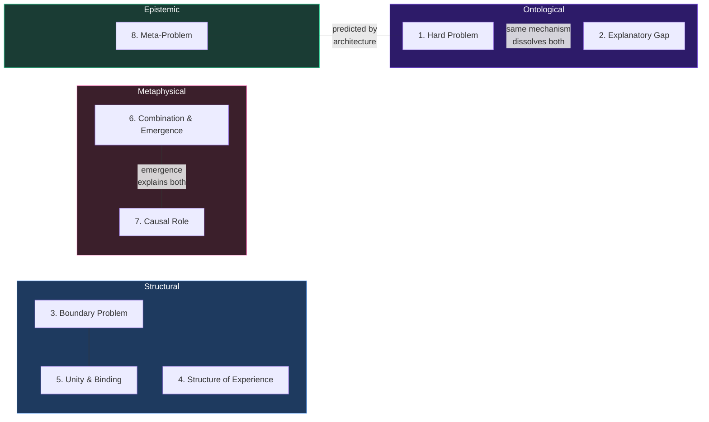

# Eight Requirements for a Theory of Consciousness

**Any theory claiming to provide a comprehensive account of consciousness must address eight core requirements simultaneously — not just the ones it finds convenient.**

The requirements are not novel individually; each has been identified by previous authors as a central challenge. What is novel is the demand that a single theory address all eight at once. Existing theories typically excel on two or three requirements while remaining silent on the rest. The Four-Model Theory was designed from the outset to address the full set.

## The Eight Requirements

### 1. The Hard Problem (Chalmers, 1995)

Why does physical processing give rise to subjective experience? Functional accounts explain discrimination, integration, and reporting — but not why there is "something it is like" to undergo these processes. Most neuroscientific theories (GNW, RPT, PP) remain silent on this. IIT attempts an answer through intrinsic causal power but inherits panpsychist commitments. Illusionism dissolves the problem by denying qualia exist as traditionally conceived.

### 2. The Explanatory Gap (Levine, 1983)

Why does the explanation of neural correlates feel incomplete? Even a perfect map of every neural correlate leaves something out — the gap between third-person description and first-person reality. This is distinct from the Hard Problem: it concerns the *form* of explanation rather than the *existence* of the phenomenon. A theory that dissolves the Hard Problem should close this gap simultaneously.

### 3. The Boundary Problem (Bayne, 2010; Tononi, 2004)

Where does the conscious system end? Within the brain, only some processing is conscious at any moment. Between organisms, the line is unclear. IIT's exclusion postulate offers the strongest existing treatment, but calculating the required measure (Phi) is computationally intractable. GNW defines boundaries through global broadcasting; PP uses Markov blankets.

### 4. The Structure of Experience (Nagel, 1974)

Conscious experience is richly structured — spatial, temporal, modal, and qualitative. A visual scene has colors, depths, and textures; auditory experience has pitch, timbre, and spatial location. Any complete theory must explain how physical processing generates this structured phenomenology. IIT's qualia space and PP's generative models provide partial accounts.

### 5. Unity and Binding (Treisman & Gelade, 1980; Revonsuo, 1999)

How are distributed neural processes — occurring in different brain regions, at different timescales, across different modalities — unified into a single coherent experience? Proposed solutions range from temporal synchrony to integrated information to global broadcasting. None is universally accepted.

### 6. Combination and Emergence (Chalmers, 2016)

How do non-conscious elements combine to produce consciousness? For panpsychist theories, this is the **Combination Problem**: how do micro-experiences combine into macro-experience? For physicalist theories, the challenge is emergence — at what point, and by what mechanism, does consciousness emerge? The Four-Model Theory navigates this through weak emergence within a five-system hierarchy.

### 7. The Causal Role (Jackson, 1982)

Does consciousness *do* anything? Epiphenomenalism is widely dismissed — evolution would not produce something causally inert — yet many mechanistic theories implicitly struggle to specify what the experience adds beyond the mechanism. The PP framework provides the strongest case for a functional role through active inference.

### 8. The Meta-Problem (Chalmers, 2018)

Why do we *think* there is a Hard Problem? Even if the Hard Problem is misformulated, the intuition that consciousness is deeply mysterious is itself a fact requiring explanation. AST provides the strongest existing account: the brain's model of its own attention necessarily omits mechanistic details, producing the intuition of non-physical mystery.

## Figure

## Key Takeaway

The eight requirements form a completeness test for consciousness theories. No existing theory prior to FMT addresses all eight simultaneously — most address two or three well and ignore the rest. The requirements are not a menu to pick from; they are a minimum specification.

## See Also

- [The Standard Model of Consciousness](../foundations/overview.md)
- [The Pre-Paradigm State of Consciousness Science](../foundations/pre-paradigm.md)
- [Hard Problem Dissolution](../hard-problem/hard-problem-dissolution.md)
- [The Meta-Problem Dissolved](../hard-problem/meta-problem-dissolved.md)
- [Comparative Scoreboard](../comparative/comparative-scoreboard.md)
