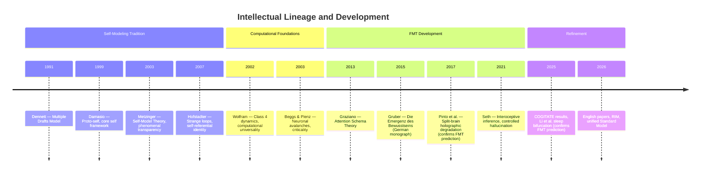

# Historical Context

**The Standard Model of Consciousness originates in *Die Emergenz des Bewusstseins* (Gruber, 2015), a German-language monograph that laid out the core architecture, and has been refined through a structured adversarial challenge process in 2026.**

The theory did not emerge from an academic laboratory but from a decade of independent theoretical work. Its intellectual lineage lies squarely within the self-modeling tradition in consciousness studies — the view that consciousness is constituted by, rather than merely correlated with, the system's model of itself.

## Origins: *Die Emergenz des Bewusstseins* (2015)

Matthias Gruber published *Die Emergenz des Bewusstseins* ("The Emergence of Consciousness") in 2015. The book presented the four-model architecture, the real/virtual split, the criticality requirement (derived independently from Wolfram's computational framework), and the core claim that qualia are constitutive properties of the computational level. The theory self-identified as an intersection of Dennett's Multiple Drafts Model (Dennett, 1991), Metzinger's Self-Model Theory of Subjectivity (Metzinger, 2003, 2009), and neural network architecture.

The 2015 publication predates several empirical findings that the theory's axioms predict: the anesthetic-criticality convergence, sleep-dependent criticality restoration, sleep onset as bifurcation (Li et al., 2025), and the holographic degradation pattern in split-brain patients (Pinto et al., 2017). This temporal precedence — predictions derived from first principles, subsequently confirmed by independent research groups — constitutes an unusual empirical track record for consciousness theories.

## The Self-Modeling Tradition

The Four-Model Theory belongs to a lineage of theories that ground consciousness in self-representation:

**Thomas Metzinger** (2003, 2009) analyzed the phenomenal self-model as a transparent representational structure — a model the system cannot recognize as a model, producing the naive realism of everyday experience. FMT adopts this insight and specifies the architecture: the Explicit Self Model (ESM) is Metzinger's phenomenal self-model given a precise functional role within a four-model system.

**Antonio Damasio** (1999, 2010) proposed a multi-level self framework — proto-self, core self, autobiographical self — grounding consciousness in progressively elaborated self-representations built from body-state monitoring. FMT's implicit-to-explicit progression echoes Damasio's hierarchical self-construction.

**Douglas Hofstadter** (2007) identified the self with self-referential symbolic structures — "strange loops" in which a system's highest-level patterns refer back to the system itself. FMT's self-referential closure mechanism formalizes a similar insight: the ESM models the system that is doing the modeling, collapsing the inside/outside distinction.

**Michael Graziano** (2013) proposed Attention Schema Theory, in which subjective awareness is the brain's simplified model of its own attention process. AST provides the strongest existing account of the Meta-Problem. FMT incorporates this insight — the ESM's inability to observe its own generative machinery explains why consciousness seems mysterious — while extending it to address the Hard Problem, which AST does not.

**Anil Seth** (2021) developed an interoceptive inference framework casting the experienced self as a "controlled hallucination" grounded in body-state prediction. Seth's emphasis on the predictive, constructive nature of self-experience aligns with FMT's treatment of the explicit models as generated simulations rather than passive reflections.

## What FMT Adds

The Four-Model Theory extends the self-modeling tradition in three specific ways:

1. **Minimal architecture specification.** Where predecessors described self-modeling as a general principle, FMT specifies the minimum architecture: four model kinds arranged along two axes (scope and mode). This transforms a conceptual insight into a concrete, testable structure.

2. **The criticality requirement.** No prior self-modeling theory specified a physical prerequisite for the substrate. FMT requires Class 4 dynamics (edge of chaos), derived from Wolfram's computational universality framework (Wolfram, 2002) and independently confirmed by the empirical criticality program in neuroscience.

3. **Two-level ontology.** The real/virtual split provides a dissolution of the Hard Problem unavailable to prior self-modeling accounts. Qualia exist at the computational level (virtual side) where they are constitutive, not at the substrate level (real side) where they would be mysterious.

## The 2026 Refinement

The theory underwent a structured adversarial challenge process in 2026, during which the English-language papers were written, predictions were sharpened, and the comparative analysis against all major frameworks was systematized. The Recursive Intelligence Model was developed in parallel, completing the unified framework by linking consciousness to intelligence through cognitive learning.

## Figure

## Key Takeaway

The Four-Model Theory is not a novel construction but a synthesis and extension of the self-modeling tradition, adding the three elements that tradition lacked: a minimum architecture, a physical prerequisite, and a two-level ontology that dissolves the Hard Problem.

## See Also

- [The Standard Model of Consciousness](../foundations/overview.md)
- [The Four-Model Theory](../core-architecture/four-model-theory.md)
- [FMT and the Self-Modeling Tradition](../comparative/self-modeling-tradition.md)
- [Virtual Qualia](../hard-problem/virtual-qualia.md)
- [The Criticality Requirement](../physical-foundations/criticality-requirement.md)
