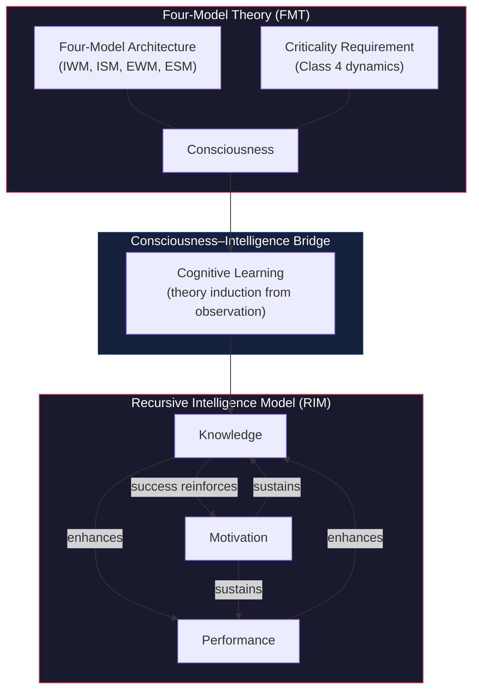

# The Standard Model of Consciousness

**The Standard Model of Consciousness is a unified theoretical framework comprising the Four-Model Theory of consciousness (FMT) and the Recursive Intelligence Model (RIM), together providing a complete account of what consciousness is, how it arises, and how it relates to intelligence.**

Consciousness and intelligence are typically studied as separate phenomena. The Standard Model treats them as causally linked through a specific cognitive capacity: consciousness enables cognitive learning (the induction of general theories from particular observations), which in turn enables the recursive intelligence loop that produces self-directed intellectual development. FMT specifies the architecture of consciousness; RIM specifies the dynamics of intelligence; the bridge between them explains why conscious systems learn differently from unconscious ones.

## The Four-Model Theory (FMT)

The Four-Model Theory proposes that consciousness is constituted by ongoing self-simulation across four nested models arranged along two orthogonal axes: **scope** (world vs. self) and **mode** (implicit/learned vs. explicit/generated). The implicit models — the **Implicit World Model** (IWM) and **Implicit Self Model** (ISM) — are substrate-level, learned, and non-conscious. The explicit models — the **Explicit World Model** (EWM) and **Explicit Self Model** (ESM) — are virtual, transient, and phenomenal. Experience occurs in the explicit models; the implicit models provide the knowledge base from which experience is generated.

The theory's central claim is that **qualia** are constitutive properties of the computational level. They exist at the level of the running computation but are incoherent at the substrate level, just as a spreadsheet cell's value is incoherent at the transistor level. This dissolves the Hard Problem by revealing it as a category error — a level confusion that seeks phenomenal properties where they categorically do not exist.

FMT additionally requires the substrate to operate at **criticality** — the edge of chaos in Wolfram's computational classification (Class 4). This provides a principled boundary condition: consciousness requires both the right architecture (four models) and the right dynamics (criticality). Neither alone is sufficient; together they are.

## The Recursive Intelligence Model (RIM)

The Recursive Intelligence Model redefines intelligence as a recursive, self-reinforcing system of three components: **Knowledge** (factual and operational), **Performance** (processing capacity), and **Motivation** (intrinsic drive to learn and act). These components form a closed amplification loop: knowledge enhances performance through better learning strategies; performance enhances knowledge through greater processing capacity; motivation sustains engagement with both; and success reinforces motivation.

The model's key insight is that conventional intelligence research systematically excludes motivation, treating it as a confound rather than a constitutive component. RIM argues this exclusion is a structural blind spot that explains why IQ scores predict less of real-world achievement than they should.

## The Bridge

The two theories connect through a specific causal chain: the four-model architecture enables **cognitive learning** — the capacity to induce general theories from particular observations, distinct from reinforcement learning available to non-conscious systems. Cognitive learning, in turn, is the mechanism that powers the recursive intelligence loop. Without consciousness, there is no cognitive learning. Without cognitive learning, the recursive loop cannot engage. This makes consciousness a prerequisite for intelligence of the self-developing kind.

## Figure

## Key Takeaway

The Standard Model of Consciousness is not two separate theories bolted together — it is a single framework in which consciousness and intelligence are causally linked through cognitive learning, providing a unified account from subjective experience to intellectual development.

## See Also

- [Eight Requirements for a Theory of Consciousness](../foundations/eight-requirements.md)
- [The Pre-Paradigm State of Consciousness Science](../foundations/pre-paradigm.md)
- [Historical Context](../foundations/historical-context.md)
- [The Four-Model Theory](../core-architecture/four-model-theory.md)
- [The Recursive Intelligence Model](../intelligence/recursive-intelligence-model.md)
