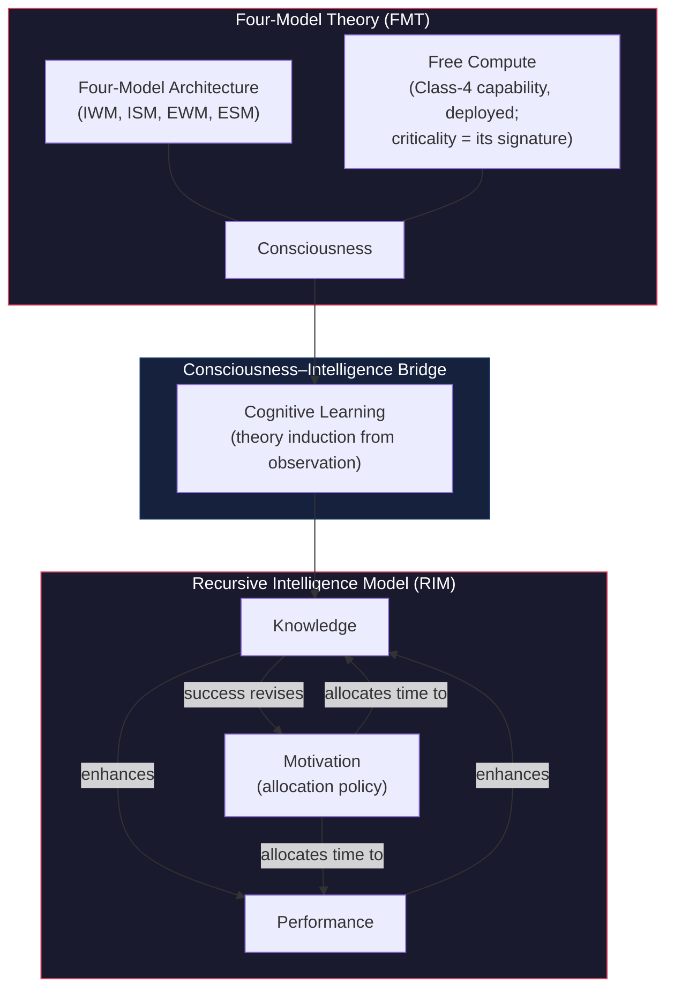

# The Standard Model of Consciousness

**The Standard Model of Consciousness is a unified theoretical framework — comprising the Four-Model Theory of consciousness (FMT) and the Recursive Intelligence Model (RIM) — offered as the leading candidate for a standard model of consciousness: a single account of what consciousness is, how it arises, and how it relates to intelligence.**

The name is deliberate. Physics has a standard model — one framework that unifies otherwise disparate phenomena and states precisely what would falsify it. Consciousness science has none: it is **pre-paradigm**, with several rival theories and no agreed criteria for choosing among them. FMT and RIM are advanced as a *candidate* for that role — the first framework to address all [eight requirements](../foundations/eight-requirements.md) of a complete theory of consciousness within one architecture, stated precisely enough to be tested and, where wrong, falsified. This is a candidate, not a consensus; the claim is that it is the strongest one currently on the table, and the invitation is for the field to try to break it.

Consciousness and intelligence are typically studied as separate phenomena. The Standard Model treats them as causally linked through a specific cognitive capacity: consciousness enables cognitive learning (the induction of general theories from particular observations), which in turn enables the recursive intelligence loop that produces self-directed intellectual development. FMT specifies the architecture of consciousness; RIM specifies the dynamics of intelligence; the bridge between them explains why conscious systems learn differently from unconscious ones.

## The Four-Model Theory (FMT)

The Four-Model Theory proposes that consciousness is constituted by ongoing self-simulation across four model *kinds* -- not four modules -- arranged along two axes: **scope** (world vs. self) and **mode** (implicit/learned vs. explicit/generated). Four is the floor, not the ceiling: the substrate runs many overlapping models, and the four kinds are the extremal poles of that continuous modeling ecology. The implicit models — the **Implicit World Model** (IWM) and **Implicit Self Model** (ISM) — are substrate-level, learned, and non-conscious. The explicit models — the **Explicit World Model** (EWM) and **Explicit Self Model** (ESM) — are virtual, transient, and phenomenal. Experience occurs in the explicit models; the implicit models provide the knowledge base from which experience is generated.

The theory's central claim is that **qualia** are constitutive properties of the computational level. They exist at the level of the running computation but are incoherent at the substrate level, just as a spreadsheet cell's value is incoherent at the transistor level. This reframes the Hard Problem as resting on a category error — a level confusion that seeks phenomenal properties where they do not exist.

FMT additionally requires the substrate to have **free compute** — the capacity for Class-4 (universal) computation in Wolfram's classification, *actually deployed* in open-ended, autonomous self-modeling rather than merely available. **Criticality** (the edge of chaos) is the dynamical signature this deployed capacity leaves in the substrate's activity, and the quantity experiments measure — a symptom of free compute at work, not a separate ingredient. This yields a principled boundary condition: consciousness requires both the right architecture (four models) and a substrate that puts universal-computation capacity to work on itself. Neither alone is sufficient; together they are.

## The Recursive Intelligence Model (RIM)

The Recursive Intelligence Model treats intelligence as *learning ability*: a recursive, self-reinforcing system of three interacting constituents — **Knowledge** (factual and operational), **Performance** (processing capacity), and **Motivation**. These form a closed amplification loop: knowledge enhances performance through better learning strategies; performance enhances knowledge through greater processing capacity; motivation decides how much of the loop runs, on what, and for how long; and success in learning revises motivation in turn.

RIM's central claim concerns *type*. The psychometric tradition typed every constituent of intelligence as a capacity, because capacities are what its instruments were built to measure. On RIM's account only Performance is a capacity in that sense. Knowledge is two stores divided by content — what is known, and what is known about learning. Motivation is not a third capacity at all: it is the **policy that allocates the loop's time — a schedule, not a substance**. The long absence of motivation from intelligence models is the symptom of this mis-typing, and the re-typing accounts for results the field reports without an explanation, among them motivation's resistance to trait measurement and the prediction that the *consistency* of intellectual engagement, not its peak intensity, carries long-term development.

## The Bridge

The two theories connect through a specific causal chain: the four-model architecture enables **cognitive learning** — the capacity to induce general theories from particular observations, distinct from reinforcement learning available to non-conscious systems. Cognitive learning, in turn, is the mechanism that powers the recursive intelligence loop. Without consciousness, there is no cognitive learning. Without cognitive learning, the recursive loop cannot engage. This makes consciousness a prerequisite for intelligence of the self-developing kind.

## Figure

```mermaid
graph TB
    subgraph FMT["Four-Model Theory (FMT)"]
        A["Four-Model Architecture<br/>(IWM, ISM, EWM, ESM)"]
        B["Free Compute<br/>(Class-4 capability, deployed;<br/>criticality = its signature)"]
        A --- C["Consciousness"]
        B --- C
    end

    subgraph Bridge["Consciousness–Intelligence Bridge"]
        C --> D["Cognitive Learning<br/>(theory induction from observation)"]
    end

    subgraph RIM["Recursive Intelligence Model (RIM)"]
        D --> E["Knowledge"]
        E -->|"enhances"| F["Performance"]
        F -->|"enhances"| E
        G["Motivation<br/>(allocation policy)"] -->|"allocates time to"| E
        G -->|"allocates time to"| F
        E -->|"success revises"| G
    end

    style FMT fill:#1a1a2e,stroke:#e94560,color:#fff
    style Bridge fill:#16213e,stroke:#0f3460,color:#fff
    style RIM fill:#1a1a2e,stroke:#e94560,color:#fff
```

## Key Takeaway

The Standard Model of Consciousness is not two separate theories bolted together — it is a single framework in which consciousness and intelligence are causally linked through cognitive learning, providing a unified account from subjective experience to intellectual development.

## See Also

- [Eight Requirements for a Theory of Consciousness](../foundations/eight-requirements.md)
- [The Pre-Paradigm State of Consciousness Science](../foundations/pre-paradigm.md)
- [Historical Context](../foundations/historical-context.md)
- [The Four-Model Theory](../core-architecture/four-model-theory.md)
- [The Recursive Intelligence Model](../intelligence/overview.md)
