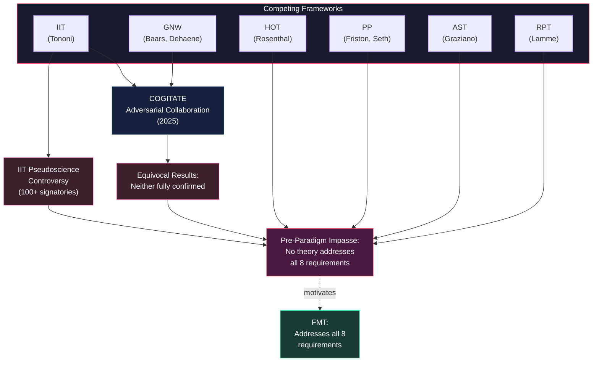

# The Pre-Paradigm State of Consciousness Science

**After three decades of intensive scientific investigation, consciousness research possesses no dominant paradigm, no agreed-upon methodology, and no theory that commands broad assent.**

The field is pre-paradigmatic in the Kuhnian sense (Kuhn, 1962): multiple frameworks compete for explanatory primacy, but none has established decisive empirical or theoretical superiority. Recent developments — equivocal adversarial collaboration results, a public controversy over pseudoscience accusations, and growing skepticism about whether the field is making genuine progress — have deepened the crisis rather than resolving it.

## The Competing Frameworks

Six major theories dominate consciousness research, each addressing different aspects of the problem while leaving others unresolved:

**Integrated Information Theory** (IIT; Tononi, 2004; Albantakis et al., 2023) identifies consciousness with integrated information (Phi), providing mathematical rigor and a treatment of the Boundary Problem through its exclusion postulate. However, IIT inherits panpsychist commitments, faces the Combination Problem, and requires computations that are intractable for real neural systems.

**Global Neuronal Workspace** (GNW; Baars, 1988; Dehaene & Changeux, 2011) explains when content becomes conscious through global broadcasting — information made available to multiple cognitive processes simultaneously. GNW provides a strong account of access consciousness but remains silent on why broadcasting produces experience.

**Higher-Order Theories** (HOT; Rosenthal, 2005; Lau & Rosenthal, 2011) propose that a mental state is conscious when it is the object of a higher-order representation. HOT explains why organisms report having experience but leaves open whether it addresses phenomenality itself or merely the report of phenomenality.

**Predictive Processing** (PP; Friston; Seth, 2021) casts the brain as a prediction machine that minimizes prediction error. PP generates structured experience naturally through its generative models and provides the strongest existing case for consciousness having a functional role through active inference. Its boundary-setting criteria (Markov blankets) have been criticized as too liberal.

**Attention Schema Theory** (AST; Graziano, 2013) models subjective awareness as the brain's schema of its own attention. AST provides the strongest existing account of the Meta-Problem — why consciousness seems mysterious — but does not extend this insight to a solution of the Hard Problem.

**Recurrent Processing Theory** (RPT; Lamme, 2006, 2010) identifies consciousness with recurrent (feedback) neural processing. RPT provides clear neural criteria for when visual experience occurs but addresses a narrower scope than the other frameworks.

## The COGITATE Crisis

The crisis came into sharp focus with the COGITATE adversarial collaboration (COGITATE Consortium, 2025; protocol: Melloni et al., 2023), designed to pit IIT against GNW in a preregistered empirical test. The results, published in *Nature*, were equivocal: neither theory was fully confirmed. The data favored posterior cortical involvement — not cleanly predicted by either camp.

Rather than settling the debate, COGITATE exposed the depth of the disagreement. A letter signed by over 100 researchers declared IIT pseudoscientific (IIT-Concerned et al., 2025), provoking fierce rebuttals from IIT's proponents (Tononi, Albantakis, et al., 2025) and methodological commentary questioning the framing of the dispute (Gomez-Marin & Seth, 2025). The controversy revealed fractures not just between theories but between standards of evidence, criteria for scientific legitimacy, and fundamental assumptions about what kind of theory consciousness requires.

## Why the Impasse Persists

The impasse persists because each theory addresses a subset of the eight requirements that any complete theory must meet. IIT excels on the Boundary Problem and Structure of Experience but struggles with the Combination Problem. GNW handles access consciousness but is silent on the Hard Problem. HOT and AST treat the Meta-Problem well but leave phenomenality underspecified. PP provides structured experience and a functional role but faces boundary-setting challenges.

No theory prior to FMT attempted to address all eight requirements simultaneously. Most theories were not designed to — they were built to solve one or two problems well, with the assumption that other problems would be handled separately. The Standard Model of Consciousness argues this assumption is itself the problem: the requirements are interconnected, and a theory that addresses all eight discovers that the solutions constrain and reinforce each other.

## Figure

## Key Takeaway

The field's impasse is not due to lack of effort or data — it is structural. Each leading theory was designed to solve a subset of the problem. The Standard Model of Consciousness was designed to solve the whole thing.

## See Also

- [Eight Requirements for a Theory of Consciousness](../foundations/eight-requirements.md)
- [The Standard Model of Consciousness](../foundations/overview.md)
- [Comparative Scoreboard](../comparative/comparative-scoreboard.md)
- [COGITATE and Adversarial Collaborations](../comparative/cogitate.md)
