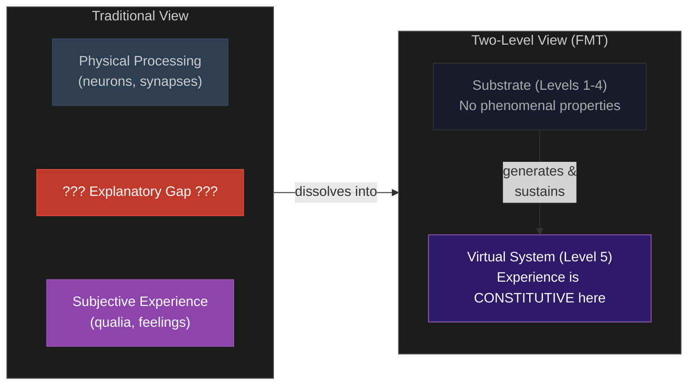

# Hard Problem Dissolution

**The Hard Problem of consciousness rests on a category error -- a level confusion that seeks phenomenal properties at the substrate level where they categorically do not exist.**

[Chalmers (1995)](https://doi.org/10.1093/jcs/2.3.200) formulated the Hard Problem as the question of why physical processing is accompanied by subjective experience. The Four-Model Theory does not solve this problem in its own terms. It dissolves it -- by showing that the question, as formulated, contains a hidden false presupposition about where phenomenal properties should be found.

## The Standard Formulation and Its Error

The Hard Problem asks: "Why does physical processing (neuronal firing, synaptic transmission) *feel like* something?"

The Four-Model Theory's answer: it does not. The implicit models -- IWM and ISM -- operate at the substrate level without any phenomenal character whatsoever. There is nothing it is like to be a synaptic weight. Qualia are not missing from the substrate; they are the wrong kind of property to seek there. They exist at the [computational level](virtual-qualia.md), where they are not mysterious but constitutive.

The standard formulation smuggles in a presupposition: that if experience exists, it must be a property of the substrate doing the processing. Once this presupposition is made explicit and rejected, the "hardness" evaporates. The neurons are not the experience; they generate and sustain the computational process in which experience is constitutive. The question "why does neuronal firing feel like something?" is structurally identical to "why does transistor switching *equal* a spreadsheet?" -- and the answer to both is the same: it does not. The substrate generates and sustains a higher-level process with its own constitutive properties.

## The Explanatory Gap Closes Simultaneously

[Levine's (1983)](https://doi.org/10.1111/j.1468-0114.1983.tb00207.x) Explanatory Gap -- the persistent sense that even a complete neural account "leaves something out" -- closes as a direct consequence. The gap between "neurons fire in pattern X" and "I experience red" is not a gap in knowledge. It is a reflection of the [level distinction](category-error.md). The neural firing pattern generates and sustains the computation in which redness is experienced, but the firing pattern itself is not red and does not experience redness, just as a CPU's electrical states are not "a spreadsheet" even though they generate and sustain one.

The feeling that something is "left out" is accurate -- at the substrate level, phenomenal properties *are* absent. They exist one level up. Once both levels are in view, nothing is missing.

## What This Is Not

**Not illusionism.** Dennett (1991) and [Frankish (2016)](https://doi.org/10.1093/jcs/jcs16301) dissolve the Hard Problem by denying that qualia as traditionally conceived exist. The Four-Model Theory preserves the reality of qualia -- they are genuine properties of the computational level. Experience is not an illusion; the illusion is that experience must be found in the substrate.

**Not deflationary.** Graziano's AST explains why we *report* phenomenal experience, but the Four-Model Theory goes further: the phenomenal character is constitutive of the virtual level, not merely a cognitive artifact of self-modeling.

**Not dualism.** Both levels are physical. The computational level is a physical process running on a physical substrate. This is a [two-level ontology](two-level-ontology.md) within a single physical system -- a level distinction, not a substance distinction.

**Not functionalism (in the standard sense).** Standard functionalism identifies mental states with functional roles. The Four-Model Theory identifies experience with a specific *kind* of computation -- self-referential simulation at criticality -- not with functional roles abstractly defined.

## Figure

*Left: the traditional framing places physical processing and subjective experience on the same level, producing an unbridgeable gap. Right: the two-level view shows that experience is constitutive of the computational level, generated by but not identical to the substrate. The gap was never between two things -- it was between two levels.*

## Key Takeaway

The Hard Problem is not unsolvable -- it is mis-stated. It presupposes that phenomenal properties must exist at the substrate level. Once the two-level ontology is recognized, the "hardness" is revealed as a category error, and the Explanatory Gap closes as a natural consequence.

## See Also

- [Virtual Qualia](virtual-qualia.md)
- [The Category Error](category-error.md)
- [The Meta-Problem Dissolved](meta-problem.md)
- [The Explanatory Gap](explanatory-gap.md)
- [Two-Level Ontology](two-level-ontology.md)
