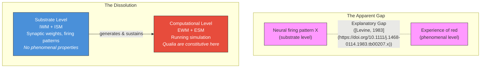

# The Explanatory Gap

**The Explanatory Gap is not a gap in our knowledge but a reflection of the level distinction between substrate and computation.**

In 1983, Joseph Levine identified a problem distinct from the Hard Problem: even if neuroscience identifies every neural correlate of every conscious state, the explanation still feels incomplete. The gap between "neurons fire in pattern X" and "I experience red" seems unbridgeable — not because we lack data, but because the explanation itself appears to be the wrong *kind* of explanation. The Four-Model Theory closes this gap by showing it was never a gap at all.

## The Standard Formulation

The **Explanatory Gap** ([Levine, 1983](https://doi.org/10.1111/j.1468-0114.1983.tb00207.x)) is often confused with the Hard Problem, but it has a distinct character. The Hard Problem asks *why* physical processing produces experience. The Explanatory Gap asks why our *explanations* of neural correlates feel incomplete — why mapping every synapse still would not tell us what redness is like.

Ned Block ([1995](https://doi.org/10.1017/S0140525X00038188)) sharpened the distinction further: **access consciousness** (the functional role — what information is available for report, reasoning, and behavior) can be explained by neural mechanisms, but **phenomenal consciousness** (the subjective feel) resists explanation in those terms. The gap is between the third-person description and the first-person reality.

Most consciousness theories either ignore the Explanatory Gap, treat it as equivalent to the Hard Problem, or attempt to explain it away. The Four-Model Theory does something different: it dissolves it.

## How the Gap Closes

The dissolution follows directly from the theory's **two-level ontology** (see [Two-Level Ontology](two-level-ontology.md)). The substrate level (implicit models, synaptic weights, neural firing patterns) and the computational level (explicit models, the running simulation) are both physical, but they have different ontological properties.

The neural firing pattern *generates and sustains* the computation in which redness is experienced, but the firing pattern itself is not red and does not experience redness. This is no more mysterious than the fact that a CPU's electrical states are not "a spreadsheet" even though they generate and sustain one. The gap between "neurons fire in pattern X" and "I experience red" is the same gap that exists between "transistors switch in pattern Y" and "cell A1 contains the sum of column B." Both are real. Neither is mysterious. Both reflect a level distinction, not a knowledge deficit.

The Explanatory Gap closes simultaneously with the Hard Problem because both rest on the same **category error**: seeking phenomenal properties at the substrate level where they categorically do not exist. Once the level confusion is recognized, the "incompleteness" of neural explanations is revealed as a feature of any two-level system, not a special problem for consciousness.

## Why Other Approaches Leave the Gap Open

**Global Neuronal Workspace** explains *when* content becomes conscious (via global broadcasting) but says nothing about *why* broadcasting produces experience. The gap between "this information was broadcast" and "I experienced red" remains open.

**Higher-Order Theories** explain why we *report* having experience but leave open whether phenomenality itself has been addressed. The gap between "there is a higher-order representation of this state" and "there is something it is like" persists.

**Predictive Processing** provides richly structured experience through generative models but does not explain why prediction errors have phenomenal character rather than being mere signal discrepancies.

The Four-Model Theory addresses the gap directly: phenomenal character is a property of the computational level — the virtual side — where it is constitutive, not added on.

## Figure

*The Explanatory Gap appears unbridgeable when substrate and computation are conflated (top). Once the level distinction is recognized (bottom), the gap dissolves: phenomenal properties belong to the computational level, not the substrate level. Both levels are physical.*

## Key Takeaway

The Explanatory Gap is not evidence of a deep mystery about consciousness — it is a predictable consequence of confusing two levels of description within a single physical system. The gap between neural activity and experience is no more mysterious than the gap between transistor states and spreadsheet values.

## See Also

- [Hard Problem Dissolution](dissolution.md)
- [Two-Level Ontology](two-level-ontology.md)
- [The Category Error](category-error.md)
- [Virtual Qualia](virtual-qualia.md)
- [The Meta-Problem Dissolved](meta-problem.md)

---

Based on: Gruber, M. (2026). The Four-Model Theory of Consciousness. Zenodo. https://doi.org/10.5281/zenodo.18669891
