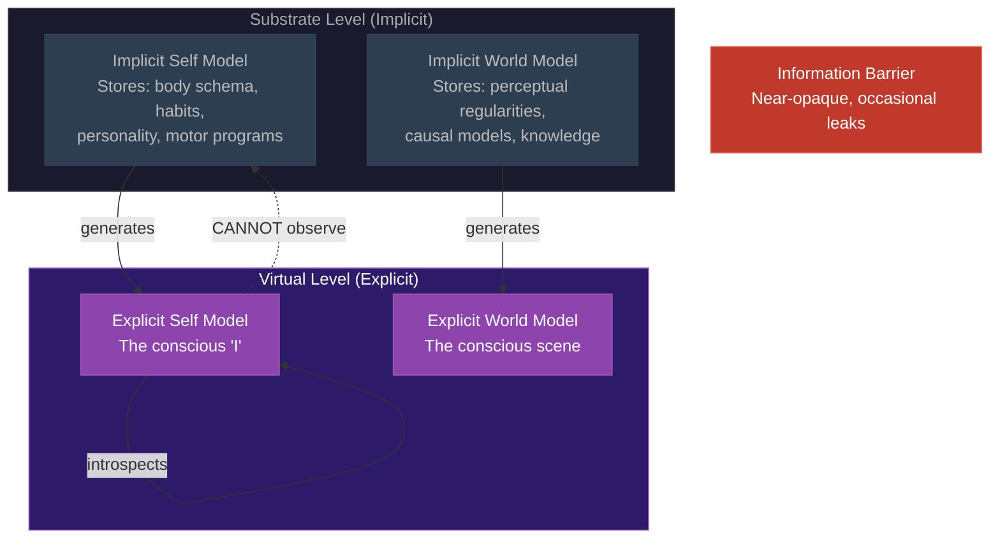

# The Meta-Problem Dissolved

**Consciousness seems mysterious because the Explicit Self Model cannot observe the Implicit Self Model's mechanisms -- the self-model is structurally sealed off from its own generative machinery.**

[Chalmers (2018)](https://consc.net/papers/solving.pdf) posed the Meta-Problem: why do we *think* there is a Hard Problem? Even if the Hard Problem is dissolved, a complete theory must explain why consciousness *seems* inexplicable -- why the intuition of mystery is so persistent and universal. The Four-Model Theory provides a precise architectural account: the mystery is a structural consequence of how the models are arranged.

## The Information Barrier

The [Implicit Self Model](../core-architecture/implicit-self-model.md) (ISM) stores the substrate-level self-knowledge that generates the conscious self-model. The [Explicit Self Model](../core-architecture/explicit-self-model.md) (ESM) is the conscious self -- the virtual, phenomenal self-representation. The ISM generates the ESM, but the ISM is **structurally inaccessible** to the ESM. The conscious self cannot directly observe its own substrate.

When the ESM attempts to introspect on the basis of its own experience, it encounters a principled opacity: the implicit models that generate the simulation are not themselves part of the simulation. The ESM can represent *that* it is having an experience, but it cannot represent *the mechanism by which* the experience is generated -- because that mechanism operates at the implicit/substrate level, which is by definition outside the explicit/virtual level.

The result is the persistent intuition that something is being "left out" of any physical explanation. The ESM cannot find the mechanism within its own simulation, so it concludes -- naturally but incorrectly -- that the mechanism must be non-physical or fundamentally inexplicable.

## Near-Opacity With Occasional Leaks

The boundary between implicit and explicit models is not perfectly opaque. The [variable permeability](../mechanisms/variable-permeability.md) of the implicit-explicit boundary means that substrate-level processing artifacts occasionally leak through to the simulation. In altered states (psychedelics, meditation, pre-sleep imagery) this happens dramatically. In normal waking states, it happens subtly -- phosphenes, blind-spot filling, the tip-of-the-tongue phenomenon.

The conscious self thus inhabits a peculiar epistemic position: mostly sealed off from its own generative machinery, yet occasionally catching fleeting glimpses of something operating beneath the surface of experience. This architectural feature -- near-opacity punctuated by occasional leaks -- produces precisely the phenomenology that the Meta-Problem describes: the persistent, nagging intuition that consciousness is somehow deeper than any explanation can reach, that something vast operates just beyond the edge of introspective access.

## Mystery as Prediction, Not Evidence Against

This is where the Four-Model Theory turns the Meta-Problem from a challenge into a confirmation. A virtual process with a mostly-opaque but imperfect boundary to its own substrate would experience *exactly* this sense of irreducible depth. The mystery of consciousness is not evidence that consciousness is inexplicable -- it is a **prediction** of the theory.

Any system with the four-model architecture would:

1. **Experience itself as conscious** (the ESM models the system's own states)
2. **Be unable to explain *how* it is conscious** (the ISM's mechanisms are outside the ESM's observational reach)
3. **Have fleeting intuitions of hidden depth** (occasional permeability leaks give partial access to substrate processes)
4. **Conclude that consciousness is mysterious** (the introspective gap is taken as evidence of an explanatory gap)

This is not a post-hoc rationalization. It is a structural consequence of the architecture: any self-modeling system whose self-model cannot fully observe its own generative substrate will experience its own consciousness as mysterious.

## Relation to Graziano's AST

Graziano's Attention Schema Theory offers a parallel account: the brain's internal model of its own attention is necessarily incomplete, and this incompleteness is experienced as the sense that awareness has some irreducible, non-physical quality. The Four-Model Theory shares this insight but grounds it in a more specific architecture (four models, [real/virtual split](../core-architecture/real-virtual-split.md), variable permeability) and connects it to the broader [dissolution of the Hard Problem](dissolution.md) rather than treating the Meta-Problem in isolation.

## Figure

*The ESM (conscious self) is generated by the ISM (substrate-level self-knowledge) but cannot observe the ISM's mechanisms. The dashed arrow represents the failed introspective attempt. The information barrier between implicit and explicit levels is the architectural source of the "mystery" of consciousness -- the ESM can see that it is conscious but not how.*

## Key Takeaway

The mystery of consciousness is not a defect in our theories -- it is a feature of our architecture. Any self-modeling system whose explicit self-model cannot observe its own implicit generative substrate will experience its own consciousness as inexplicable. The Meta-Problem is a prediction, not a problem.

## See Also

- [Hard Problem Dissolution](dissolution.md)
- [Explicit Self Model](../core-architecture/explicit-self-model.md)
- [Implicit Self Model](../core-architecture/implicit-self-model.md)
- [Variable Permeability](../mechanisms/variable-permeability.md)
- [Virtual Qualia](virtual-qualia.md)
