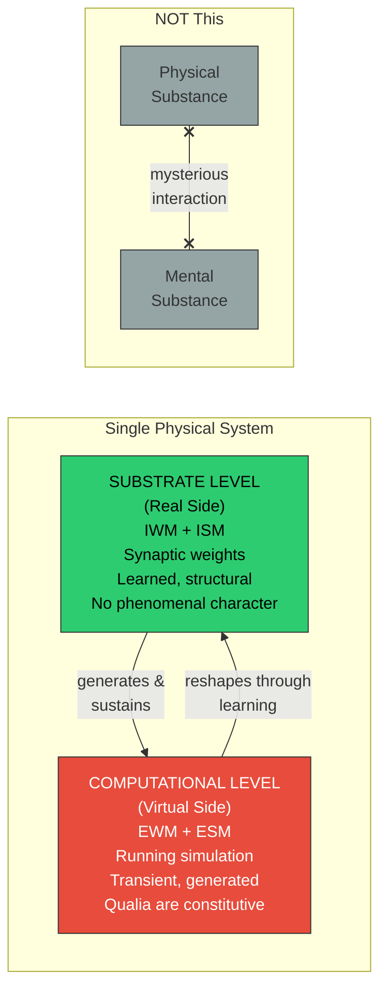

# Two-Level Ontology

**Both the substrate level and the computational level are physical — the distinction between them is a level distinction within a single physical system, not a substance distinction.**

The Four-Model Theory rests on a straightforward observation from computer science: every computing system distinguishes between a physical substrate and the computational processes running on it. A spreadsheet's "sum of column B" exists at the computational level but is incoherent at the transistor level. The theory applies this universal distinction to consciousness and finds that it dissolves the deepest problems in philosophy of mind.

## The Two Levels

The **substrate level** (the "real side") comprises the implicit models — the **Implicit World Model** (IWM) and **Implicit Self Model** (ISM). In biological brains, these are stored in synaptic weights, dendritic morphology, and connectivity patterns. They accumulate over a lifetime through learning. They have no phenomenal character. As the theory puts it: "lights off."

The **computational level** (the "virtual side") comprises the explicit models — the **Explicit World Model** (EWM) and **Explicit Self Model** (ESM). These are transient patterns of activity, dynamically generated from the implicit models and current sensory input. They *are* experience. "Lights on."

Both levels are fully physical. The computation is a physical process — electrochemical dynamics in biological brains, potentially electrical or photonic dynamics in artificial substrates. There is no non-physical substance, no soul, no fundamental experiential property floating free of matter. This is **process physicalism**: consciousness is constituted by the *process* of self-simulation, not identical to any particular neural state.

## Why This Is Not Dualism

The two-level ontology invites an obvious objection: is this not just dualism dressed in computational clothing? It is not, for a precise reason.

**Substance dualism** (Descartes) posits two fundamentally different kinds of stuff — physical matter and non-physical mind — and struggles to explain how they interact. The two-level ontology posits one kind of stuff (physical matter) organized at two levels of description. The relationship between substrate and computation is not mysterious interaction between different substances; it is the well-understood relationship between hardware and the processes it runs. No one considers a laptop to be "dualist" because it distinguishes between transistor states and spreadsheet values.

**Property dualism** posits that physical matter has irreducible phenomenal properties. The two-level ontology disagrees: phenomenal properties are not properties of the substrate at all. They are properties of the computation — specifically, of the self-referential simulation. They are no more "irreducible" than any other higher-level computational property. They are simply the wrong kind of thing to look for at the substrate level.

The theory occupies a position that is physicalist (one substance), non-reductive (the computational level has genuine properties not usefully described in substrate terms), and non-mysterious (the level distinction is an engineering truism, not a metaphysical puzzle).

## The Five-System Hierarchy

The two-level ontology is embedded within a more detailed **five-system hierarchy** (see [Five-System Hierarchy](../physical-foundations/five-system-hierarchy.md)):

1. **Physical** — atoms, molecules, macroscopic structures
2. **Electrochemical** — ion gradients, action potentials, synaptic transmission
3. **Proteomic** — receptor configurations, neurotransmitter synthesis, plasticity mechanisms
4. **Topological** — connectivity architecture, synaptic strengths, circuit organization (where implicit models live)
5. **Virtual** — the dynamic pattern constituting the explicit models (where consciousness exists)

Each level is fully determined by the level below. There is no strong emergence, no ontological gap between levels. But each level exhibits properties not usefully described in terms of the lower level: describing a memory in terms of ion channel kinetics is possible in principle but explanatorily vacuous. Seeking experiential properties at Levels 1-4 is the **category error** that generates the Hard Problem.

## Figure

*Left: The two-level ontology — a single physical system with substrate and computational levels in bidirectional interaction. Right: What the theory is NOT — substance dualism with two different kinds of stuff requiring mysterious interaction. The two-level ontology is a level distinction, not a substance distinction.*

## The Category Error Revealed

The two-level ontology makes the Hard Problem's category error visible. Asking "why does neuronal firing feel like something?" conflates the two levels. The neurons (substrate level) do not feel like anything. The *computation they generate* — the self-referential simulation at the virtual level — is where experience is constitutive. This is analogous to asking why transistor switching "is" a spreadsheet. The transistors are not the spreadsheet; they generate and sustain it. The neurons are not the experience; they generate and sustain the process in which experience is constitutive.

## Key Takeaway

The two-level ontology is not a philosophical innovation but the recognition that a well-understood distinction from computer science — between substrate and computation — applies to consciousness. Both levels are physical. The Hard Problem arises from conflating them.

## See Also

- [The Real/Virtual Split](../core-architecture/real-virtual-split.md)
- [The Category Error](category-error.md)
- [Virtual Qualia](virtual-qualia.md)
- [Five-System Hierarchy](../physical-foundations/five-system-hierarchy.md)
- [Process Physicalism](../philosophical/process-physicalism.md)

---

Based on: Gruber, M. (2026). The Four-Model Theory of Consciousness. Zenodo. https://doi.org/10.5281/zenodo.18669891
