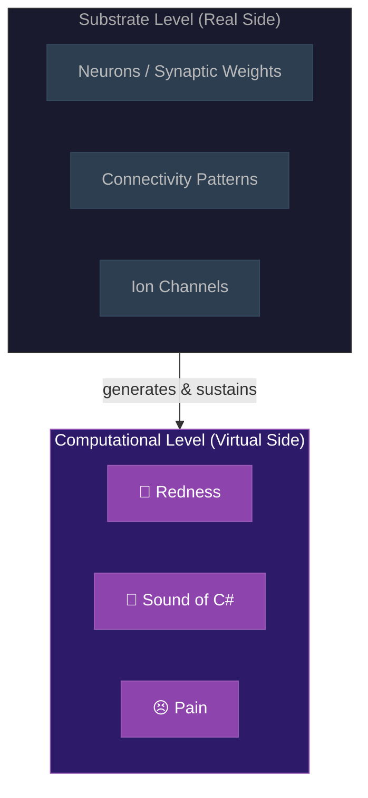

# Virtual Qualia

**Qualia are constitutive properties of the computational level -- digital constructs that exist at the level of the running computation but are incoherent at the substrate level.**

The Four-Model Theory's treatment of qualia is its most distinctive philosophical contribution. Rather than explaining qualia away (illusionism) or locating them in the fundamental fabric of reality (panpsychism), the theory identifies them as properties of a specific computational level -- genuine, physical, and fully real at that level, yet categorically absent from the substrate that generates them.

## The Level Distinction

Every computing system distinguishes between a physical substrate and the computational processes running on it. This is not a philosophical claim but an engineering truism. A spreadsheet cell "contains a sum," but no transistor contains a sum. The sum is a property of the computational level -- it exists, it is real, it does real work -- but asking which transistor holds the sum is a [category error](category-error.md). The property is incoherent at the substrate level.

The **Explicit World Model** (EWM) and **Explicit Self Model** (ESM) constitute the virtual, phenomenal side of the [four-model architecture](../core-architecture/four-models.md). Qualia are the way the ESM registers its own states and the content of the EWM. "Redness" is the ESM's mode of registering a particular class of EWM content -- no more mysterious than "cell A1 contains 42" is mysterious to a spreadsheet user, despite being nowhere in the transistors.

## Why Not All Computation?

A spreadsheet runs at a computational level above its substrate. So does a weather simulation. Why do they lack qualia? The answer lies in **self-referential closure**. A weather simulation models weather; it does not model *itself modeling weather*. The four-model architecture creates a closed loop: the ESM models the system's own modeling process. In this loop, the distinction between the model and the modeled collapses -- the computation *is* the thing being computed.

Qualia are not an addition to the self-modeling. They are the self-modeling as encountered from inside the loop. A non-self-referential computation has an outside from which it can be described without remainder. A self-referential computation at criticality has no such outside -- the computation is its own observer, and observation-from-inside is what experience *is*.

## Not Illusionism, Not Deflationary

This position must be distinguished from two superficially similar views. **Illusionism** (Dennett, Frankish) holds that qualia as traditionally conceived are illusions -- there is nothing it is like, and our sense that there is something it is like is itself a misrepresentation. The Four-Model Theory holds that qualia are *real at the computational level*. Within the EWM/ESM, experience has genuine phenomenal character.

**Deflationary accounts** (Graziano) explain why we *report* having phenomenal experience but leave open whether phenomenality itself has been addressed. The Four-Model Theory goes further: the phenomenal character is constitutive of the virtual level, not an artifact of misreporting.

What is illusory is the assumption that phenomenal character must be a property of the physical substrate. It is not. It is a property of the computational process that the substrate runs.

## Figure

*Qualia exist at the computational level (top), where they are constitutive. The substrate level (bottom) generates and sustains the computation but does not itself possess phenomenal properties. Asking which neuron "contains" redness is like asking which transistor "contains" a spreadsheet sum.*

## Key Takeaway

Qualia are real -- but they are real at the computational level, not the substrate level. The Hard Problem's apparent mystery arises from seeking phenomenal properties at the wrong level of description.

## See Also

- [Hard Problem Dissolution](dissolution.md)
- [The Category Error](category-error.md)
- [The Real/Virtual Split](../core-architecture/real-virtual-split.md)
- [Self-Referential Closure](../core-architecture/self-referential-closure.md)
- [Two-Level Ontology](two-level-ontology.md)
