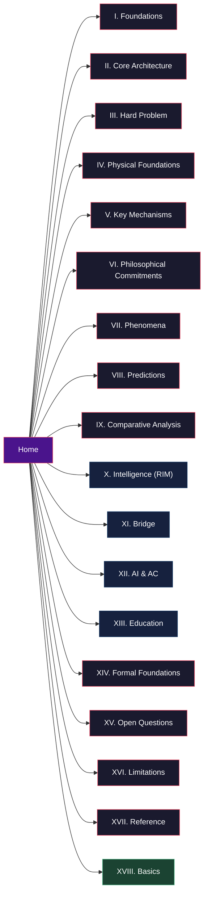

# The Standard Model of Consciousness

**A comprehensive reference for the Four-Model Theory (FMT) and Recursive Intelligence Model (RIM)**

---

The Standard Model of Consciousness is a unified theoretical framework that answers three questions most theories of consciousness leave open: what consciousness *is*, why physical processes give rise to subjective experience, and how consciousness relates to intelligence. The framework comprises two interlocking theories — the Four-Model Theory (FMT), which specifies the architecture of consciousness, and the Recursive Intelligence Model (RIM), which specifies the dynamics of intelligence — connected by a causal bridge through cognitive learning.

FMT proposes that consciousness is constituted by ongoing self-simulation across four nested models arranged along two axes: scope (world vs. self) and mode (implicit vs. explicit). The explicit models are virtual, transient, and phenomenal — they *are* the experience. Qualia are constitutive properties of the computational level, dissolving the Hard Problem by revealing it as a category error. The substrate must operate at criticality (edge of chaos) for the simulation to run. Five predictions derived from these principles in 2015 have since been independently confirmed; four novel predictions remain untested.

RIM redefines intelligence as a recursive, self-reinforcing system of Knowledge, Performance, and Motivation. The systematic exclusion of motivation from intelligence models is identified as the field's central blind spot. The bridge between FMT and RIM runs through cognitive learning: consciousness enables the induction of general theories from particular observations, which powers the recursive loop that produces self-directed intellectual development.

---

## Site Map

*The wiki is organized into 18 sections spanning 125 articles. Dark red sections cover FMT (consciousness); blue sections cover RIM (intelligence) and their intersection; green covers background knowledge.*

---

## Sections

### Foundations

The theoretical starting point: why consciousness science is stuck, what a complete theory must explain, and where this framework comes from.

- [The Standard Model of Consciousness (Overview)](foundations/overview.md) -- Article 1
- [Eight Requirements for a Theory of Consciousness](foundations/eight-requirements.md) -- Article 2
- [The Pre-Paradigm State of Consciousness Science](foundations/pre-paradigm.md) -- Article 3
- [Historical Context](foundations/historical-context.md) -- Article 4

### Core Architecture (FMT)

The heart of the theory: four models, two axes, and the real/virtual split that makes experience possible.

- [The Four-Model Theory](core-architecture/four-model-theory.md) -- Article 5
- [Core Definition of Consciousness](core-architecture/core-definition.md) -- Article 6
- [The Two Axes: Scope and Mode](core-architecture/two-axes.md) -- Article 7
- [Implicit World Model (IWM)](core-architecture/implicit-world-model.md) -- Article 9
- [Implicit Self Model (ISM)](core-architecture/implicit-self-model.md) -- Article 10
- [Explicit World Model (EWM)](core-architecture/explicit-world-model.md) -- Article 11
- [Explicit Self Model (ESM)](core-architecture/explicit-self-model.md) -- Article 12
- [The Real/Virtual Split](core-architecture/real-virtual-split.md) -- Article 13
- [Self-Referential Closure](core-architecture/self-referential-closure.md) -- Article 14

### Dissolving the Hard Problem

How the theory resolves the deepest puzzle in philosophy of mind -- not by explaining qualia away, but by showing the question rests on a level confusion.

- [Virtual Qualia](hard-problem/virtual-qualia.md) -- Article 15
- [Hard Problem Dissolution](hard-problem/dissolution.md) -- Article 16
- [The Category Error (Level Confusion)](hard-problem/category-error.md) -- Article 17
- [The Meta-Problem Dissolved](hard-problem/meta-problem.md) -- Article 20

### Physical Foundations

The physics beneath the theory: criticality, cellular automata, the five-system hierarchy, and two thresholds.

- [The Criticality Requirement](physical-foundations/criticality.md) -- Article 21
- [The Cortical Automaton](physical-foundations/cortical-automaton.md) -- Article 23
- [The Five-System Hierarchy](physical-foundations/five-system-hierarchy.md) -- Article 24
- [Two Thresholds for Consciousness](physical-foundations/two-thresholds.md) -- Article 25

### Key Mechanisms

The dynamic processes that connect architecture to phenomenology: permeability, graduated consciousness, forking, holography.

- [The Implicit-Explicit Boundary](mechanisms/implicit-explicit-boundary.md) -- Article 27
- [Variable Permeability](mechanisms/variable-permeability.md) -- Article 28
- [Graduated Levels of Consciousness](mechanisms/graduated-consciousness.md) -- Article 29
- [The Redirectable ESM](mechanisms/redirectable-esm.md) -- Article 30
- [Virtual Model Forking](mechanisms/virtual-model-forking.md) -- Article 31
- [Holographic Storage](mechanisms/holographic-storage.md) -- Article 32
- [The Dual Evaluation Architecture](mechanisms/dual-evaluation.md) -- Article 33

### Philosophical Commitments

The theory's explicit philosophical positions: process physicalism, substrate independence, weak emergence.

- [Process Physicalism](philosophical/process-physicalism.md) -- Article 34
- [Consciousness as Process, Not Agent](philosophical/consciousness-as-process.md) -- Article 35
- [Substrate Independence](philosophical/substrate-independence.md) -- Article 36
- [Weak Emergence](philosophical/weak-emergence.md) -- Article 37
- [Not Illusionism, Not Deflationary](philosophical/not-illusionism.md) -- Article 38

### Explanatory Range (Phenomena)

What the theory explains: altered states, clinical syndromes, sleep, animal consciousness, and meditation.

- [Psychedelic Phenomenology](phenomena/psychedelics.md) -- Article 39
- [Ego Dissolution](phenomena/ego-dissolution.md) -- Article 40
- [Dissociative Identity Disorder (DID)](phenomena/did.md) -- Article 41
- [Anesthesia and Loss of Consciousness](phenomena/anesthesia.md) -- Article 42
- [Split-Brain Phenomena](phenomena/split-brain.md) -- Article 43
- [Sleep, Dreams, and Criticality](phenomena/sleep.md) -- Article 44
- [Lucid Dreaming](phenomena/lucid-dreaming.md) -- Article 45
- [Anosognosia](phenomena/anosognosia.md) -- Article 46
- [Animal Consciousness](phenomena/animal-consciousness.md) -- Article 47
- [Meditation](phenomena/meditation.md) -- Article 48

### Predictions and Empirical Evidence

Five confirmed predictions and four novel ones that no competing theory generates.

- [Confirmed Predictions (Post-2015 Convergence)](predictions/confirmed.md) -- Article 49
- [Prediction 1: Psychedelics Alleviate Anosognosia](predictions/prediction-1-anosognosia.md) -- Article 50
- [Prediction 2: Ego Dissolution Content Is Controllable](predictions/prediction-2-ego-dissolution.md) -- Article 51
- [Prediction 3: DID Alter Switches in ESM Networks](predictions/prediction-3-did.md) -- Article 52
- [Prediction 4: Lucid Dream Onset Is a Criticality Crossing](predictions/prediction-4-lucid-dreaming.md) -- Article 53

### Comparative Analysis

How FMT compares against every major consciousness theory, requirement by requirement.

- [Comparative Scoreboard](comparative/scoreboard.md) -- Article 54
- [FMT vs. Integrated Information Theory (IIT)](comparative/vs-iit.md) -- Article 55
- [FMT vs. Global Neuronal Workspace (GNW)](comparative/vs-gnw.md) -- Article 56
- [FMT vs. Predictive Processing (PP)](comparative/vs-pp.md) -- Article 58
- [FMT vs. Attention Schema Theory (AST)](comparative/vs-ast.md) -- Article 59

### The Recursive Intelligence Model (RIM)

Intelligence redefined: a recursive system where Knowledge, Performance, and Motivation amplify each other.

- [The Recursive Intelligence Model (Overview)](intelligence/overview.md) -- Article 63
- [The Three Components: Knowledge, Performance, Motivation](intelligence/three-components.md) -- Article 64
- [The Recursive Loop](intelligence/recursive-loop.md) -- Article 65
- [Operational Knowledge: The Hidden Multiplier](intelligence/operational-knowledge.md) -- Article 66
- [The Matthew Effect and Compounding Dynamics](intelligence/matthew-effect.md) -- Article 68

### The Consciousness-Intelligence Bridge

The causal chain linking FMT and RIM through cognitive learning.

- [Consciousness-Intelligence Bridge](bridge/consciousness-intelligence-bridge.md) -- Article 73
- [Cognitive Learning vs. Reinforcement Learning](bridge/cognitive-vs-reinforcement.md) -- Article 74
- [The Dual Evaluation Architecture and Intelligence](bridge/dual-evaluation-intelligence.md) -- Article 75

### AI and Artificial Consciousness

What the theory says about current AI, why LLMs are not conscious, and what a conscious machine would require.

- [The AI Diagnostic: What Machines Are Missing](ai-consciousness/ai-diagnostic.md) -- Article 76
- [Why LLMs Are Not Conscious (Under FMT)](ai-consciousness/llms-not-conscious.md) -- Article 77
- [Engineering Specification for Artificial Consciousness](ai-consciousness/engineering-specification.md) -- Article 78
- [The Path to AGI Runs Through Motivation](ai-consciousness/path-through-motivation.md) -- Article 79

### Educational and Societal Implications

What the recursive model means for schools, grading, and the question of whether intelligence is learnable.

- [Intelligence Is Learnable](education/intelligence-learnable.md) -- Article 81
- [The School Grade Disaster](education/school-grade-disaster.md) -- Article 82
- [Educational Implications](education/educational-implications.md) -- Article 83

### Open Questions and Research Frontiers

What the theory does not yet know -- and where the research programme goes next.

- [Open Questions](open-questions/overview.md) -- Article 89
- [Are the Implicit Models Also Virtual?](open-questions/implicit-models-virtual.md) -- Article 90
- [Minimum Configuration for Consciousness](open-questions/minimum-configuration.md) -- Article 91

### Limitations and Intellectual Honesty

The theory's acknowledged limitations, from the other-minds problem to Godel-type constraints.

- [Limitations](limitations/overview.md) -- Article 94
- [The Other-Minds Problem](limitations/other-minds.md) -- Article 95
- [Inside-Modeling and Godel](limitations/inside-modeling-godel.md) -- Article 96

### Reference

- [Glossary of Terms](reference/glossary.md) -- Article 97
- [Key Figures and Diagrams](reference/key-figures.md) -- Article 98
- [Bibliography](reference/bibliography.md) -- Article 99
- [Reading Order Guide](reference/reading-order.md) -- Article 100

### Basics (Background Knowledge)

Standalone explainer articles for readers without a science background. Each covers one concept used across the wiki.

- [Neurons and the Cerebral Cortex](basics/neurons-and-cortex.md)
- [Synaptic Weights and Plasticity](basics/synaptic-plasticity.md)
- [Default Mode Network](basics/default-mode-network.md)
- [Recurrent Processing](basics/recurrent-processing.md)
- [EEG, fMRI, and Brain Imaging](basics/brain-imaging.md)
- [Cellular Automaton](basics/cellular-automaton.md)
- [Criticality and Edge of Chaos](basics/criticality.md)
- [Phase Transitions](basics/phase-transitions.md)
- [Neuronal Avalanches](basics/neuronal-avalanches.md)
- [Bifurcation and Dynamical Systems](basics/bifurcation.md)
- [Lempel-Ziv Complexity](basics/lempel-ziv-complexity.md)
- [Qualia](basics/qualia.md)
- [Phenomenal Consciousness](basics/phenomenal-consciousness.md)
- [Physicalism](basics/physicalism.md)
- [Panpsychism and the Combination Problem](basics/panpsychism.md)
- [Emergence](basics/emergence.md)
- [Working Memory](basics/working-memory.md)
- [Fluid and Crystallized Intelligence](basics/fluid-crystallized-intelligence.md)
- [Metacognition](basics/metacognition.md)
- [Prediction Error](basics/prediction-error.md)
- [Global Neuronal Workspace Theory](basics/global-neuronal-workspace.md)
- [Anosognosia](basics/anosognosia.md)
- [Ego Dissolution](basics/ego-dissolution.md)
- [Split-Brain and Callosotomy](basics/split-brain.md)
- [Interoception and Proprioception](basics/interoception.md)

---

## Start Here

Different readers will want different entry points. Pick the path that matches your background:

**Philosopher of mind?** Start with [Virtual Qualia](hard-problem/virtual-qualia.md) and [Hard Problem Dissolution](hard-problem/dissolution.md). The theory's central move is a level-confusion argument that dissolves rather than solves the Hard Problem. From there, follow the [Comparative Scoreboard](comparative/scoreboard.md) to see how FMT measures against IIT, GNW, HOT, and the rest.

**Neuroscientist?** Start with [The Criticality Requirement](physical-foundations/criticality.md) and [Confirmed Predictions](predictions/confirmed.md). The theory predicts specific empirical signatures -- five already confirmed by independent groups since 2015, four still untested. The [Cortical Automaton](physical-foundations/cortical-automaton.md) and [Five-System Hierarchy](physical-foundations/five-system-hierarchy.md) ground the architecture in neural reality.

**AI researcher?** Start with [Engineering Specification for Artificial Consciousness](ai-consciousness/engineering-specification.md) and [Why LLMs Are Not Conscious](ai-consciousness/llms-not-conscious.md). The theory provides concrete architectural criteria for consciousness -- not vague analogies -- and explains precisely what current AI systems lack. Then read [The Path to AGI Runs Through Motivation](ai-consciousness/path-through-motivation.md) for why scaling alone will not produce self-developing agents.

**Educator or psychologist?** Start with [The Recursive Intelligence Model](intelligence/overview.md) and [Intelligence Is Learnable](education/intelligence-learnable.md). The recursive model explains why motivation is not a confound but a constitutive component of intelligence, and why conventional grading systems actively destroy the recursive loop they should be strengthening.

**New to science?** Start with the [Basics section](#basics-background-knowledge). These 25 standalone articles explain the neuroscience, philosophy, and physics concepts used throughout the wiki — no prior knowledge assumed.

**Want the full picture?** Read the [Overview](foundations/overview.md), then follow the articles in numerical order. The wiki is designed so that each article builds on the ones before it.

---

## Source Papers

This wiki is based on two peer-reviewed preprints:

- **FMT**: Gruber, M. (2026). The Four-Model Theory of Consciousness: A Simulation-Based Framework Unifying the Hard Problem, Binding, and Altered States. *Zenodo*. [doi:10.5281/zenodo.18669891](https://doi.org/10.5281/zenodo.18669891)
- **RIM**: Gruber, M. (2026). Why Intelligence Models Must Include Motivation: A Recursive Framework. *PsyArXiv*. [osf.io/preprints/osf/kctvg](https://osf.io/preprints/osf/kctvg)

## Author

**Matthias Gruber** -- Independent researcher. ORCID: [0009-0005-9697-1665](https://orcid.org/0009-0005-9697-1665). The theory was originally published in German as *Die Emergenz des Bewusstseins* ([Gruber, 2015](https://doi.org/10.5281/zenodo.18669891)) and refined through a structured adversarial challenge process in 2026.

Source code: [github.com/JeltzProstetnic/aIware](https://github.com/JeltzProstetnic/aIware)

---

*Based on: Gruber, M. (2026). The Four-Model Theory of Consciousness. Zenodo. [doi:10.5281/zenodo.18669891](https://doi.org/10.5281/zenodo.18669891)*
