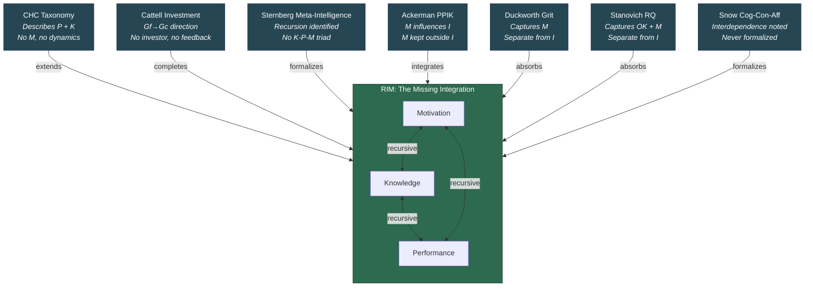

# Relation to Established Intelligence Models

**RIM does not replace established intelligence models -- it completes them by adding the motivational component and recursive structure that each model independently approaches but none formally integrates.**

The [Recursive Intelligence Model](../intelligence/overview.md) did not emerge from a vacuum. Several major frameworks in intelligence research have gestured toward the territory RIM occupies -- the integration of cognition, knowledge, and motivation into a dynamic developmental system. Each captures part of the picture. None completes it. RIM's contribution is to show that these partial accounts are fragments of a single recursive structure.

## CHC Taxonomy

The Cattell-Horn-Carroll (CHC) taxonomy is the dominant psychometric framework for describing cognitive abilities. It organizes intelligence into a hierarchical structure with *g* at the apex, broad abilities (Gf, Gc, Gv, Gs, etc.) at the second stratum, and narrow abilities at the third. CHC provides an excellent descriptive map of the cognitive components of intelligence.

RIM's relationship to CHC is one of extension, not contradiction. The CHC taxonomy describes the Performance and Knowledge components with considerable precision -- Gf maps to Performance, Gc maps to (factual) Knowledge. What CHC lacks is any representation of Motivation and any account of the recursive dynamics by which these components interact over time. CHC is a snapshot; RIM adds the movie.

## Cattell's Investment Theory

Cattell (1971) proposed that Gf is "invested" in Gc over the lifespan -- fluid intelligence serves as the engine for acquiring crystallized intelligence. This insight is foundational, but Cattell's theory has two gaps the recursive model fills. First, **the investor is missing**: who or what decides to invest? In RIM, Motivation is the investor -- the drive that sustains the conversion of processing capacity into knowledge. Second, **the feedback is missing**: Cattell's model is unidirectional (Gf flows into Gc), whereas RIM adds the return channel through which accumulated Knowledge (especially [operational knowledge](../intelligence/operational-knowledge.md)) feeds back into effective Performance.

## Sternberg's Triarchic and Meta-Intelligence

Sternberg's (2019) concept of "adaptive intelligence" emphasizes goals and purpose in intelligent behavior. More recently, Sternberg et al. (2021) proposed "meta-intelligence" -- intelligence that operates on itself, recursively improving its own functioning. This is structurally identical to the [recursive loop](../intelligence/recursive-loop.md): meta-intelligence *is* operational knowledge driving the loop to optimize its own iteration. What Sternberg does not provide is the formal K-P-M triad or the mechanism by which motivation sustains the recursive process.

## Ackerman's PPIK Theory

Ackerman (1996) explicitly modeled how Personality, interests (Process), Intelligence, and Knowledge interact across intellectual development. PPIK recognizes that motivational factors (personality traits, interests) direct the Gf-to-Gc investment process. [Wittmann and Suss (1999)](https://doi.org/10.1016/S0160-2896(99)00013-X), working within the PPIK framework, demonstrated empirically that motivation's effect on complex performance is largely indirect -- mediated through knowledge rather than acting directly on performance. Their path-analytic model showed intelligence-as-knowledge as the strongest direct predictor, with motivational variables contributing primarily via knowledge acquisition. This is precisely the M-to-K-to-P pathway the recursive model formalizes. PPIK's limitation is that it keeps motivational constructs *outside* the intelligence construct -- as influences on intelligence rather than constitutive components of it.

## Duckworth's Grit

Duckworth et al.'s (2007) "grit" -- perseverance and passion for long-term goals -- captures what IQ misses: the sustained effort that drives intellectual development. In the recursive model's terms, grit is a proxy for the Motivation component, specifically the persistence dimension of [Handlungsdrang](../intelligence/wissensdrang-handlungsdrang.md). Duckworth frames grit as a separate construct from intelligence rather than a constitutive component of it. RIM argues this separation is the error: grit is not external to intelligence but is part of what intelligence *is*.

## Stanovich's Rationality Quotient

Stanovich (2016) argued that IQ measures fail to capture rational thinking -- the disposition to engage effortful, reflective processing rather than defaulting to heuristic shortcuts. The Rationality Quotient captures something close to operational knowledge combined with the motivation to deploy it. Like Duckworth, Stanovich frames this as a separate construct rather than a component of intelligence. RIM absorbs both: rational thinking is a consequence of high operational Knowledge deployed via adequate Motivation.

## Snow's Cognitive-Conative-Affective Framework

Snow (1996) acknowledged the interdependence of cognition, conation (effort, will), and affect in learning. His framework remains perhaps the closest precursor to RIM's integration of cognitive and motivational components. Snow's limitation was disciplinary: the framework stayed within educational psychology and was never integrated into mainstream intelligence theory. RIM carries Snow's insight into the intelligence literature and formalizes the interaction structure that Snow described qualitatively.

## Dynamic Systems Approaches

Van Geert (2020) argues that constructs like intelligence must be understood as "temporary process stabilities" rather than fixed traits. Balboni et al. (2021) argue that intelligence is an emergent property of person-task-situation interaction. These process-oriented approaches provide the philosophical foundation for RIM's dynamic account. What RIM adds to these frameworks is specificity: the identification of three components (K, P, M), their recursive interaction, and the temporal dynamics by which the interaction compounds over the lifespan.

## Figure

*Each established model captures part of the recursive structure. RIM's contribution is the integration: formalizing the K-P-M triad and the recursive dynamics that existing models approach but never complete.*

## Key Takeaway

RIM does not compete with established intelligence models -- it integrates them. CHC describes the cognitive components, Cattell describes the investment direction, Sternberg identifies the recursion, Ackerman maps the influences, and Duckworth and Stanovich capture what IQ misses. What was missing was the formal integration of all these insights into a single recursive system. That integration is RIM.

## See Also

- [The Three Components: Knowledge, Performance, Motivation](../intelligence/three-components.md)
- [The Recursive Loop](../intelligence/recursive-loop.md)
- [Gf-Gc Divergence Across the Lifespan](../intelligence/gf-gc-divergence.md)
- [Operational Knowledge: The Hidden Multiplier](../intelligence/operational-knowledge.md)
- [The Recursive Intelligence Model (Overview)](../intelligence/overview.md)

---

Based on: Gruber, M. (2026). Why Intelligence Models Must Include Motivation: A Recursive Framework. PsyArXiv. https://osf.io/preprints/osf/kctvg
