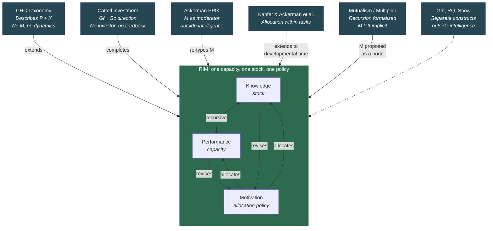

# Relation to Established Intelligence Models

**RIM does not replace established intelligence models. It re-types one of their constituents: where the tradition typed every constituent of intelligence as a capacity, RIM treats Performance as a capacity, Knowledge as a stock, and Motivation as the allocation policy over the loop. The recursive structure itself has precedents; the re-typing and its measurement consequences are what RIM adds.**

The [Recursive Intelligence Model](../intelligence/overview.md) did not emerge from a vacuum. Several frameworks in intelligence research approach the territory RIM occupies -- the integration of cognition, knowledge and motivation into a developmental system -- and two of them formalized recursive dynamics in intelligence two decades ago. The sections below state what each supplies and where RIM differs.

## CHC Taxonomy

The Cattell-Horn-Carroll (CHC) taxonomy is the dominant psychometric framework for describing cognitive abilities. It organizes intelligence into a hierarchical structure with *g* at the apex, broad abilities (Gf, Gc, Gv, Gs, etc.) at the second stratum, and narrow abilities at the first. CHC remains a useful descriptive framework for the cognitive components of intelligence.

RIM's relationship to CHC is one of extension, not contradiction. CHC describes the Performance and Knowledge components with considerable precision -- Gf maps roughly to Performance, Gc loosely to Knowledge. What CHC lacks is any representation of Motivation and any account of the recursive dynamics by which the components interact over time. CHC is a snapshot; RIM adds the movie.

## Cattell's Investment Theory

Cattell (1971) proposed that Gf is "invested" in Gc over the lifespan. This insight is foundational, but the theory has two gaps. First, **the investor is missing**: who or what decides what to invest in? Cattell treated motivation as an external condition that modulates the investment, not as part of intelligence. In RIM, Motivation is the investor -- the allocation policy that decides how much of the loop runs, on what, and for how long. Second, **the feedback is missing**: Cattell's model runs from Gf to Gc, whereas RIM adds the return channel through which accumulated Knowledge (especially [operational knowledge](../intelligence/operational-knowledge.md)) feeds back into effective Performance.

## Sternberg's Adaptive Intelligence and Meta-Intelligence

Sternberg's (2019) concept of "adaptive intelligence" emphasizes goals and purpose in intelligent behavior. Sternberg et al. (2021) proposed "meta-intelligence" -- intelligence that operates on itself. Meta-intelligence is a control layer that selects among creative, analytical, practical and wisdom-based approaches to a problem, not a loop through which capacity raises itself. The recursion RIM proposes operates on the components rather than on the choice between approaches, and it carries motivation inside the loop.

## Ackerman's PPIK Theory

Ackerman's (1996, 2018) PPIK theory (Process, Personality, Interests, Knowledge) comes closest to RIM: it explicitly models how personality traits and interests direct the Gf-to-Gc investment process, and its empirical program has shown that these non-cognitive factors predict intellectual development beyond cognitive ability alone. RIM can be understood as extending PPIK by treating motivation not as a moderator of the investment process but as the allocation policy that governs it -- a step that changes the formal structure of the model rather than adding predictors to it.

Wittmann and Süß (1999) established the Brunswik symmetry framework for these path relationships, and Wittmann (2002) applied it to motivation: his path-analytic model showed intelligence-as-knowledge as the strongest direct predictor of dynamic task performance, with motivational variables contributing primarily via knowledge acquisition. This is the M-to-K-to-Performance pathway the recursive model formalizes.

## Duckworth's Grit and Stanovich's Rationality Quotient

Duckworth et al.'s (2007) "grit" and Stanovich et al.'s (2016) Rationality Quotient each capture what IQ misses -- including the drive to engage effortful processing -- but frame these as separate constructs standing outside intelligence rather than as anything internal to it.

## Snow's Cognitive-Conative-Affective Framework

Snow (1996) acknowledged the interdependence of cognition and motivation in learning, but the framework remained in educational psychology and was never integrated into mainstream intelligence theory.

## Allocation Accounts of Motivation

The claim that motivation is best understood as the allocation of a limited resource is not new. Kanfer and Ackerman (1989) treat motivation as the allocation of limited attentional resources during skill acquisition; Shenhav et al. (2013) derive the allocation of cognitive control from an expected-value optimization; Kurzban et al. (2013) account for the sensation of mental effort as the output of an opportunity-cost computation. Kanfer and Ackerman's account is the closest, and RIM does not correct it.

What remains separable is the resource and the timescale. All three accounts allocate attention or control during task engagement. RIM allocates **iterations of the loop, across developmental time** -- how often the cycle runs and at what it is pointed, over years. None of the three re-types the intelligence construct, and none derives consequences for the measurement of the allocated disposition itself: attenuation under narrow single-occasion sampling, and consistency rather than level as the predictive statistic.

## Mutualism, Multipliers and Dynamic Systems

The closest formal precedents are not in the personality-intelligence literature. Van der Maas et al. (2006) derived the positive manifold from *mutualism*: initially uncorrelated cognitive processes that reinforce one another's growth produce a general factor without any general cause. Dickens and Flynn (2001) formalized a multiplier in which a small initial advantage attracts a better-matched environment, which raises ability further. Savi et al. (2019) extended the network account into a developmental wiring model. Van Geert (2020) argues that constructs like intelligence are "temporary process stabilities" rather than fixed traits, and Sternberg (2021) that intelligence emerges from person × task × situation interaction.

RIM should therefore not be read as discovering recursion in intelligence. What it claims is narrower. First, the quantity the mutualism and multiplier models leave implicit -- how much of the reciprocal process actually runs, and for how long -- is motivation, and it belongs inside the system: Dickens and Flynn's multiplier presupposes an agent that seeks out and holds onto matched environments, and in their model that seeking is a parameter rather than a construct. Second, motivation's apparent fragmentation across the personality-intelligence literature is a measurement artifact rather than a structural fact. Third, the resulting programme is a measurement programme with stated falsifiers.

## Figure

```mermaid
graph TB
    subgraph RIM_CORE["RIM: one capacity, one stock, one policy"]
        direction TB
        K["Knowledge<br/><i>stock</i>"]
        P["Performance<br/><i>capacity</i>"]
        M["Motivation<br/><i>allocation policy</i>"]
        K <-->|"recursive"| P
        M -->|"allocates"| K
        M -->|"allocates"| P
        K -->|"revises"| M
        P -->|"revises"| M
    end

    CHC["CHC Taxonomy<br/><i>Describes P + K<br/>No M, no dynamics</i>"] -->|"extends"| RIM_CORE
    CAT["Cattell Investment<br/><i>Gf→Gc direction<br/>No investor, no feedback</i>"] -->|"completes"| RIM_CORE
    ACK["Ackerman PPIK<br/><i>M as moderator<br/>outside intelligence</i>"] -->|"re-types M"| RIM_CORE
    ALLOC["Kanfer & Ackerman et al.<br/><i>Allocation within tasks</i>"] -->|"extends to<br/>developmental time"| RIM_CORE
    MUT["Mutualism / Multiplier<br/><i>Recursion formalized<br/>M left implicit</i>"] -->|"M proposed<br/>as a node"| RIM_CORE
    SEP["Grit, RQ, Snow<br/><i>Separate constructs<br/>outside intelligence</i>"] -.-> RIM_CORE

    style RIM_CORE fill:#2d6a4f,color:#fff,stroke:#1b4332
    style CHC fill:#264653,color:#fff,stroke:#1d3557
    style CAT fill:#264653,color:#fff,stroke:#1d3557
    style ACK fill:#264653,color:#fff,stroke:#1d3557
    style ALLOC fill:#264653,color:#fff,stroke:#1d3557
    style MUT fill:#264653,color:#fff,stroke:#1d3557
    style SEP fill:#264653,color:#fff,stroke:#1d3557
```

*The recursive structure has formal precedents in mutualism and multiplier models, and the allocation view of motivation has precedents within tasks. RIM's contribution is to type motivation as the policy allocating loop iterations across developmental time, and to derive measurement consequences from that typing.*

## Key Takeaway

RIM does not compete with established intelligence models. CHC describes the cognitive components, Cattell the investment direction, PPIK the non-cognitive influences, and the mutualism and multiplier models the recursive dynamics. What RIM adds is the claim that one of the three things being reciprocally caused -- motivation -- has been the wrong kind of thing all along, together with the measurement predictions that correcting its type entails.

## See Also

- [Three Components, Three Kinds: Knowledge, Performance, Motivation](../intelligence/three-components.md)
- [The Recursive Loop](../intelligence/recursive-loop.md)
- [Gf-Gc Divergence Across the Lifespan](../intelligence/gf-gc-divergence.md)
- [Operational Knowledge: The Hidden Multiplier](../intelligence/operational-knowledge.md)
- [The Recursive Intelligence Model (Overview)](../intelligence/overview.md)

---

Based on: Gruber, M. (2026). A Schedule, Not a Substance: Motivation as Allocation Policy and the Mis-Typed Components of Intelligence. Zenodo. https://doi.org/10.5281/zenodo.20125095
