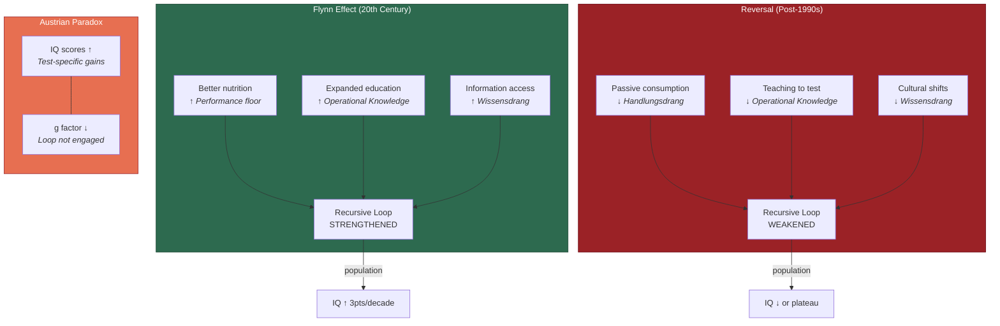

# The Flynn Effect and Its Reversal

**Population-level IQ changes -- rising for decades, now reversing in developed nations -- are inexplicable under static-trait models of intelligence but follow directly from the recursive model's prediction that environmental conditions supporting the loop determine population-level intellectual development.**

The Flynn effect -- the sustained rise in IQ scores across the 20th century, documented across dozens of countries (Flynn, 1987) -- has been called the most puzzling finding in intelligence research. Equally puzzling is its reversal: since the mid-1990s, IQ scores have plateaued or declined in several developed nations (Dutton & Lynn, 2013; Bratsberg & Rogeberg, 2018). The [Recursive Intelligence Model](../intelligence/overview.md) provides a unified explanation for both phenomena.

## The Effect

IQ scores rose by approximately 3 points per decade across most of the 20th century. The gains were largest on tests of fluid intelligence (Gf) -- precisely the component that static-trait models consider most biologically determined and least responsive to environmental influence.

Competing explanations -- improved nutrition, smaller family sizes, greater test familiarity, educational expansion -- all capture partial truths but lack a unifying mechanism. The recursive model provides one: environmental improvements in the 20th century systematically strengthened the [recursive loop](../intelligence/recursive-loop.md). Better nutrition improved the Performance floor. Expanding education provided [operational knowledge](../intelligence/operational-knowledge.md). Growing access to information fueled Wissensdrang. Each improvement strengthened one or more components, and the loop amplified those gains across the lifespan and across generations.

## The Reversal

[Bratsberg and Rogeberg (2018)](https://doi.org/10.1073/pnas.1718793115), analyzing Norwegian military conscript data, demonstrated that IQ scores rose and then declined across birth cohorts *within families* -- ruling out genetic explanations (differential fertility, dysgenic selection) and confirming environmental causation. This finding is devastating for models that treat intelligence as a primarily biological trait. It is precisely what the recursive model predicts: when environmental conditions that support the loop degrade, the loop weakens at the population level.

What environmental conditions might be degrading? The recursive model points to specific suspects: declining educational quality (particularly in the teaching of operational knowledge), screen-mediated information consumption that favors passive reception over active engagement (suppressing Handlungsdrang), and cultural shifts that may reduce the status of intellectual curiosity (weakening Wissensdrang).

## The Austrian Paradox

The most striking evidence for the recursive interpretation comes from [Gignac and Zajenkowski (2024)](https://doi.org/10.1016/j.intell.2024.101812), who documented an "Austrian paradox": IQ scores rose while *g* -- the general factor extracted from the correlation matrix -- simultaneously declined. This dissociation is inexplicable under static-trait models but directly predicted by the recursive framework.

Teaching to the test inflates Performance scores -- narrow, task-specific knowledge that boosts standardized measures without engaging the recursive loop. The result is higher scores on IQ tests with lower capacity for the self-directed, generalizable learning that the recursive loop produces. In the model's terms: test-prep interventions target a thin slice of Knowledge (factual, domain-specific) and a thin slice of Performance (specific task strategies), while neglecting the operational knowledge and motivation that drive the loop. IQ goes up; intelligence, properly understood, goes down.

## Figure

*The Flynn effect and its reversal reflect changes in the environmental conditions that support the recursive loop. The Austrian paradox reveals the mechanism: teaching to the test inflates scores without engaging the loop that produces genuine intellectual development.*

## Key Takeaway

The Flynn effect is not a mystery about biology -- it is a predictable consequence of environmental conditions strengthening or weakening the recursive intelligence loop. The Austrian paradox (IQ up, *g* down) provides the sharpest evidence: interventions that inflate scores without engaging the loop produce the illusion of rising intelligence alongside its actual decline.

## See Also

- [The Recursive Loop](../intelligence/recursive-loop.md)
- [Operational Knowledge: The Hidden Multiplier](../intelligence/operational-knowledge.md)
- [The School Grade Disaster](../education/school-grade-disaster.md)
- [Compounding Effects](../education/educational-implications.md)
- [Gf-Gc Divergence Across the Lifespan](../intelligence/gf-gc-divergence.md)

---

Based on: Gruber, M. (2026). Why Intelligence Models Must Include Motivation: A Recursive Framework. PsyArXiv. https://osf.io/preprints/osf/kctvg
