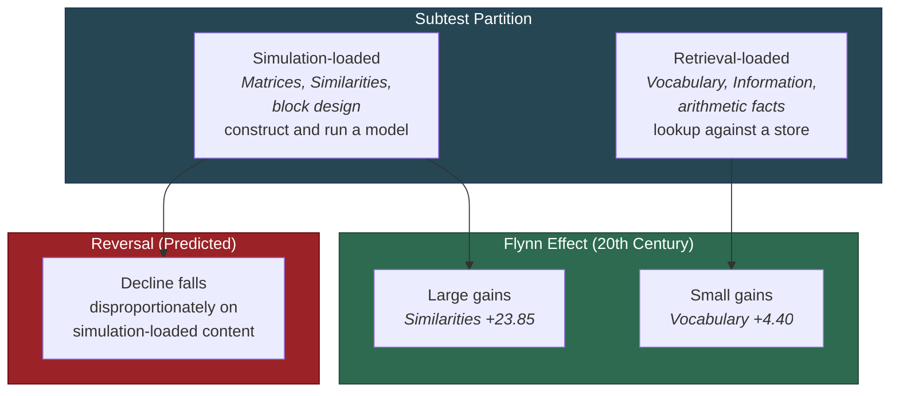

# The Flynn Effect and Its Reversal

**Population-level IQ changes -- rising for decades, now reversing in several developed nations -- are hard to reconcile with models that treat intelligence as a primarily biological trait. The recursive model reads them as changes in the environmental conditions that support the loop, and implies a partition of test content that makes the reading testable.**

The Flynn effect -- the sustained rise in IQ scores across the 20th century, documented across dozens of countries (Flynn, 1987) -- has been called the most puzzling finding in intelligence research. Equally puzzling is its reversal: since the mid-1990s, IQ scores have plateaued or declined in several developed nations (Dutton & Lynn, 2013; Bratsberg & Rogeberg, 2018).

## The Effect

The gains were not uniform. Across the American Wechsler standardizations from 1947–48 to 2001.75, Flynn and Weiss (2007) report a gain of 23.85 IQ points on Similarities, against 4.40 on Vocabulary, 2.30 on Arithmetic and 2.15 on Information. Pietschnig and Voracek's (2015) meta-analysis of 271 samples from 31 countries estimates annual gains of 0.41 IQ points for fluid and 0.30 for spatial performance, against 0.21 for crystallized.

Flynn's own account attributes this pattern to a secular shift toward abstract and scientific habits of classification -- children have come to "view the world through the spectacles provided by science" -- and the recursive model does not displace that reading. What it adds is a reason why particular classes of subtest should be the ones that separate.

## Simulation-Loaded and Retrieval-Loaded Content

The recursive model implies a partition of standard test content that cuts across the usual verbal/performance and Gf/Gc divisions. **Simulation-loaded** subtests require the examinee to construct a model of a situation that is not present and run it: matrix reasoning, block design, mental rotation, Similarities (constructing a superordinate relation neither term supplies), Comprehension items about hypothetical circumstances. **Retrieval-loaded** subtests ask for a lookup against a store: Vocabulary, Information, arithmetic-fact items. Coding, a speeded clerical task, fits neither class and is excluded.

The partition is the stored/running boundary of the [three components](../intelligence/three-components.md) transposed to test content. A retrieval-loaded item is answered from what is stored in structure. A simulation-loaded item cannot be answered that way: the generative process has to run, and model construction is the operation the [recursive loop](../intelligence/recursive-loop.md) trains, while the store is filled only incidentally.

The partition sorts the largest secular changes on record. Because it was drawn with the American table in view, that fit describes the classification rather than tests it; the test requires a held-out record classified in advance.

## The Reversal

[Bratsberg and Rogeberg (2018)](https://doi.org/10.1073/pnas.1718793115), analyzing Norwegian military conscript data, demonstrated that IQ scores rose and then declined across birth cohorts *within families* -- a design that rules out explanations resting on changing between-family composition, including the prominent genetic ones, and is consistent with environmental causation. It is what the recursive model predicts: when environmental conditions that support the loop (educational quality, intellectual engagement) degrade, the loop weakens at the population level.

The model adds a prediction the record can check: if the loop-supporting conditions have degraded, the decline should fall disproportionately on simulation-loaded content, mirroring the ascent. The Norwegian conscript archive carries its three subtests separately and can settle this directly.

## The Austrian Record

Oberleiter et al. (2024), comparing two population-representative Germanophone samples (N = 1267) across six measurement-invariant subscales from 2005 to 2024, report declines in single-factor *g* alongside score increases in every domain; Andrzejewski et al. (2024) report the same direction over a shorter window, where the change was not statistically significant. What declines is the strength of the positive manifold -- the inter-correlation among subtests -- not the level of any measured ability. Both sets of authors read the pattern as increasing ability differentiation in the general population.

The recursive model does not predict that decoupling in advance and does not claim it as support. It offers a candidate mechanism for the differentiation: a loop engaged unevenly across content would produce increasingly asymmetric individual profiles while every subtest mean rises.

## What Would Disconfirm It

The prediction is disconfirmed if simulation-loaded and retrieval-loaded subtests show statistically indistinguishable secular trajectories in a record the partition was not read off, with every subtest assigned to a class before its gains are inspected, or if the reversal falls on retrieval-loaded content while simulation-loaded scores hold. Competing accounts do not generate the contrast: a test-familiarity account predicts gains concentrated on whatever content is most practiced, and a nutrition or general-health account predicts a broadly uniform lift.

## Figure

```mermaid
graph TB
    subgraph PART["Subtest Partition"]
        direction TB
        SIM["Simulation-loaded<br/><i>Matrices, Similarities,<br/>block design</i><br/>construct and run a model"]
        RET["Retrieval-loaded<br/><i>Vocabulary, Information,<br/>arithmetic facts</i><br/>lookup against a store"]
    end

    subgraph RISE["Flynn Effect (20th Century)"]
        direction TB
        R1["Large gains<br/><i>Similarities +23.85</i>"]
        R2["Small gains<br/><i>Vocabulary +4.40</i>"]
    end

    subgraph FALL["Reversal (Predicted)"]
        direction TB
        F1["Decline falls<br/>disproportionately on<br/>simulation-loaded content"]
    end

    SIM --> R1
    RET --> R2
    SIM --> F1

    style PART fill:#264653,color:#fff,stroke:#1d3557
    style RISE fill:#2d6a4f,color:#fff,stroke:#1b4332
    style FALL fill:#9b2226,color:#fff,stroke:#6a040f
```

*The partition separates the largest secular gains from the smallest. Its predictions -- for held-out records and for the reversal -- have not yet been tested against a classification fixed in advance.*

## Key Takeaway

The Flynn effect and its within-family reversal are consistent with environmental conditions strengthening or weakening the recursive intelligence loop. The recursive model does not replace Flynn's own account; it supplies a reason why simulation-loaded and retrieval-loaded content should move differently, and states in advance what result would show it wrong.

## See Also

- [The Recursive Loop](../intelligence/recursive-loop.md)
- [Three Components, Three Kinds: Knowledge, Performance, Motivation](../intelligence/three-components.md)
- [Operational Knowledge: The Hidden Multiplier](../intelligence/operational-knowledge.md)
- [The School Grade Disaster](../education/school-grade-disaster.md)
- [Compounding Effects](../education/educational-implications.md)
- [Gf-Gc Divergence Across the Lifespan](../intelligence/gf-gc-divergence.md)

---

Based on: Gruber, M. (2026). Motivation as Allocation Policy and the Mis-Typed Components of Intelligence. Zenodo. https://doi.org/10.5281/zenodo.20125095
