# Gf-Gc Divergence Across the Lifespan

**The classic puzzle of intelligence research -- why fluid intelligence (Gf) declines from early adulthood while crystallized intelligence (Gc) continues to grow -- resolves naturally within the recursive model as the growing dominance of Knowledge and Motivation over the declining Performance component.**

The Gf-Gc divergence is one of the most robust findings in intelligence research. Fluid intelligence -- raw processing capacity, pattern recognition, novel problem-solving -- peaks in the early twenties and declines thereafter. Crystallized intelligence -- accumulated knowledge, vocabulary, domain expertise -- continues to grow well into the sixties or beyond. Cattell's (1971) investment theory proposed that Gf is "invested" in Gc over the lifespan, but the mechanism by which this investment occurs was left underspecified. The [Recursive Intelligence Model](../intelligence/overview.md) completes the picture.

## The Standard Account

Cattell's investment theory observes that fluid intelligence serves as the engine for acquiring crystallized intelligence: higher Gf enables faster and deeper learning, which accumulates as Gc over time. As Gf declines with age, the rate of new Gc acquisition slows, but existing Gc remains and continues to be refined. This is a reasonable first approximation, but it treats the relationship as unidirectional (Gf invests into Gc) and says nothing about what sustains the investment process across decades.

## The Recursive Explanation

The recursive model reframes the divergence as a shift in which components of the [recursive loop](../intelligence/recursive-loop.md) dominate the system's behavior over time.

**In youth**, Performance (Gf) is at its peak. The young learner has maximum processing capacity -- fast working memory, rapid pattern recognition, high neural plasticity. Knowledge and Motivation are relatively low (the learner has not yet accumulated much of either). Performance dominates the loop.

**In middle age**, Performance begins its biological decline. But Knowledge -- particularly [operational knowledge](../intelligence/operational-knowledge.md) -- has been accumulating for decades. The experienced professional has learned how to learn, how to reason efficiently, how to leverage expertise to compensate for declining raw speed. Motivation, if sustained, continues to drive the loop. The system shifts from Performance-dominated to Knowledge-dominated operation. This is why a 55-year-old expert typically outperforms a 25-year-old novice in their domain despite lower Gf: the accumulated Knowledge (both factual and operational) more than compensates for the decline in raw processing capacity.

**In the recursive model's terms**, Gc continues to grow because the K and M legs of the loop are still iterating, even as the P leg weakens. The loop does not stop when Performance declines -- it shifts its center of gravity. Knowledge compensates for Performance through chunking, automatization, and strategic shortcuts. Motivation sustains the iteration count. The only scenario in which Gc stagnates is when Motivation collapses (retirement apathy, depression) or when Performance declines catastrophically (dementia, severe neurological insult).

## Why Cattell's Theory Is Incomplete

Cattell's investment theory gets the direction right (Gf invests into Gc) but misses two critical features that the recursive model adds:

1. **The investor is missing.** Cattell's theory describes what is invested (Gf) and what accumulates (Gc) but not what drives the investment process. In the recursive model, Motivation is the investor -- it sustains the loop iterations that convert processing capacity into knowledge. Without motivation, Gf sits idle regardless of its level.

2. **The feedback is missing.** Cattell's model is unidirectional: Gf flows into Gc. The recursive model adds the return channel: accumulated Knowledge (especially operational knowledge) feeds back into effective Performance, partially compensating for biological Gf decline. The 55-year-old expert's effective processing capacity is not just raw Gf but Gf augmented by decades of learned strategies.

## Figure

```mermaid
graph LR
    subgraph YOUTH["Youth (Peak Gf)"]
        direction TB
        YP["Performance ★★★<br/><i>High Gf, fast WM</i>"]
        YK["Knowledge ★<br/><i>Still accumulating</i>"]
        YM["Motivation ★★<br/><i>Building</i>"]
    end

    subgraph MIDLIFE["Midlife (Gf Declining)"]
        direction TB
        MP["Performance ★★<br/><i>Gf declining</i>"]
        MK["Knowledge ★★★<br/><i>Deep expertise +<br/>operational knowledge</i>"]
        MM["Motivation ★★★<br/><i>Sustained by mastery</i>"]
    end

    subgraph RESULT["Observable Pattern"]
        direction TB
        GF["Gf ↓<br/><i>Biological decline</i>"]
        GC["Gc ↑<br/><i>Loop still iterating<br/>via K and M</i>"]
    end

    YOUTH -->|"decades of<br/>loop iterations"| MIDLIFE
    MIDLIFE --> RESULT

    style YOUTH fill:#264653,color:#fff,stroke:#1d3557
    style MIDLIFE fill:#2d6a4f,color:#fff,stroke:#1b4332
    style RESULT fill:#e76f51,color:#fff,stroke:#9b2226
    style GF fill:#9b2226,color:#fff,stroke:#6a040f
    style GC fill:#2d6a4f,color:#fff,stroke:#1b4332
```

*The Gf-Gc divergence reflects a shift in which component dominates the recursive loop: from Performance-dominated in youth to Knowledge-and-Motivation-dominated in maturity. Gc continues to grow because the loop keeps iterating -- just with different legs carrying the load.*

## Key Takeaway

The Gf-Gc divergence is not a puzzle but a prediction. The recursive model expects Gc to grow even as Gf declines, because two of the three loop components (Knowledge and Motivation) are not biologically constrained. The divergence is the visible signature of a system shifting from hardware-dependent to software-dependent operation over the lifespan.

## See Also

- [The Three Components: Knowledge, Performance, Motivation](../intelligence/three-components.md)
- [The Recursive Loop](../intelligence/recursive-loop.md)
- [Performance Is Not the Bottleneck](../intelligence/performance-not-bottleneck.md)
- [Relation to Established Intelligence Models](../intelligence/established-models.md)
- [Operational Knowledge: The Hidden Multiplier](../intelligence/operational-knowledge.md)

---

Based on: Gruber, M. (2026). Why Intelligence Models Must Include Motivation: A Recursive Framework. PsyArXiv. https://osf.io/preprints/osf/kctvg
