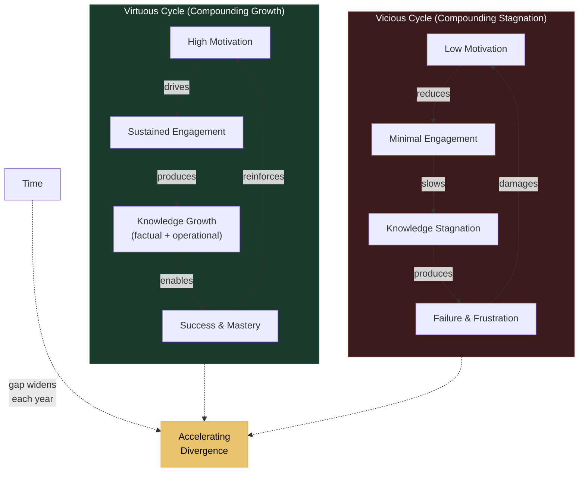

# The Matthew Effect and Compounding Dynamics

**The recursive intelligence loop produces self-reinforcing dynamics in which small initial differences compound over time, producing wide variance in adult intellectual achievement — the Matthew effect is not an anomaly to be explained but a direct structural prediction of the model.**

The term "Matthew effect" comes from Stanovich's (1986) observation in reading research: children who read well read more, which makes them read even better, while poor readers read less, fall further behind, and the gap widens with each passing year. The Recursive Intelligence Model argues that Stanovich's Matthew effect in reading is a specific instance of a general recursive dynamic that operates across all domains of intellectual development.

## The General Mechanism

The Matthew effect emerges from the recursive loop's feedback structure. Consider two children who begin with slightly different configurations:

**Child A** has moderate Performance but high Motivation and strong [operational knowledge](../intelligence/operational-knowledge.md) (learning strategies acquired from a stimulating home environment). The [recursive loop](../intelligence/recursive-loop.md) iterates efficiently: motivation drives engagement, operational knowledge ensures that effort translates into learning, learning produces success, success reinforces motivation. Each cycle adds capability and accelerates the next cycle.

**Child B** has equal or even superior Performance but low Motivation and poor operational knowledge. The loop iterates infrequently. Without motivation, there is no sustained engagement. Without operational knowledge, effort translates poorly into learning. Without learning, there is no success to reinforce motivation.

After one year, the difference between A and B is modest. After ten years, it is substantial. After twenty, it can be enormous — and the gap is still widening, because the recursive loop compounds. The divergence is not linear; it accelerates. This is compound interest applied to intellectual development.

## Compounding: A Structural Prediction

The recursive model makes a specific, testable prediction about the time course of these effects: both motivation-enhancing and motivation-destroying interventions should produce effects that *compound* over time, not effects that remain static.

A single discouraging grade in first grade does not merely reduce motivation in first grade. It slightly reduces the rate at which the loop iterates, producing a slightly smaller knowledge base by second grade, slightly worse performance on subsequent assessments, another discouraging signal, further reduced motivation, and so on. The recursive structure predicts that early motivational damage should be visible as an *accelerating* divergence from peers — a fanning-out of trajectories that grows wider with each passing year.

Conversely, a motivation-enhancing intervention in early childhood should show larger effects at five-year follow-up than at one-year follow-up, because the additional loop iterations accumulate. Heckman's (2006) analysis of early childhood interventions, including the Perry Preschool Project, confirms exactly this pattern: returns grow over time, with larger effects at age 27 than at age 7. Initial cognitive gains often fade, but motivational and self-regulatory gains compound through subsequent learning — precisely what a recursive model predicts and precisely what a static-trait model does not.

## The Virtuous and Vicious Cycles

The Matthew effect operates in both directions:

**Virtuous cycle**: High M drives engagement, engagement produces K growth, K growth (especially operational knowledge) accelerates future learning, successful learning reinforces M. The loop spins faster with each iteration. The rich get richer.

**Vicious cycle**: Low M reduces engagement, reduced engagement slows K growth, slow K growth means poor strategies and few successes, lack of success further damages M. The loop decelerates. The poor get poorer. Educational practices that attack motivation — punitive grading, fixed-ability labeling, competitive ranking — do not merely fail to develop intelligence; they actively reverse the loop, producing compounding damage that worsens year after year.

The recursive model explains why interventions that target only one component (e.g., growth mindset alone) produce negligible effects. Macnamara and Burgoyne's (2023) meta-analysis found that growth mindset interventions produced a corrected effect size of d = 0.05 on academic achievement — effectively zero. The recursive model predicts this failure: changing one belief within the Motivation component, without simultaneously addressing Knowledge (especially operational knowledge), cannot restart a stalled loop. Effective intervention must engage the full system.

## Population-Level Compounding

The compounding dynamic operates at population level as well as individual level. The Flynn effect — the sustained rise in IQ scores across the 20th century — reflects environmental conditions that support the loop: better nutrition, more education, richer intellectual environments. The Flynn effect reversal, documented across multiple countries (Bratsberg & Rogeberg, 2018), reflects the degradation of those conditions. The "Austrian paradox" (Gignac & Zajenkowski, 2024) — IQ scores rising while the general factor *g* simultaneously declines — reflects teaching-to-the-test that inflates Performance scores without engaging the recursive loop. Scores go up; actual intelligence development stagnates.

## Figure

## Key Takeaway

The Matthew effect in intelligence is not an anomaly or a side effect — it is a direct structural prediction of the recursive model. Small initial differences compound because the loop amplifies them with each iteration. This makes early motivational interventions disproportionately powerful and early motivational damage disproportionately destructive.

## See Also

- [The Recursive Loop](../intelligence/recursive-loop.md)
- [The Three Components: Knowledge, Performance, Motivation](../intelligence/three-components.md)
- [Operational Knowledge: The Hidden Multiplier](../intelligence/operational-knowledge.md)
- [The School Grade Disaster](../education/school-grade-disaster.md)
- [Compounding Effects: A Structural Prediction](../education/compounding-effects.md)
- [The Recursive Intelligence Model (Overview)](../intelligence/overview.md)
