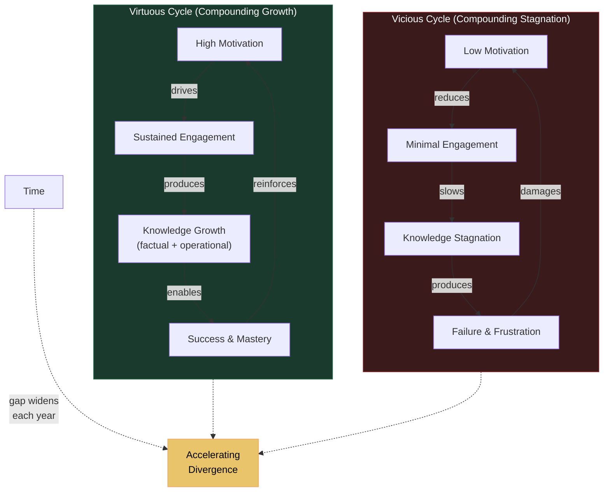

# The Matthew Effect and Compounding Dynamics

**The recursive intelligence loop produces self-reinforcing dynamics in which small initial differences compound over time, producing wide variance in adult intellectual achievement. On this model the Matthew effect is what the loop's structure produces.**

The term "Matthew effect" comes from Stanovich's (1986) observation in reading research: children who read well read more, which makes them read even better, while poor readers read less, fall further behind, and the gap widens with each passing year. The Recursive Intelligence Model argues that Stanovich's Matthew effect in reading is a specific instance of a general recursive dynamic that operates across all domains of intellectual development.

## The General Mechanism

The Matthew effect emerges from the recursive loop's feedback structure. Consider two children who begin with slightly different configurations:

**Child A** has moderate Performance but a motivational schedule that points consistently at learning, and strong [operational knowledge](../intelligence/operational-knowledge.md) (learning strategies acquired from a stimulating home environment). The [recursive loop](../intelligence/recursive-loop.md) iterates efficiently: the schedule allocates engagement, operational knowledge ensures that effort translates into learning, learning produces success, success reinforces the schedule. Each cycle adds capability and accelerates the next cycle.

**Child B** has equal or even superior Performance but a schedule that points at learning only sporadically, and poor operational knowledge. The loop iterates infrequently. Without consistent allocation, there is no sustained engagement. Without operational knowledge, effort translates poorly into learning. Without learning, there is no success to reinforce motivation.

After one year, the difference between A and B is modest. After ten years, it is substantial. After twenty, it can be enormous — and the gap is still widening, because the recursive loop compounds. The divergence is not linear; it accelerates. This is compound interest applied to intellectual development.

## Compounding: A Structural Prediction

The recursive model makes a specific, testable prediction about the time course of these effects: both motivation-enhancing and motivation-destroying interventions should produce effects that *compound* over time, not effects that remain static.

A single discouraging grade in first grade does not merely reduce motivation in first grade. It slightly reduces the rate at which the loop iterates, producing a slightly smaller knowledge base by second grade, slightly worse performance on subsequent assessments, another discouraging signal, further reduced motivation, and so on. The recursive structure predicts that early motivational damage should be visible as an *accelerating* divergence from peers — a fanning-out of trajectories that grows wider with each passing year.

Conversely, a motivation-enhancing intervention in early childhood should show larger effects at five-year follow-up than at one-year follow-up, because the additional loop iterations accumulate. [Heckman's (2006)](https://doi.org/10.1126/science.1128898) analysis of early childhood interventions, including the Perry Preschool Project, supports this pattern: returns grow over time. The Perry treatment group had IQ scores no higher than the control group by age 10, yet in follow-ups to age 40 showed higher rates of high school graduation, higher salaries and fewer arrests. Heckman attributes the divergence not to persisting cognitive gains — those faded — but to the treated children being "more motivated to learn," a motivational and self-regulatory gain that compounds through subsequent learning. This is what a recursive model predicts and what a static-trait model does not.

## The Virtuous and Vicious Cycles

The Matthew effect operates in both directions:

**Virtuous cycle**: A schedule pointed consistently at learning allocates engagement, engagement produces K growth, K growth (especially operational knowledge) accelerates future learning, successful learning reinforces M. The loop spins faster with each iteration. The rich get richer.

**Vicious cycle**: A schedule that points at learning only sporadically reduces engagement, reduced engagement slows K growth, slow K growth means poor strategies and few successes, lack of success further damages M. The loop decelerates. The poor get poorer. The model predicts that punitive grading runs the loop in this direction, with damage that widens year after year; fixed-ability labeling and competitive ranking are candidates for the same treatment, each to be tested on its own terms.

The recursive model also accounts for why one-shot interventions on a single belief (e.g., growth mindset alone) produce negligible effects. Macnamara and Burgoyne's (2023) meta-analysis found that growth mindset interventions produced an effect of d = 0.05 on academic achievement, which became non-significant once publication bias was accounted for. On the policy reading this is the expected result: a single message about ability moves a momentary willingness, and a schedule that any single message could re-set would not be a schedule. What changes a policy is what recurs — which is why grading, delivered term after term with the institution's authority, is the case the model is concerned with. Effective intervention must engage the full loop, not one belief within one component.

## Population-Level Compounding

The compounding dynamic operates at population level as well as individual level. The Flynn effect reversal, documented within families in Norwegian conscript data ([Bratsberg & Rogeberg, 2018](https://doi.org/10.1073/pnas.1718793115)), is consistent with environmental causation and is what a recursive model predicts: when the environmental conditions that support the loop degrade, the loop weakens at the population level. The recent Austrian record (Oberleiter et al., 2024) shows every measured domain gaining while the positive manifold — the inter-correlation among subtests — weakens. The recursive model does not predict that decoupling in advance; it offers a candidate mechanism for it, in a loop engaged unevenly across content. See [The Flynn Effect and Its Reversal](../intelligence/flynn-effect.md).

## Figure

```mermaid
graph TD
    subgraph Virtuous["Virtuous Cycle (Compounding Growth)"]
        direction TB
        HM["High Motivation"] -->|"drives"| HE["Sustained Engagement"]
        HE -->|"produces"| KG["Knowledge Growth<br/>(factual + operational)"]
        KG -->|"enables"| S["Success & Mastery"]
        S -->|"reinforces"| HM
    end

    subgraph Vicious["Vicious Cycle (Compounding Stagnation)"]
        direction TB
        LM["Low Motivation"] -->|"reduces"| LE["Minimal Engagement"]
        LE -->|"slows"| SK["Knowledge Stagnation"]
        SK -->|"produces"| F["Failure & Frustration"]
        F -->|"damages"| LM
    end

    T["Time"] -.->|"gap widens<br/>each year"| Diverge["Accelerating<br/>Divergence"]

    Virtuous -.-> Diverge
    Vicious -.-> Diverge

    style Virtuous fill:#1a3a2e,stroke:#2d6a4f,color:#fff
    style Vicious fill:#3a1a1a,stroke:#9b2226,color:#fff
    style Diverge fill:#e9c46a,color:#000,stroke:#f4a261
```

## Key Takeaway

The Matthew effect in intelligence is what a recursive system produces. Small initial differences compound because the loop amplifies them with each iteration. The mutualism and multiplier accounts accommodate it as well; what RIM adds is that the quantity deciding how often the loop runs is motivation, typed as an allocation policy. This makes early, recurring interventions on that policy disproportionately powerful, in both directions.

## See Also

- [The Recursive Loop](../intelligence/recursive-loop.md)
- [Three Components, Three Kinds: Knowledge, Performance, Motivation](../intelligence/three-components.md)
- [Operational Knowledge: The Hidden Multiplier](../intelligence/operational-knowledge.md)
- [The School Grade Disaster](../education/school-grade-disaster.md)
- [Compounding Effects: A Structural Prediction](../education/compounding-effects.md)
- [The Recursive Intelligence Model (Overview)](../intelligence/overview.md)
