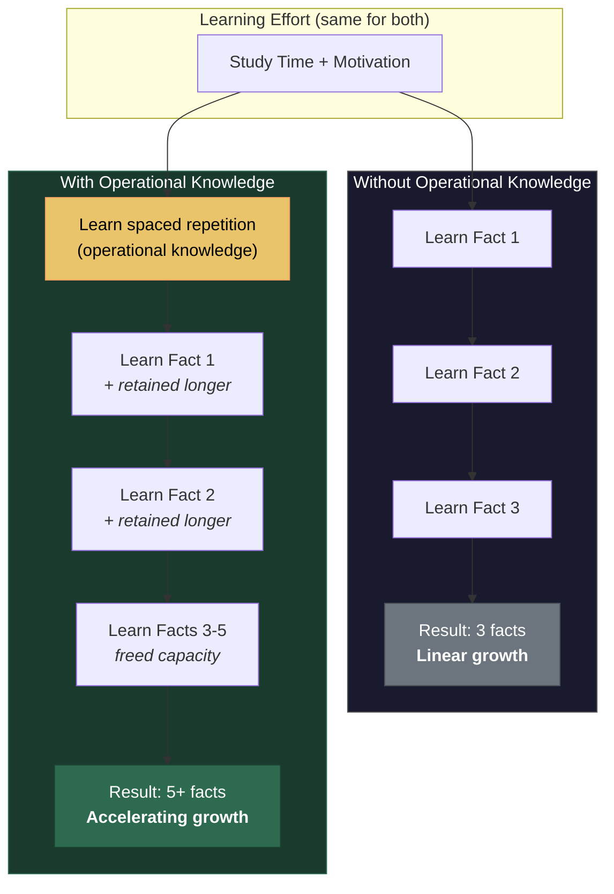

# Operational Knowledge: The Hidden Multiplier

**Operational knowledge — knowledge about how to learn and think — occupies a special position in the recursive intelligence loop because it multiplies the rate of all subsequent learning rather than adding to it incrementally.**

The [Knowledge component](../intelligence/three-components.md) of the Recursive Intelligence Model contains two functionally distinct categories that the intelligence literature has noted but never structurally exploited. Factual knowledge adds content. Operational knowledge accelerates the entire system. This distinction — between knowledge that is additive and knowledge that is multiplicative — is the single most consequential structural feature within the recursive loop.

## Factual vs. Operational Knowledge

**Factual knowledge** is knowledge of content: facts, concepts, procedures, cultural repertoire. Learning that Paris is the capital of France adds one fact to the store. Learning the quadratic formula adds one procedure. Factual knowledge accumulates linearly — each new item increases the total by one unit. This is what intelligence tests primarily measure under the rubric of crystallized intelligence (Gc) and what educational systems spend most of their time transmitting.

**Operational knowledge** (*Metawissen*) is knowledge about *how to learn and think*: learning strategies, reasoning heuristics, metacognitive skills, strategic planning, logical tools, and the ability to evaluate one's own understanding. The term overlaps with but is not identical to "metacognition" (Flavell, 1979) or "self-regulated learning" (Zimmerman, 2002). It extends beyond these constructs to include general-purpose reasoning strategies and logical tools that are not domain-specific — the capacity to think about thinking in ways that improve thinking.

## Why Multiplication, Not Addition

Operational knowledge occupies a special position in the [recursive loop](../intelligence/recursive-loop.md) because it amplifies the *rate* of knowledge acquisition. Consider a concrete example: a student who learns the technique of **spaced repetition** — distributing practice over time rather than massing it — does not merely acquire one new fact. She acquires a tool that increases the retention rate of *all* subsequent learning. Every future study session becomes more efficient. Every fact acquired thereafter is retained more reliably. The knowledge multiplies the return on all future investments.

The same multiplicative logic applies across the full range of operational knowledge:

- **Learning strategies** (spaced repetition, interleaving, elaborative interrogation) increase the efficiency of knowledge acquisition.
- **Reasoning heuristics** (working backward, analogical reasoning, falsification testing) improve the quality of conclusions drawn from available information.
- **Metacognitive skills** (self-monitoring, error detection, confidence calibration) direct effort toward gaps in understanding rather than wasting it on already-mastered material.
- **Strategic thinking** (problem decomposition, priority assessment, resource allocation) determines which problems are tackled and in what order.

Each of these is a tool that improves the operation of the system itself, not merely the size of its database. Operational knowledge is the transmission gear of the recursive loop — it determines how efficiently the turning of one component (Motivation producing effort) translates into the turning of another (Knowledge producing capability).

## The Educational Consequence

This distinction becomes acutely consequential in the age of artificial intelligence. When factual knowledge is instantly available via internet search and when computational performance is available for the cost of an API call, the relative importance of the three components shifts dramatically. Factual knowledge is no longer scarce. Raw processing power is no longer exclusively biological. What remains uniquely human — and uniquely valuable — is the combination of intrinsic motivation and operational knowledge: the drive to learn *and* the meta-skill of knowing how to learn effectively.

If this analysis is correct, the most valuable thing an educational system can transmit is not factual knowledge but operational knowledge — the strategies, heuristics, and metacognitive skills that allow a learner to learn independently. In the AI age, *learning how to learn* is close to the only thing still worth teaching.

## The Invisible Multiplier Problem

The intelligence literature has noted the existence of metacognitive skills and learning strategies. But it has not drawn the structural implication. The distinction between factual and operational knowledge is acknowledged and then set aside — treated as a curiosity rather than as the structurally decisive feature it is. Operational knowledge remains invisible in psychometric models because the models lack the recursive structure that would make its multiplicative role apparent.

## Figure

## Key Takeaway

Operational knowledge is the hidden multiplier within the intelligence loop. Teaching a learner *how to learn* does not add one unit of knowledge — it accelerates the rate at which all future knowledge is acquired. In a recursive system, rate changes compound. A small advantage in operational knowledge early in life produces an enormous divergence by adulthood.

## See Also

- [The Three Components: Knowledge, Performance, Motivation](../intelligence/three-components.md)
- [The Recursive Loop](../intelligence/recursive-loop.md)
- [The Matthew Effect and Compounding](../intelligence/matthew-effect.md)
- [Educational Implications](../education/educational-implications.md)
- [The Recursive Intelligence Model (Overview)](../intelligence/overview.md)
