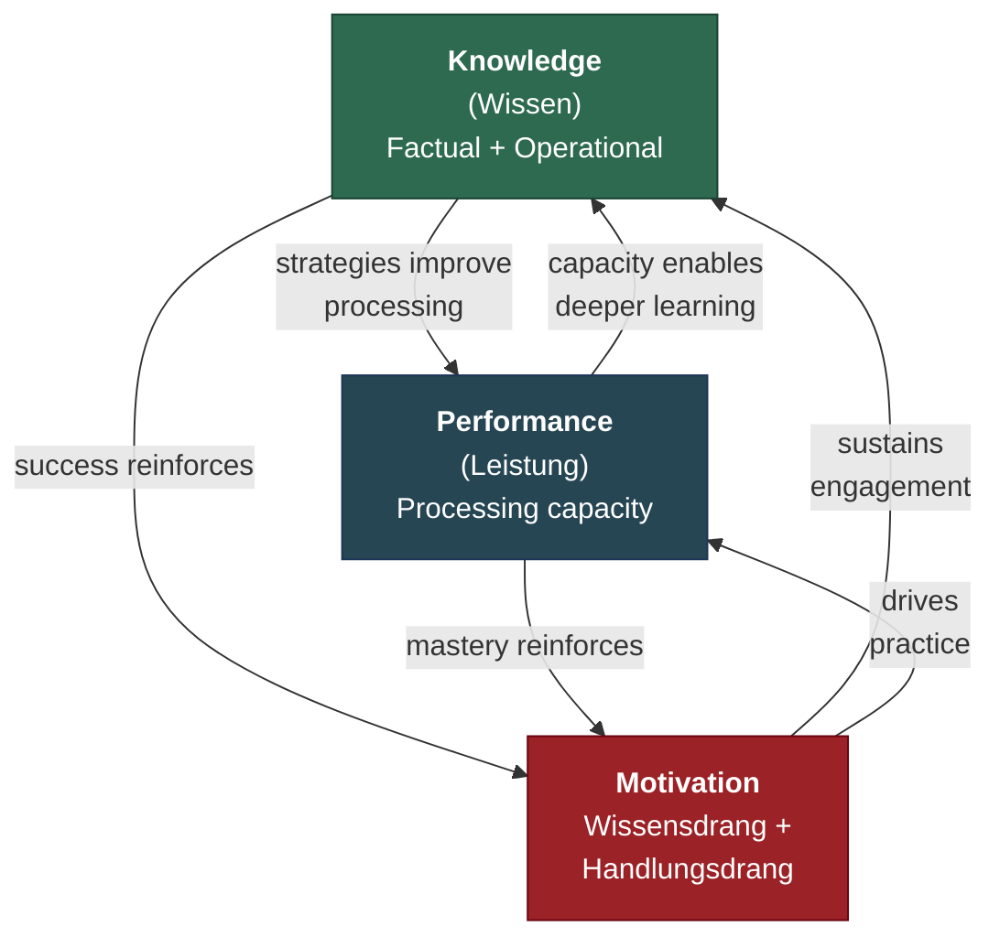

# The Recursive Intelligence Model

**The Recursive Intelligence Model (RIM) redefines intelligence as a recursive, self-reinforcing system of three components — Knowledge, Performance, and Motivation — rather than a static cognitive trait.**

Intelligence research has produced a paradox: the field universally acknowledges that motivation shapes cognitive development, yet every major model of intelligence formally excludes it. The Cattell-Horn-Carroll (CHC) taxonomy contains no motivational component. Cattell's investment theory requires an investor but never models one. Wechsler explicitly called for the inclusion of "non-intellective factors" in 1943 — and the field proceeded as though he had not spoken. RIM argues this exclusion is not a harmless simplification but a structural blind spot that distorts the field's understanding of how intelligence actually develops and operates.

## Intelligence as Learning Ability

RIM proposes that intelligence is best understood not as a capacity measured at a single point in time but as **learning ability** (*Lernfähigkeit*) — a dynamic process whose trajectory is determined by recursive interactions among three components:

- **Knowledge** (*Wissen*): The accumulated content of learning, encompassing both factual knowledge (what is known) and [operational knowledge](../intelligence/operational-knowledge.md) (how to learn and think). Corresponds roughly to Cattell's crystallized intelligence (Gc).
- **Performance** (*Leistung*): Cognitive processing capacity — working memory, processing speed, the computational power of the neural substrate. Corresponds roughly to Cattell's fluid intelligence (Gf).
- **Motivation**: The sustained drive to engage with the world in ways that produce learning. Subdivided into *Wissensdrang* (intrinsic drive to understand) and *Handlungsdrang* (drive to act and experiment).

These three components do not simply add up. They form a **closed amplification loop** in which each component strengthens the others: knowledge improves performance through better strategies, performance accelerates knowledge acquisition, motivation sustains both over time, and success reinforces motivation. Remove any component from the model and the system's behavior changes qualitatively — not just quantitatively.

## The Blind Spot

The exclusion of motivation from intelligence models produces three specific distortions. First, it mischaracterizes intelligence as a static trait rather than a recursive system. Second, it renders invisible the role of operational knowledge — the meta-skills of learning and reasoning — which functions as the primary multiplier within the loop. Third, it leaves the field unable to explain why current artificial intelligence systems, which possess vast knowledge and extraordinary processing power but no intrinsic motivation, fail to exhibit the self-directed development that characterizes human intelligence.

The blind spot has methodological origins: intelligence tests measure maximum performance, factor-analytic models are built from cognitive test scores, and disciplinary boundaries keep the motivation and intelligence literatures separate. But methodological convenience should not be confused with theoretical truth.

## Structural Consequences

Because intelligence is a recursive system, small initial differences in any component — even motivation alone — compound over time through the [Matthew effect](../intelligence/matthew-effect.md). A child with modest cognitive ability but high motivation and strong learning strategies can, through thousands of iterations of the loop, develop intellectual capabilities far exceeding what their initial IQ would predict. Conversely, high-ability children with low motivation stagnate. Both patterns are widely observed but poorly explained by static-trait models.

The recursive structure also explains population-level phenomena: the Flynn effect and its reversal reflect environmental conditions supporting or degrading the loop, and the "Austrian paradox" (rising IQ scores with declining *g*) reflects teaching-to-the-test that inflates Performance scores without engaging the recursive loop.

## Figure

## Key Takeaway

Intelligence is not a capacity a person has — it is a recursive learning process whose trajectory depends on the interaction of Knowledge, Performance, and Motivation. Excluding motivation from intelligence models is like modeling combustion with fuel and oxygen but without heat.

## See Also

- [The Three Components: Knowledge, Performance, Motivation](../intelligence/three-components.md)
- [The Recursive Loop](../intelligence/recursive-loop.md)
- [Operational Knowledge: The Hidden Multiplier](../intelligence/operational-knowledge.md)
- [The Matthew Effect and Compounding](../intelligence/matthew-effect.md)
- [Consciousness-Intelligence Bridge](../bridge/consciousness-intelligence-bridge.md)
- [The Standard Model of Consciousness](../foundations/overview.md)
