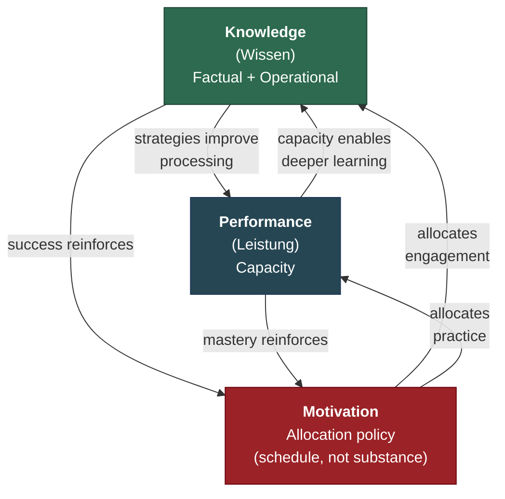

# The Recursive Intelligence Model

**The Recursive Intelligence Model (RIM) treats intelligence as a learning ability in which three constituents of different kinds — one capacity, one stock of knowledge and one allocation policy — interact in a recursive loop. Motivation is the policy that allocates the loop's time: a schedule, not a substance.**

No major model of intelligence carries motivation inside its formal structure. The Cattell-Horn-Carroll (CHC) taxonomy contains no motivational component. Cattell's investment theory requires an investor but never models one. Wechsler explicitly called for the inclusion of "non-intellective factors" in 1943 — and the field proceeded as though he had not spoken. The field has treated this as an omission to be repaired by adding a component. RIM argues that the omission is a symptom. What went wrong is a matter of *type*: the tradition typed every constituent of intelligence as a capacity, because capacities are what psychometric instruments were built to measure, and motivation is not one.

## Intelligence as Learning Ability

RIM proposes that intelligence is best understood not as a capacity measured at a single point in time but as **learning ability** (*Lernfähigkeit*) — a system whose course is set by how its loop iterates. Its three constituents are not the same kind of thing:

- **Performance** (*Leistung*) — **a capacity**, and the only one of the three that is a capacity in the psychometric sense: working memory, processing speed, the computational power of the neural substrate. Corresponds roughly to Cattell's fluid intelligence (Gf).
- **Knowledge** (*Wissen*) — **a stock**, and two things rather than one, divided by content: factual knowledge (what is the case) and [operational knowledge](../intelligence/operational-knowledge.md) (how to learn and think). Corresponds loosely to Cattell's crystallized intelligence (Gc).
- **Motivation** — **the allocation policy over the loop.** It contributes no quantity that combines with the other two; it decides how much of the loop runs, on what, and for how long. Its two readily distinguished expressions are *Wissensdrang* (allocation toward understanding) and *Handlungsdrang* (allocation toward action and exploration).

The three form a **closed recursive loop**: knowledge improves performance through better strategies, performance accelerates knowledge acquisition, motivation directs engagement toward both, and success in learning revises motivation. Motivation is a node of the loop, not an input to it — the loop's outcomes revise the schedule — but a node can be updated without being a magnitude.

## What the Re-Typing Explains

Re-typing motivation as a policy changes what should be expected of measurement. Four results the field reports without an account follow from it:

1. **Motivation resists trait measurement** because a policy has no trait essence to find; instruments that sample it in different contexts disagree to the extent the contexts differ.
2. **Motivation-intelligence correlations attenuate under narrow, single-occasion sampling** because a policy is visible only in the allocations that fall inside the sampled window.
3. **Schooling raises measured intelligence durably while working-memory training shows no far transfer against active controls**, because education re-points the schedule while training drills the capacity measure.
4. **Motivation should predict the *consistency* of intellectual engagement rather than its peak**, because a loop compounds through iteration count.

The recursive structure itself is not claimed as novel: mutualism and multiplier accounts formalized reciprocal causation two decades ago (see [Relation to Established Intelligence Models](../intelligence/established-models.md)). What RIM claims is that one of the three things being reciprocally caused has been the wrong kind of thing all along.

## Structural Consequences

Because intelligence is a recursive system, small initial differences in any component — even motivation alone — compound over time through the [Matthew effect](../intelligence/matthew-effect.md). A child with modest cognitive ability but high motivation and strong learning strategies can, through thousands of iterations of the loop, develop intellectual capabilities far exceeding what their initial IQ would predict. Conversely, a high-ability child with low motivation or poor learning strategies may stagnate. Both patterns are widely observed but poorly explained by static-trait models.

The same structure bears on population-level records: the within-family rise and fall of IQ scores across Norwegian birth cohorts is consistent with environmental conditions supporting or degrading the loop, and the model implies a partition of test content — simulation-loaded against retrieval-loaded subtests — with stated predictions for the [Flynn effect and its reversal](../intelligence/flynn-effect.md).

## Figure

```mermaid
graph TB
    K["<b>Knowledge</b><br/>(Wissen)<br/>Factual + Operational"]
    P["<b>Performance</b><br/>(Leistung)<br/>Capacity"]
    M["<b>Motivation</b><br/>Allocation policy<br/>(schedule, not substance)"]

    K -->|"strategies improve<br/>processing"| P
    P -->|"capacity enables<br/>deeper learning"| K
    M -->|"allocates<br/>engagement"| K
    M -->|"allocates<br/>practice"| P
    K -->|"success reinforces"| M
    P -->|"mastery reinforces"| M

    style K fill:#2d6a4f,color:#fff,stroke:#1b4332
    style P fill:#264653,color:#fff,stroke:#1d3557
    style M fill:#9b2226,color:#fff,stroke:#6a040f
```

## Key Takeaway

Intelligence is not a capacity a person has — it is a learning ability in which one capacity, one stock of knowledge and one allocation policy interact across a lifespan. An observatory has optics (a capacity), a plate archive (accumulated content) and a telescope-time schedule (the allocation policy). You cannot find the schedule by disassembling the instrument, because it is not in the instrument — which is why instruments built to measure capacities registered so little of motivation.

## See Also

- [Three Components, Three Kinds: Knowledge, Performance, Motivation](../intelligence/three-components.md)
- [The Recursive Loop](../intelligence/recursive-loop.md)
- [Operational Knowledge: The Hidden Multiplier](../intelligence/operational-knowledge.md)
- [The Matthew Effect and Compounding](../intelligence/matthew-effect.md)
- [Consciousness-Intelligence Bridge](../bridge/consciousness-intelligence-bridge.md)
- [The Standard Model of Consciousness](../foundations/overview.md)
