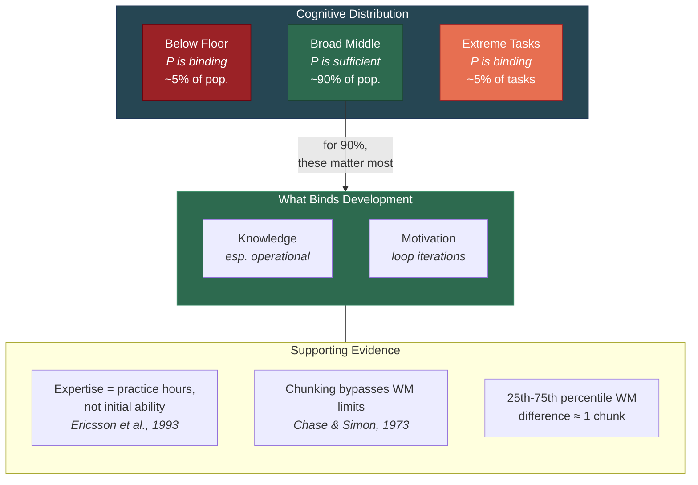

# Performance Is Not the Bottleneck

**Average working memory capacity is sufficient for highly intelligent real-world behavior -- the binding constraints on intellectual development are Knowledge and Motivation, not cognitive processing power.**

The psychometric tradition carries an implicit assumption so deeply embedded it is rarely examined: that intelligence differences are primarily differences in cognitive processing capacity. More working memory, faster processing, better pattern recognition -- these are the axes along which people supposedly differ in intelligence. The [Recursive Intelligence Model](../intelligence/overview.md) challenges this assumption directly.

## The Magnitude of the Difference

The difference between the 25th and 75th percentile in working memory capacity is real but modest. It amounts to roughly one additional chunk of information held simultaneously. One chunk. This matters at the extremes -- in theoretical physics, in certain forms of mathematical proof, in competitive chess at the grandmaster level. But in the contexts where most people live their intellectual lives -- learning a profession, solving practical problems, understanding complex arguments, acquiring expertise -- one chunk is not the difference between success and failure.

What separates the person who becomes expert in their field from the person who remains a novice is overwhelmingly *not* a difference in working memory capacity. It is a difference in accumulated [Knowledge](../intelligence/three-components.md) (including [operational knowledge](../intelligence/operational-knowledge.md) -- knowing how to learn effectively), sustained over time by a difference in Motivation. The expert has iterated the [recursive loop](../intelligence/recursive-loop.md) thousands of times; the novice stopped iterating early.

## The Compound Interest Analogy

The recursive loop is a compound interest machine. In compound interest, three things matter: the initial principal (Performance), the rate of deposit (Motivation), and the investment strategy (operational Knowledge). Of these three, the initial principal matters least over long time horizons. A modest initial deposit with consistent contributions and a sound strategy will dramatically outperform a large initial deposit with no further contributions.

A person of average cognitive processing capacity who is deeply motivated and who possesses strong operational knowledge will, over a lifetime, develop intellectual capabilities that far exceed those of a person with superior processing capacity but low motivation and poor learning strategies. The math is not subtle -- this is a direct consequence of recursive amplification over decades.

## The Expertise Literature

The expertise literature confirms this pattern. [Ericsson et al.'s (1993)](https://doi.org/10.1037/0033-295X.100.3.363) deliberate practice framework demonstrated that expert performance in domains from chess to music to surgery is predicted overwhelmingly by accumulated practice hours rather than by initial cognitive ability. Chase and Simon's (1973) chunking studies showed that chess masters do not have larger working memories than novices -- they have richer knowledge structures that allow them to encode board positions into larger chunks, effectively bypassing the working memory bottleneck through knowledge.

This is precisely the K-enhances-P pathway in the recursive model: accumulated knowledge (operational knowledge in particular) augments effective processing capacity, making the biological Performance floor less relevant with each iteration.

## The Caveat

This argument applies to the broad middle of the cognitive distribution. At the extremes, Performance does become the binding constraint:

- **Below the floor**: Individuals with significant cognitive impairments may lack the minimum processing capacity required for the recursive loop to self-sustain. The loop requires enough working memory to hold a problem and a strategy in mind simultaneously.
- **Above the ceiling**: Certain tasks -- constructing novel mathematical proofs, theoretical physics at the frontier, grandmaster-level chess -- may genuinely require exceptional processing capacity that no amount of knowledge or motivation can substitute for.

The recursive model does not deny the reality of individual differences in Gf. It argues that the recursive loop amplifies K and M differences far more than P differences across the lifespan. For the broad middle of the distribution -- which is where most people are -- Performance is sufficient. The trajectory is determined by K and M.

## Figure

*For the vast majority of people and tasks, Performance (Gf) is not the binding constraint. Knowledge and Motivation determine the trajectory of intellectual development because the recursive loop amplifies them over the lifespan.*

## Key Takeaway

The psychometric tradition's focus on cognitive processing capacity has created a distorted picture of intelligence. For roughly 90% of people in roughly 90% of intellectual contexts, average working memory capacity is enough. What determines whether that capacity translates into intellectual achievement is how many times the recursive loop iterates -- and that depends on Knowledge and Motivation, both of which are learnable.

## See Also

- [The Three Components: Knowledge, Performance, Motivation](../intelligence/three-components.md)
- [The Recursive Loop](../intelligence/recursive-loop.md)
- [Gf-Gc Divergence Across the Lifespan](../intelligence/gf-gc-divergence.md)
- [Intelligence Is Learnable](../education/intelligence-learnable.md)
- [Operational Knowledge: The Hidden Multiplier](../intelligence/operational-knowledge.md)

---

Based on: Gruber, M. (2026). Why Intelligence Models Must Include Motivation: A Recursive Framework. PsyArXiv. https://osf.io/preprints/osf/kctvg
