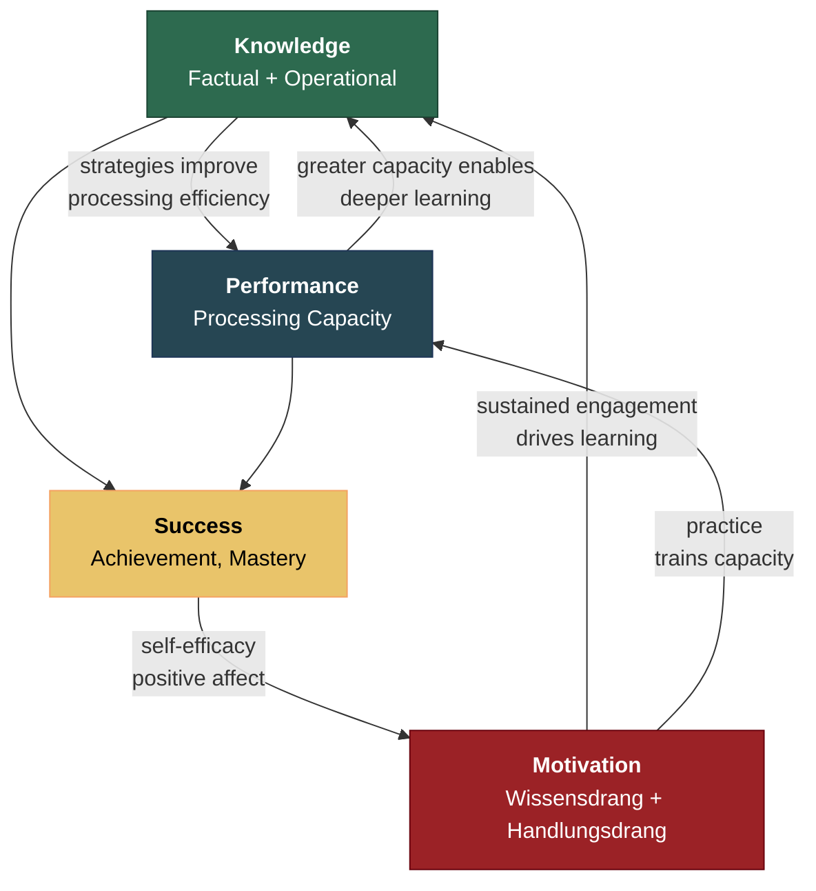

# The Recursive Loop

**The three components of intelligence — Knowledge, Performance, and Motivation — form a closed amplification loop in which each component strengthens the others, producing self-reinforcing dynamics that static-trait models cannot explain.**

The central structural claim of the Recursive Intelligence Model is not merely that motivation matters for intelligence. That observation is trivial. The claim is that intelligence is a *system* whose behavior is determined by recursive interaction among its three components, and that removing any one component from the model produces qualitatively wrong predictions about the system's dynamics. The recursive loop is the mechanism that turns a snapshot of cognitive ability into a developmental trajectory.

## The Four Pathways

The recursive loop operates through four mutually reinforcing pathways:

**Knowledge enhances Performance.** Learning strategies, logical tools, and reasoning heuristics — [operational knowledge](../intelligence/operational-knowledge.md) — directly improve the efficiency of cognitive processing. A chess player who has internalized positional heuristics evaluates positions faster than one relying on brute-force search. A reader who has mastered phonemic decoding processes text more fluently, freeing working memory for comprehension. Knowledge does not merely accumulate — it makes the processing machinery work better.

**Performance enhances Knowledge.** Greater cognitive processing capacity enables faster and deeper learning. Higher working memory capacity allows the learner to hold more elements in mind simultaneously, facilitating pattern extraction and connection formation. A student who can track four variables at once in a physics problem acquires understanding of multi-variable systems more readily than one who can track three.

**Motivation enhances both Knowledge and Performance.** The motivated learner seeks out learning opportunities (expanding Knowledge) and practices cognitive skills (training Performance). Crucially, motivation sustains engagement over time. The recursive loop requires *iterations* — it is a compound interest machine. Without motivation, the loop runs once or twice and stalls. With sustained motivation, it iterates thousands of times across a lifespan.

**Success enhances Motivation.** Successful learning and problem-solving generate positive affect and self-efficacy (Bandura, 1997), which sustain and strengthen motivation. This is the pathway that closes the loop: Knowledge and Performance produce achievements that feed back into Motivation, which drives further engagement, which produces further Knowledge and Performance gains.

## Why This Is Not "Motivation Matters"

The recursive structure produces dynamics that a simple "motivation matters" addendum to existing models cannot capture. Standard psychometric models treat intelligence as a relatively stable trait. They have difficulty explaining why some individuals show dramatically increasing intellectual capability over decades while others plateau early. The recursive model predicts exactly this: small initial differences in any component compound over time, producing wide variance in adult intellectual achievement.

This is not merely statistical amplification (a fan-spread effect). It is a qualitatively different dynamic: a positive feedback loop that can be entered at any point. A child with modest cognitive ability but high motivation and strong operational knowledge can, through sustained iteration of the loop, develop capabilities far exceeding what initial test scores would predict. Conversely, a child with high initial ability but low motivation may stagnate — the loop iterates too infrequently to compound.

The recursive structure also explains why the loop can reverse. Any intervention that damages Motivation — punitive grading, fixed-ability labeling, ability tracking — does not merely reduce motivation in the present. It reduces the iteration rate of the loop, which reduces Knowledge growth, which reduces Performance on subsequent tasks, which generates more negative feedback, which further damages Motivation. The [Matthew effect](../intelligence/matthew-effect.md) works in both directions.

## The Cognitive Learning Prerequisite

The recursive loop requires a specific cognitive capacity: **cognitive learning** — the induction of general theories from particular observations, as distinct from reinforcement learning (trial-and-error). Cognitive learning enables the Knowledge-Performance pathway to function recursively rather than linearly. The consciousness paper (Gruber, 2026) argues that cognitive learning requires the explicit self-modeling that consciousness provides, establishing a causal chain from consciousness through cognitive learning to the recursive intelligence loop.

## Figure

## Key Takeaway

The recursive loop is a compound interest machine. Knowledge and Motivation determine the rate of deposit and the investment strategy; Performance provides the initial principal. Over a lifetime, compound interest cares far more about the deposit rate than the starting balance — which is why the learnable components of intelligence matter more than the biological ones for most people.

## See Also

- [The Three Components: Knowledge, Performance, Motivation](../intelligence/three-components.md)
- [Operational Knowledge: The Hidden Multiplier](../intelligence/operational-knowledge.md)
- [The Matthew Effect and Compounding](../intelligence/matthew-effect.md)
- [Consciousness-Intelligence Bridge](../bridge/consciousness-intelligence-bridge.md)
- [The Recursive Intelligence Model (Overview)](../intelligence/overview.md)
