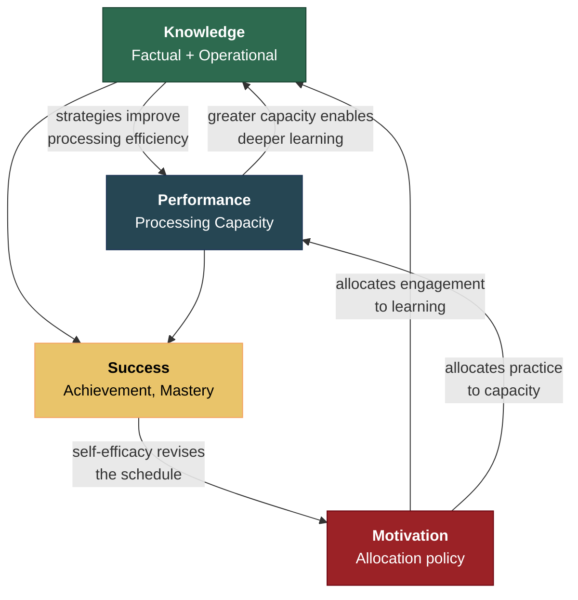

# The Recursive Loop

**The three components of intelligence — Knowledge, Performance, and Motivation — form a closed recursive loop in which each amplifies the others. Motivation is the loop's allocation policy: it decides how often the loop runs, on what, and for how long.**

The structural claim of the Recursive Intelligence Model is stronger than the observation that motivation influences learning outcomes. It is that intelligence is a *system* whose behavior is determined by the recursive interaction of three components, that those components are of different kinds — a capacity, a stock and a policy — and that removing any one of them, or mis-typing it, produces qualitatively wrong predictions about the system's dynamics. The recursive loop is the mechanism that turns a snapshot of cognitive ability into a developmental trajectory.

The recursive structure itself is not new: van der Maas et al.'s (2006) mutualism model and Dickens and Flynn's (2001) multiplier formalized reciprocal causation in intellectual development two decades ago. What RIM adds is that the quantity those models leave implicit — how much of the reciprocal process actually runs, and for how long — is motivation, and that it belongs inside the system as its allocation policy.

## The Four Pathways

The recursive loop operates through four mutually reinforcing pathways:

**Knowledge enhances Performance.** Learning strategies, logical tools, and reasoning heuristics — [operational knowledge](../intelligence/operational-knowledge.md) — directly improve the efficiency of cognitive processing. A chess player who has internalized positional heuristics evaluates positions faster than one relying on brute-force search. A reader who has mastered phonemic decoding processes text more fluently, freeing working memory for comprehension. Knowledge does not merely accumulate — it makes the processing machinery work better.

**Performance enhances Knowledge.** Greater cognitive processing capacity enables faster and deeper learning. Higher working memory capacity allows the learner to hold more elements in mind simultaneously, facilitating pattern extraction and connection formation. A student who can track four variables at once in a physics problem acquires understanding of multi-variable systems more readily than one who can track three.

**Motivation allocates engagement to both Knowledge and Performance.** The motivated learner seeks out learning opportunities (expanding Knowledge) and practices cognitive skills (training Performance). Motivation contributes no quantity of its own to this; it decides where the loop's time goes and how regularly. The recursive loop requires *iterations* — it is a compound interest machine, and it compounds through iteration count rather than iteration intensity. A schedule that points the loop at learning only sporadically runs it once or twice and stalls; a schedule kept consistently iterates it thousands of times across a lifespan.

**Success revises Motivation.** Successful learning and problem-solving generate positive affect and self-efficacy (Bandura, 1997), which re-point the schedule toward further engagement. This is the pathway that closes the loop: Knowledge and Performance produce achievements that feed back into Motivation, which directs further engagement, which produces further Knowledge and Performance gains. Motivation is therefore a node of the loop, not an input to it — a node that can be updated without being a magnitude.

## Why This Is Not "Motivation Matters"

The recursive structure produces dynamics that a simple "motivation matters" addendum to existing models cannot capture. Standard psychometric models treat intelligence as a relatively stable trait. They have difficulty explaining why some individuals show dramatically increasing intellectual capability over decades while others plateau early. The recursive model predicts exactly this: small initial differences in any component compound over time, producing wide variance in adult intellectual achievement.

This is not merely statistical amplification (a fan-spread effect). It is a qualitatively different dynamic: a positive feedback loop that can be entered at any point. A child with modest cognitive ability but high motivation and strong operational knowledge can, through sustained iteration of the loop, develop capabilities far exceeding what initial test scores would predict. Conversely, a child with high initial ability but low motivation may stagnate — the loop iterates too infrequently to compound.

The recursive structure also predicts that the loop can reverse. Punitive grading is the case the model develops: a signal that recurs term after term re-points the allocation policy away from the subject matter and onto the evaluation, which reduces the iteration rate of the loop, which reduces Knowledge growth, which reduces performance on subsequent tasks, which generates more negative feedback. Ability tracking and fixed-ability labeling are candidates for the same treatment, each to be tested on its own terms. The [Matthew effect](../intelligence/matthew-effect.md) works in both directions. These system-level regularities are accommodated by the mutualism and multiplier accounts as well; what distinguishes RIM is the measurement consequences of typing motivation as a policy.

## The Cognitive Learning Prerequisite

The recursive loop requires a specific cognitive capacity: **cognitive learning** — the induction of general theories from particular observations, as distinct from reinforcement learning (trial-and-error). Cognitive learning enables the Knowledge-Performance pathway to function recursively rather than linearly. What supplies that capacity is a question about architecture, and the recursive model does not depend on the answer. The consciousness paper ([Gruber, 2026](https://doi.org/10.5281/zenodo.18669891)) proposes one candidate: explicit self-modeling, which makes cognitive learning affordable to an organism under a bounded budget -- an advantage of cost, not of possibility. That proposal links consciousness through cognitive learning to the recursive intelligence loop as a conjecture.

## Figure

```mermaid
graph TD
    K["<b>Knowledge</b><br/>Factual + Operational"]
    P["<b>Performance</b><br/>Processing Capacity"]
    M["<b>Motivation</b><br/>Allocation policy"]
    S["<b>Success</b><br/>Achievement, Mastery"]

    K -->|"strategies improve<br/>processing efficiency"| P
    P -->|"greater capacity enables<br/>deeper learning"| K
    M -->|"allocates engagement<br/>to learning"| K
    M -->|"allocates practice<br/>to capacity"| P
    K --> S
    P --> S
    S -->|"self-efficacy revises<br/>the schedule"| M

    style K fill:#2d6a4f,color:#fff,stroke:#1b4332
    style P fill:#264653,color:#fff,stroke:#1d3557
    style M fill:#9b2226,color:#fff,stroke:#6a040f
    style S fill:#e9c46a,color:#000,stroke:#f4a261
```

## Key Takeaway

The recursive loop is a compound interest machine. Motivation sets the rate of deposit, operational Knowledge the investment strategy, and Performance provides the initial principal. Over a lifetime, compound interest cares far more about the deposit rate than the starting balance — which is why the learnable components of intelligence matter more than the biological ones for most people.

## See Also

- [Three Components, Three Kinds: Knowledge, Performance, Motivation](../intelligence/three-components.md)
- [Operational Knowledge: The Hidden Multiplier](../intelligence/operational-knowledge.md)
- [The Matthew Effect and Compounding](../intelligence/matthew-effect.md)
- [Consciousness-Intelligence Bridge](../bridge/consciousness-intelligence-bridge.md)
- [The Recursive Intelligence Model (Overview)](../intelligence/overview.md)
