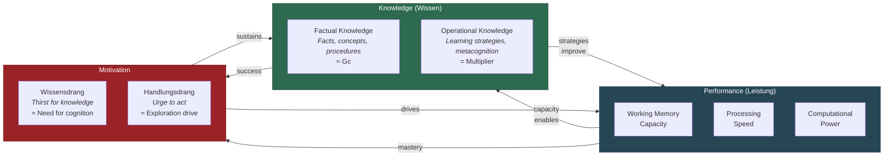

# The Three Components: Knowledge, Performance, Motivation

**Intelligence is constituted by three interacting components — Knowledge, Performance, and Motivation — each mapping to established constructs in the psychometric literature but integrated here as parts of a single recursive system.**

The Recursive Intelligence Model identifies three components that are individually well-studied but have never been formally combined into a unified model of intelligence. Each component has a German-language origin term from [Gruber (2015)](https://doi.org/10.5281/zenodo.18669891) and corresponds to existing constructs in intelligence research, personality psychology, and motivation science. What RIM adds is the claim that these three components are not merely correlated — they are constitutive of a single recursive system whose behavior cannot be understood by studying any component in isolation.

## Knowledge (*Wissen*)

Knowledge encompasses everything the system has learned, divided into two functionally distinct categories:

- **Factual knowledge**: Content — facts, concepts, procedures, cultural repertoire. This is what intelligence tests primarily measure under the rubric of crystallized intelligence (Gc) and what educational systems primarily transmit.
- **[Operational knowledge](../intelligence/operational-knowledge.md)** (*Metawissen*): Knowledge about how to learn and think — learning strategies, reasoning heuristics, metacognitive skills, strategic planning, logical tools. This category has a special status within the [recursive loop](../intelligence/recursive-loop.md) because it multiplies the rate of all subsequent learning rather than adding to it incrementally.

Knowledge corresponds roughly to Cattell's Gc but extends beyond it by including the operational dimension, which traditional psychometrics treats as a separate construct (metacognition, self-regulated learning) rather than as a subdivision of knowledge itself.

## Performance (*Leistung*)

Performance is the cognitive processing capacity of the system: working memory capacity, processing speed, and the computational power of the neural substrate. It corresponds to Cattell's fluid intelligence (Gf) and to Frank's (1959) short-term memory capacity formula C = S x D, where S is processing speed in bits per second and D is memory span in seconds.

Performance is the component most influenced by genetics and neurobiology. It peaks in early adulthood and declines thereafter — the well-documented Gf trajectory. However, Performance is trainable to a degree (working memory training produces modest gains), and expertise routinely allows individuals to circumvent apparent working memory limits through chunking and automatization.

The critical point: **for the vast majority of people, Performance is not the bottleneck.** The difference between the 25th and 75th percentile in working memory capacity amounts to roughly one additional chunk. This matters at extremes — theoretical physics, grandmaster chess — but not in the contexts where most people live their intellectual lives. What separates expert from novice is overwhelmingly iteration count through the recursive loop, driven by Knowledge and Motivation.

## Motivation

Motivation is the sustained drive to engage with the world in ways that produce learning. RIM distinguishes two sub-components:

- **Wissensdrang** (thirst for knowledge): The intrinsic drive to understand, to learn, to make sense of the world. This aligns with intrinsic motivation in Self-Determination Theory ([Deci & Ryan, 2000](https://doi.org/10.1037/0003-066X.55.1.68)) and with [Cacioppo et al.'s (1996)](https://doi.org/10.1037/0022-3514.70.1.130) "need for cognition."
- **Handlungsdrang** (urge to act): The drive to apply knowledge, to experiment, to engage actively with one's environment. Partly genetically predisposed, partly shaped by conditioning and experience.

Motivation is substantially learnable. Self-Determination Theory demonstrates that intrinsic motivation responds to environmental conditions — specifically the satisfaction of autonomy, competence, and relatedness needs. Dweck's work on growth mindset shows that beliefs about the malleability of intelligence directly affect motivational persistence. Motivation is not fixed temperament; it is shaped, for better or worse, by the feedback systems surrounding the learner.

## Figure

## Key Takeaway

Two of intelligence's three components — Knowledge and Motivation — are highly responsive to environmental influence and intervention. Performance, the component most influenced by biology, is rarely the binding constraint. The recursive model predicts that the trajectory of intellectual development depends more on the learnable components than on the biological one.

## See Also

- [The Recursive Intelligence Model (Overview)](../intelligence/overview.md)
- [The Recursive Loop](../intelligence/recursive-loop.md)
- [Operational Knowledge: The Hidden Multiplier](../intelligence/operational-knowledge.md)
- [The Matthew Effect and Compounding](../intelligence/matthew-effect.md)
- [Relation to Established Intelligence Models](../intelligence/established-models.md)
