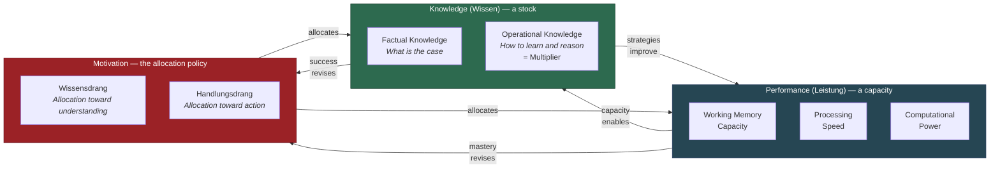

# Three Components, Three Kinds: Knowledge, Performance, Motivation

**The Recursive Intelligence Model treats intelligence as a system of three interacting components — Performance, Knowledge and Motivation — and holds that they are not the same kind of thing: Performance is a capacity, Knowledge is a stock, and Motivation is the policy that allocates the loop's time.**

The recursive model shares with the investment tradition the idea that intelligence is a system of interacting components; the model was first proposed in [Gruber (2015)](https://doi.org/10.5281/zenodo.18669891), in German. What it does not share is the assumption that the three are the same *kind* of thing. The tradition typed every constituent of intelligence as a capacity, because capacities are what psychometric instruments were built to measure. The field's long difficulty with motivation follows from proceeding as though all three were capacities.

## Performance (*Leistung*) — a capacity

Performance is the processing capacity of the cognitive system: working memory capacity, processing speed, and the computational power of the neural substrate. It corresponds roughly to Cattell's fluid intelligence (Gf) and to Frank's (1962) short-term memory capacity C = S x D, where S is processing speed in bits per second and D is memory span in seconds. It is influenced by genetics and by training.

Performance is the clear case, and the only one of the three that is a capacity in the psychometric sense. It is what the psychometric instrument was built for: it is bounded, it is present at the moment of measurement, and a single occasion samples it well, because a person's processing capacity is not *elsewhere* while the test is running.

**For the broad middle of the distribution, Performance is not the bottleneck.** The difference between the 25th and 75th percentile in working memory capacity amounts to roughly one additional chunk. What separates expert from novice is overwhelmingly iteration count through the recursive loop, driven by Knowledge and Motivation (see [Performance Is Not the Bottleneck](../intelligence/performance-not-bottleneck.md)).

## Knowledge (*Wissen*) — a stock, and two of them

Knowledge is not one thing but two, and they divide by *content*:

- **Factual knowledge**: the store of what is the case — facts, concepts, cultural repertoire.
- **[Operational knowledge](../intelligence/operational-knowledge.md)** (*Metawissen*): the store of how to learn, how to reason, how to strategize. It has a special status within the [recursive loop](../intelligence/recursive-loop.md) because it amplifies the rate of all subsequent learning rather than adding to it.

Both correspond loosely to Cattell's crystallized intelligence (Gc), which is why the tradition has had no reason to separate them; they behave differently under intervention.

A second distinction runs across the first and must not be conflated with it. Every constituent has a **stored** mode and a **running** mode, and the boundary between them is physical: what would a dead brain still yield to a sufficiently good structural readout, and what stops when the dynamics stop? Both kinds of knowledge sit in the structure and do their work only when something runs. The mode boundary cuts across all three constituents and divides none of them.

## Motivation — the allocation policy

Motivation is in the loop, but it is not a capacity. It does not contribute a quantity that combines with the other two. It decides *how much of the loop runs, on what, and for how long*. A policy has no ceiling to measure, it is not present-at-a-moment in the way a capacity is, and asking how much of it someone has is close to a category error — the question a policy answers is not *how much* but *when, and on what*.

Motivation is a node of the loop, not an input to it: success in learning revises the schedule, which is what the [Matthew effect](../intelligence/matthew-effect.md) requires. Where the model speaks of motivation being raised, reduced or low, that is shorthand for a change in the policy — in the direction and consistency of allocation — never for a smaller value of a hidden quantity.

At the intuitive level two expressions of the policy are readily distinguished: [*Wissensdrang*](../intelligence/wissensdrang-handlungsdrang.md) (thirst for knowledge) — allocation toward understanding — and *Handlungsdrang* (urge to act) — allocation toward action and exploration. The model treats these as two functional expressions of one evaluative process, not as structurally independent traits.

**Fragmentation across instruments is what a policy looks like from outside.** A policy exists only in its allocations, so an instrument can catch it only in the act, in some particular context. Two instruments that sample different contexts — need for cognition during novel reasoning, typical intellectual engagement during habitual knowledge-seeking — are measuring the same policy at two of its expressions, and they will disagree to the extent that the contexts differ.

## The Observatory

An observatory makes the three types visible at once. The optics are a capacity: aperture and resolution are fixed, measurable on any clear night, and they bound what the instrument can ever see. The plate archive is accumulated content — it survives the observatory going dark, and it is what the institution actually knows. The telescope-time schedule is neither. It is the allocation policy: it decides which instrument points where, on which nights, for how long. **You cannot find the schedule by disassembling the instrument**, because it is not in the instrument.

Three consequences follow: a schedule is weather- and state-bound, so any single night is a poor estimate of it; a good schedule shows up as *consistency* of observation across a season rather than as intensity on one night; and the archive grows only where the schedule has been pointing.

## Functionally Separable, Not Independent

The three components are distinguished by what each contributes to the loop — processing capacity, stored content, and the direction of engagement — not by running on disjoint machinery. The capacity to construct a model of something not present and run it is drawn on by both Performance and Motivation. The model therefore predicts that the three will not be found orthogonal, and that a decomposition succeeding in making them independent would be measuring something other than the system described here.

## Figure

```mermaid
graph LR
    subgraph P["Performance (Leistung) — a capacity"]
        direction TB
        WM["Working Memory<br/>Capacity"]
        PS["Processing<br/>Speed"]
        CP["Computational<br/>Power"]
    end

    subgraph K["Knowledge (Wissen) — a stock"]
        direction TB
        FK["Factual Knowledge<br/><i>What is the case</i>"]
        OK["Operational Knowledge<br/><i>How to learn and reason</i><br/>= Multiplier"]
    end

    subgraph M["Motivation — the allocation policy"]
        direction TB
        WD["Wissensdrang<br/><i>Allocation toward understanding</i>"]
        HD["Handlungsdrang<br/><i>Allocation toward action</i>"]
    end

    K -->|"strategies<br/>improve"| P
    P -->|"capacity<br/>enables"| K
    M -->|"allocates"| K
    M -->|"allocates"| P
    K -->|"success<br/>revises"| M
    P -->|"mastery<br/>revises"| M

    style K fill:#2d6a4f,color:#fff,stroke:#1b4332
    style P fill:#264653,color:#fff,stroke:#1d3557
    style M fill:#9b2226,color:#fff,stroke:#6a040f
```

## Key Takeaway

Intelligence is one capacity, one stock of knowledge and one allocation policy interacting across a lifespan. Motivation is the schedule, not the substance: it contributes no quantity to be summed with the other two, and it decides how much of the loop runs, on what, and for how long. The two learnable constituents — Knowledge and the allocation policy — determine the trajectory of intellectual development more than the capacity does, for most people.

## See Also

- [The Recursive Intelligence Model (Overview)](../intelligence/overview.md)
- [The Recursive Loop](../intelligence/recursive-loop.md)
- [Operational Knowledge: The Hidden Multiplier](../intelligence/operational-knowledge.md)
- [Wissensdrang and Handlungsdrang](../intelligence/wissensdrang-handlungsdrang.md)
- [The Matthew Effect and Compounding](../intelligence/matthew-effect.md)
- [Relation to Established Intelligence Models](../intelligence/established-models.md)
