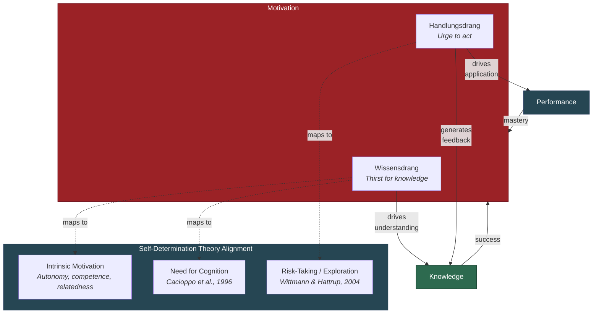

# Wissensdrang and Handlungsdrang

**Motivation in the Recursive Intelligence Model is not a single drive but two distinct sub-components -- Wissensdrang (thirst for knowledge) and Handlungsdrang (urge to act) -- whose interplay determines whether the recursive loop iterates or stalls.**

Most intelligence models that acknowledge motivation at all treat it as a single variable: the learner is either motivated or not. The [Recursive Intelligence Model](../intelligence/overview.md) disaggregates motivation into two functionally distinct drives, each with different origins, different targets, and different consequences for intellectual development. The distinction matters because the two drives can dissociate -- a person can be consumed by curiosity yet paralyzed by inaction, or ceaselessly active yet incurious -- and each dissociation produces a characteristic failure mode in the [recursive loop](../intelligence/recursive-loop.md).

## Wissensdrang: The Thirst for Knowledge

**Wissensdrang** is the intrinsic drive to understand -- to learn, to make sense of the world, to resolve uncertainty. It is what makes a child ask "why?" seventeen times in succession and what keeps a researcher reading papers at midnight. Wissensdrang does not require external reward; its satisfaction is the reward.

This construct aligns closely with two established traditions. In Self-Determination Theory (Deci & Ryan, 2000), Wissensdrang maps onto **intrinsic motivation** -- behavior driven by interest and inherent satisfaction rather than external contingencies. SDT's conditions for intrinsic motivation (autonomy, competence, relatedness) are, in the recursive model's terms, the environmental prerequisites for Wissensdrang to sustain itself across time. In the individual-differences literature, Wissensdrang corresponds to Cacioppo et al.'s (1996) **need for cognition** -- the dispositional tendency to seek out, engage in, and enjoy effortful cognitive activity.

Wissensdrang primarily feeds the Knowledge leg of the recursive loop. A learner driven by Wissensdrang seeks out information, asks questions, reads beyond the curriculum, and -- critically -- acquires [operational knowledge](../intelligence/operational-knowledge.md) (learning strategies, reasoning heuristics) because the drive to understand naturally extends to understanding how to understand better.

## Handlungsdrang: The Urge to Act

**Handlungsdrang** is the drive to apply knowledge, to experiment, to engage actively with the environment. Where Wissensdrang asks "what is this?", Handlungsdrang asks "what can I do with it?" It is the difference between the student who reads every textbook on carpentry and the one who builds a chair.

Handlungsdrang is partly genetically predisposed and partly shaped by conditioning and experience. It connects to what Wittmann and Hattrup (2004) identified as **risk-taking** in dynamic task performance -- a motivational disposition that generates new learning opportunities by driving the learner to explore rather than exploit known strategies. In their path-analytic studies, risk-taking mediated the relationship between intelligence and performance precisely because it pushed learners into novel situations where the recursive loop could iterate on new material.

Handlungsdrang feeds both the Knowledge and Performance legs of the loop: applying knowledge generates feedback (learning from consequences), and repeated practice trains cognitive processing skills.

## The Dissociation Problem

The two drives can diverge, producing recognizable failure modes:

- **High Wissensdrang, low Handlungsdrang**: The perpetual student. Vast knowledge acquired but never applied. The recursive loop iterates on the Knowledge leg but stagnates on the Performance leg because action-based feedback is missing. Libraries full of unread notes.
- **High Handlungsdrang, low Wissensdrang**: The unreflective doer. Constant activity without curiosity about underlying principles. Trial and error without theory. The loop iterates mechanically but never acquires the operational knowledge that would accelerate it.

The recursive model predicts that optimal intellectual development requires both drives at adequate levels -- not because both are "nice to have" but because each feeds a different pathway through the loop.

## Figure

*Wissensdrang and Handlungsdrang map onto established constructs in motivation science but serve distinct functions in the recursive loop: Wissensdrang drives understanding, Handlungsdrang drives application and exploration.*

## Key Takeaway

Motivation is not monolithic. Wissensdrang and Handlungsdrang serve different functions in intellectual development -- one fuels the acquisition of knowledge (including the crucial operational kind), the other fuels the application and experimentation that generates feedback. Both must be present for the recursive loop to run at full speed.

## See Also

- [The Three Components: Knowledge, Performance, Motivation](../intelligence/three-components.md)
- [The Recursive Loop](../intelligence/recursive-loop.md)
- [Operational Knowledge: The Hidden Multiplier](../intelligence/operational-knowledge.md)
- [The Matthew Effect and Compounding](../intelligence/matthew-effect.md)
- [Performance Is Not the Bottleneck](../intelligence/performance-not-bottleneck.md)

---

Based on: Gruber, M. (2026). Why Intelligence Models Must Include Motivation: A Recursive Framework. PsyArXiv. https://osf.io/preprints/osf/kctvg
