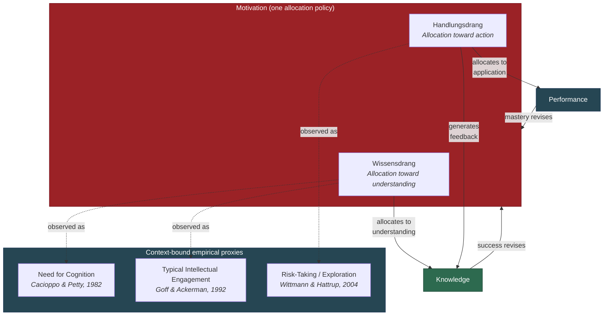

# Wissensdrang and Handlungsdrang

**In the Recursive Intelligence Model, motivation is the policy that allocates the loop's time, and it has two readily distinguished expressions -- Wissensdrang (thirst for knowledge: allocation toward understanding) and Handlungsdrang (urge to act: allocation toward action and exploration). They are two expressions of one evaluative process, not two independent traits.**

Most intelligence models that acknowledge motivation at all treat it as a trait to be measured, or as a family of traits. The [Recursive Intelligence Model](../intelligence/overview.md) types it differently: motivation is not a capacity but the [allocation policy](../intelligence/three-components.md) over the [recursive loop](../intelligence/recursive-loop.md) -- it decides how much of the loop runs, on what, and for how long. Wissensdrang and Handlungsdrang name the two directions in which that policy most visibly points.

## Wissensdrang: The Thirst for Knowledge

**Wissensdrang** is allocation toward understanding -- toward learning, making sense of the world, resolving uncertainty. It is what makes a child ask "why?" seventeen times in succession and what keeps a researcher reading papers at midnight.

Among established constructs, Wissensdrang maps closely to Cacioppo and Petty's (1982) **need for cognition** (NFC; see also [Cacioppo et al., 1996](https://doi.org/10.1037/0022-3514.70.1.130)) and to Goff and Ackerman's (1992) **typical intellectual engagement** (TIE). The environmental conditions under which intrinsic motivation is sustained -- autonomy, competence and relatedness in Self-Determination Theory ([Deci & Ryan, 2000](https://doi.org/10.1037/0003-066X.55.1.68)) -- are conditions under which this allocation is kept.

Wissensdrang primarily points the loop at the Knowledge leg. A learner whose schedule runs this way seeks out information, asks questions, reads beyond the curriculum, and acquires [operational knowledge](../intelligence/operational-knowledge.md) (learning strategies, reasoning heuristics) along the way.

## Handlungsdrang: The Urge to Act

**Handlungsdrang** is allocation toward action and exploration -- applying knowledge, experimenting, engaging actively with the environment. Where Wissensdrang asks "what is this?", Handlungsdrang asks "what can I do with it?" It is the difference between the student who reads every textbook on carpentry and the one who builds a chair.

Handlungsdrang maps to the exploration and risk-taking dispositions that [Wittmann and Hattrup (2004)](https://doi.org/10.1016/j.intell.2003.12.001) associate with intelligence-performance relationships in dynamic systems, by way of the new learning opportunities such dispositions generate.

Handlungsdrang points the loop at both the Knowledge and Performance legs: applying knowledge generates feedback (learning from consequences), and repeated practice trains cognitive processing skills.

## One Policy, Two Expressions

The relationship between these intuitive categories and their empirical proxies is not a simple mapping. NFC and TIE correlate at r ≈ .78–.87, yet they distribute differently across intelligence facets: NFC relates more strongly to fluid reasoning (Gf) than TIE does, while TIE relates more strongly to crystallized knowledge (Gc) than NFC does (Schweitzer et al., 2025). Need for achievement, openness to experience and sensation seeking show yet other patterns (Ackerman, 2018). The standard interpretation is that these are genuinely distinct motivational constructs.

The re-typing supplies an alternative. **A policy has no trait essence to be measured.** It exists only in its allocations, so an instrument can catch it only in the act -- in some particular context, allocating to some particular thing. NFC observes motivation during novel reasoning and so carries more of the processing substrate that novel reasoning depends on (Gf); TIE observes it during habitual knowledge-seeking and so carries more of the accumulated store (Gc); risk-taking observes it during exploration. Two instruments that sample different contexts are measuring the same policy at two of its expressions, and they will disagree exactly to the extent that the contexts differ. **Fragmentation across instruments is what a policy looks like from outside.**

The recursive model therefore treats Motivation as a single component with two functional expressions -- the epistemic (Wissensdrang) and the agentic (Handlungsdrang) -- that reflect a unified evaluative process rather than structurally independent traits. The unity claim is put at risk by measurement: aggregated symmetrically across contexts and occasions, motivation measures should correlate with intelligence at *r* ≥ .50, and a result at the currently reported average (*r* ≈ .30) counts against it.

## Figure

```mermaid
graph TB
    subgraph M["Motivation (one allocation policy)"]
        direction LR
        WD["Wissensdrang<br/><i>Allocation toward understanding</i>"]
        HD["Handlungsdrang<br/><i>Allocation toward action</i>"]
    end

    subgraph PROXY["Context-bound empirical proxies"]
        direction TB
        NFC["Need for Cognition<br/><i>Cacioppo & Petty, 1982</i>"]
        TIE["Typical Intellectual Engagement<br/><i>Goff & Ackerman, 1992</i>"]
        RT["Risk-Taking / Exploration<br/><i>Wittmann & Hattrup, 2004</i>"]
    end

    WD -.->|"observed as"| NFC
    WD -.->|"observed as"| TIE
    HD -.->|"observed as"| RT

    WD -->|"allocates to<br/>understanding"| K["Knowledge"]
    HD -->|"allocates to<br/>application"| P["Performance"]
    HD -->|"generates<br/>feedback"| K

    K -->|"success revises"| M
    P -->|"mastery revises"| M

    style M fill:#9b2226,color:#fff,stroke:#6a040f
    style PROXY fill:#264653,color:#fff,stroke:#1d3557
    style K fill:#2d6a4f,color:#fff,stroke:#1b4332
    style P fill:#264653,color:#fff,stroke:#1d3557
```

*Wissensdrang and Handlungsdrang are two expressions of one allocation policy. The instruments that observe them sample different contexts, which is why the literature records them as a family of moderately correlated, differently loading constructs.*

## Key Takeaway

Wissensdrang and Handlungsdrang are the two directions in which the motivational schedule most visibly points -- one toward the acquisition of knowledge (including the operational kind), the other toward the application and experimentation that generates feedback. They are expressions of a single evaluative process, and their apparent fragmentation across personality measures is the signature a policy leaves on instruments built for traits.

## See Also

- [Three Components, Three Kinds: Knowledge, Performance, Motivation](../intelligence/three-components.md)
- [The Recursive Loop](../intelligence/recursive-loop.md)
- [Operational Knowledge: The Hidden Multiplier](../intelligence/operational-knowledge.md)
- [The Matthew Effect and Compounding](../intelligence/matthew-effect.md)
- [Performance Is Not the Bottleneck](../intelligence/performance-not-bottleneck.md)

---

Based on: Gruber, M. (2026). Motivation as Allocation Policy and the Mis-Typed Components of Intelligence. Zenodo. https://doi.org/10.5281/zenodo.20125095
