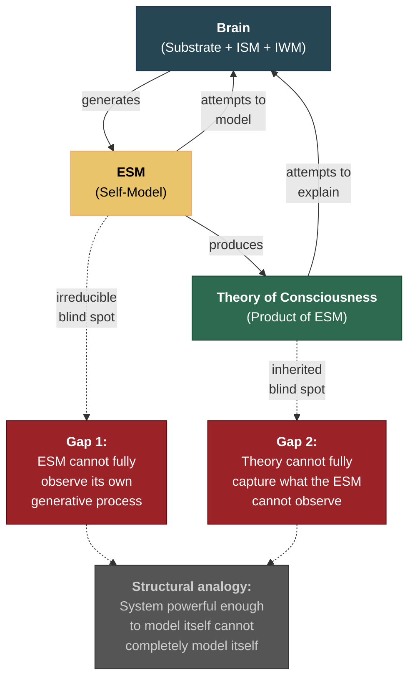

# Inside-Modeling and Godel

**The brain attempting to model itself faces an irreducible epistemological gap — structurally analogous to Godel's incompleteness. The instrument is the object of study. This is both a permanent limitation on any consciousness theory and, paradoxically, a feature that the theory predicts and explains.**

The Four-Model Theory proposes that consciousness is constituted by a system modeling itself — the [ESM](../core-architecture/explicit-self-model.md) running a model of the system that generates it. This self-referential architecture is what produces [self-referential closure](../core-architecture/self-referential-closure.md) and, with it, phenomenal experience. But the same self-referential structure that constitutes consciousness also constrains what the conscious system can know about itself.

## The Structural Analogy

Godel's first incompleteness theorem (1931) establishes that any sufficiently powerful formal system contains truths it cannot prove about itself. The theorem is specific to formal systems, and the brain is not a formal system in Godel's sense. The analogy is therefore structural, not mathematical:

**In Godel's theorem:** A formal system cannot contain a complete, consistent proof of its own consistency. The system's expressive power — the very feature that makes it interesting — is what prevents complete self-description.

**In the Four-Model Theory:** The ESM cannot contain a complete model of the ISM's mechanisms. The self-model is generated *by* the substrate, which means the model cannot fully contain its own generative process without infinite regress. The system can model many things about itself — but not everything, and specifically not the process by which the model is generated.

The analogy is not: "the brain is a formal system and Godel's theorem applies directly." The analogy is: "systems that model themselves face an irreducible gap between the modeler and the modeled, and this gap has structural features in common with incompleteness."

## Why the ESM Cannot See the ISM

The [Meta-Problem](../hard-problem/meta-problem.md) of consciousness — why consciousness *seems* mysterious from the inside — follows directly from this limitation. The ESM models the system's state but has severely restricted access to the ISM's generative machinery. The self-model is mostly sealed off from its own source, with only occasional leaks (the same leaks that produce the [variable permeability](../mechanisms/variable-permeability.md) effects: psychedelic insight, meditative access, pre-sleep imagery).

This means that when a conscious system — any conscious system, including the author of this theory — attempts to understand its own consciousness, it is using a tool (the ESM) that is constitutively unable to fully observe the process it is trying to understand (the ISM/ESM generation). The mystery of consciousness is not evidence against the theory — it is a prediction of it.

## A Feature and a Limitation

The inside-modeling gap functions as both:

**As a feature:** The theory predicts that consciousness should seem mysterious from the inside. If the ESM could fully observe the ISM's generative machinery, consciousness would not seem mysterious — but the theory also predicts that full observation is architecturally impossible (the ESM is a product of the ISM, not a container for it). The Meta-Problem is explained rather than explained away.

**As a limitation:** Any theory of consciousness generated by a conscious system will carry a residual blind spot. The theorist (a conscious system) is using an ESM (with its inherent limitations) to model the process that generates ESMs. This means there may be aspects of consciousness that no theory — including this one — can fully capture, because the theorizing instrument is constrained by the same architecture it describes.

This is not an argument for mysterianism (the claim that consciousness is permanently beyond understanding). The theory provides substantial explanatory power despite the limitation. But the limitation is real: the map cannot fully contain the mapmaker.

## Implications for the Theory Itself

The inside-modeling limitation applies reflexively to the Four-Model Theory. The theory is a model of consciousness generated by a conscious system. It therefore carries the same modeling error that any self-referential model must carry. This is why the theory does not claim to be the final word — it claims to be a productive model that generates testable consequences and unifies phenomena. The [predictions](../predictions/confirmed.md) are designed to reveal where the model's inevitable modeling error lies.

The limitation also implies that complete mathematical [formalization](../formal/formalization.md) of the theory, while desirable and tractable, will not eliminate the residual blind spot. Formalization can make the theory more precise and its predictions more testable, but it cannot close the gap between the modeler and the modeled — because the formalization itself is a product of a conscious system operating under the same constraint.

## Figure

## Key Takeaway

The inside-modeling limitation is irreducible: a system modeling itself cannot fully contain its own generative process. This explains why consciousness seems mysterious (the Meta-Problem), constrains what any consciousness theory can achieve, and applies reflexively to the Four-Model Theory itself. The limitation is a structural feature of self-referential systems, not a flaw in any particular theory — but it must be acknowledged by any theory that claims intellectual honesty.

## See Also

- [The Meta-Problem Dissolved](../hard-problem/meta-problem.md)
- [Self-Referential Closure](../core-architecture/self-referential-closure.md)
- [Limitations (Overview)](../limitations/overview.md)
- [The Other-Minds Problem](../limitations/other-minds.md)
- [Open Questions (Overview)](../open-questions/overview.md)
